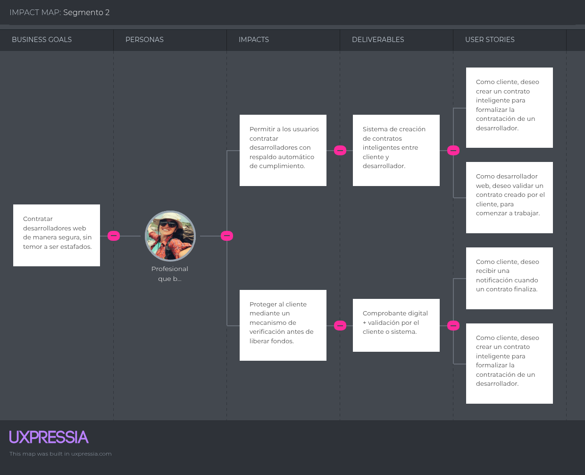
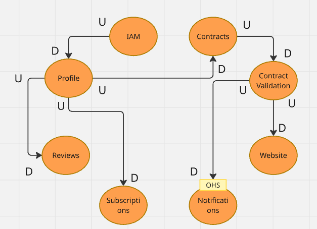
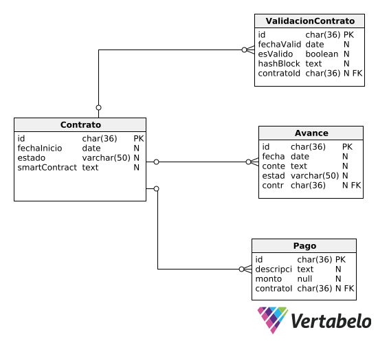
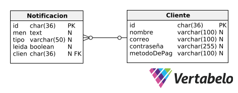
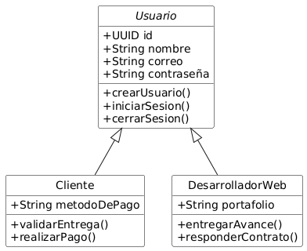
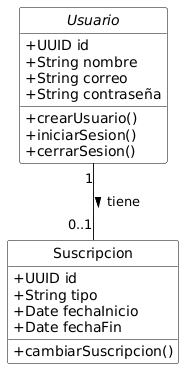
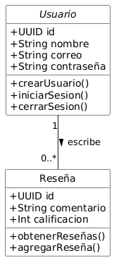

# Informe de Trabajo Final

**Universidad Peruana de Ciencias Aplicadas**  
**Ingenieria de Software**  
**Ciclo 8**

**Código del curso: 1ASI0728**  
**Curso: Arquitecturas De Software Emergentes**  
**NRC: 4281**

**Profesor: Rojas Malasquez, Royer Edelwer**

**Startup: Tarket**

**Producto: Tarket Contracts**

### Relación de integrantes:

|      Apellidos y Nombres       |   Código   |
|:------------------------------:|:----------:|
| Castilla Pachas, César Antonio | u202218735 |
| Cortés Casas, Joaquin Marcelo  | u202114545 |
|   Diaz Silva, Fernando Josué   | u202112722 |
| Jorge Arévalo, Ramón Alejandro | u20221D126 |

**Abril, 2025**

---

## Registro de Versiones del Informe

| **Versión** | **Fecha**  | **Autor**                                                                                               | **Descripción de Modificación**                                                                                                                                                 |
|-------------|------------|---------------------------------------------------------------------------------------------------------|---------------------------------------------------------------------------------------------------------------------------------------------------------------------------------|
| 1.0         | 15/04/2025 | Cortés Casas, Joaquín Marcelo                                                                           | Creación del informe. Adición de carátula y tabla de contenidos.                                                                                                                |
| 1.1         | 18/04/2025 | Castilla Pachas, César Antonio                                                                          | Adición del Startup Profile y Solution Profile.                                                                                                                                 |
| 1.2         | 23/04/2025 | Diaz Silva, Fernando Josué <br/> Jorge Arévalo, Ramón Alejandro                                         | Adición del capítulo II.                                                                                                                                                        |
| 1.3         | 24/04/2025 | Castilla Pachas, César Antonio <br/> Cortés Casas, Joaquin Marcelo <br/> Jorge Arévalo, Ramón Alejandro | Adición de User Stories, Product Backlog, To-Be Scenario Mapping, Impact Mapping, Strategic Level Atribute Driven Design, Event Storming, Context Mapping y User Flow Modeling. |
| 1.4         | 25/04/2025 | Castilla Pachas, César Antonio <br/> Cortés Casas, Joaquin Marcelo <br/> Jorge Arévalo, Ramón Alejandro | Adición de Domain Message Flow Modelings, Bounded context canvases y Software Architecture diagrams.                                                                            |
| 2.0         | 14/04/2025 | Castilla Pachas, César Antonio                                                                          | Adición de Bounded Context Domain Layer, Interface Layer, Application Layer & Infrastructure Layer.                                                                             |
| 2.0.1       | 14/04/2025 | Jorge Arévalo, Ramón Alejandro                                                                          | Adición de Bounded Context Domain Layer Class Diagram.                                                                                                                          |
| 2.1.0       | 15/05/2025 | Cortés Casas, Joaquín Marcelo                                                                           | Adición de General Style Guidelines.                                                                                                                                            |
| 2.1.1       | 15/05/2025 | Cortés Casas, Joaquín Marcelo                                                                           | Adición del Web & Mobile Style Guidelines.                                                                                                                                      |
| 2.1.2       | 16/05/2025 | Cortés Casas, Joaquín Marcelo                                                                           | Adición de Information Architecture.                                                                                                                                            |
| 2.2.0       | 16/05/2025 | Cortés Casas, Joaquín Marcelo                                                                           | Adición de Landing Page Wireframes & Mock-up                                                                                                                                    |
| 2.3.0       | 16/05/2025 | Diaz Silva, Fernando Josué                                                                              | Adición de Web Applications Wireframes.                                                                                                                                         |
| 2.3.1       | 16/05/2025 | Cortés Casas, Joaquín Marcelo                                                                           | Adición de Mobile Applications Wireframes.                                                                                                                                      |
| 2.4.0       | 16/05/2025 | Cortés Casas, Joaquín Marcelo                                                                           | Adición de Application Wireflow Diagrams.                                                                                                                                       |
| 3.0         | 20/06/2025 | Jorge Arévalo, Ramón Alejandro                                         |                                | Corrección de Class y Database Diagrams y adición de Sprint Planning y Backlog 1

---

## Project Report Collaboration Insights
### URL del repositorio en la organización GitHub
https://github.com/ArqSoftEmergentes-Grupo-NOMBRE

### Actividades de elaboración del informe
#### TB1:

**Descripción de las actividades realizadas:**
- **Castilla Pachas, César Antonio:** Creación del Startup Profile, Solution Profile, Segmentos objetivo, To-Be Scenario Mapping, Impact Mapping y Strategic-Level Attribute-Driven Design.
- **Cortés Casas, Joaquin Marcelo:** Creación de User Stories, Product Backlog, Bounded Context Canvases y diagramas de Software Architecture.
- **Diaz Silva, Fernando Josué:** Creación de tabla de competidores, Diseño de entrevistas, Ubiquitous Language y As-Is Scenario Mapping.
- **Jorge Arévalo, Ramón Alejandro:** Creación de User Personas, User Task Matrix, User Journey Mapping, Empathy Mapping y la mayor parte de Strategic-Level Domain-Driven Design.

**Evidencia de colaboración y commits en GitHub del reporte:**

### Commits realizados:


### Línea de tiempo de commits realizados

****
#### TP1:

**Descripción de las actividades realizadas:**
- **Castilla Pachas, César Antonio:** Desarrollar el Domain Layer, Interface Layer, Application Layer e Infrastructure Layer por cada bounded context.
- **Cortés Casas, Joaquin Marcelo:** Definir los general style guidelines, web and mobile style guidelines, information architecture, landing page wireframes and mockups, mobile application wireframes y application wireflow diagrams.
-  **Diaz Silva, Fernando Josué:** Creacion de los wireframes de la aplicacion web en figma y documentacion de los wireframes en el reporte.
- **Jorge Arévalo, Ramón Alejandro:** Creación de los Diagramas de Componentes, Diagramas de Base de Datos y Diagramas de Clases de los Bounded Context.

**Evidencia de colaboración y commits en GitHub del reporte:**

### Commits realizados:


### Línea de tiempo de commits realizados


---


## Contenido

**Tabla de contenidos**

- [Student Outcome](#student-outcome)

- [Capítulo I: Introducción](#capítulo-i-introducción)  
    - [1.1. Startup Profile](#11-startup-profile)  
        - [1.1.1. Descripción de la Startup](#111-descripción-de-la-startup)  
        - [1.1.2. Perfiles de integrantes del equipo](#112-perfiles-de-integrantes-del-equipo)  
    - [1.2. Solution Profile](#12-solution-profile)  
        - [1.2.1. Antecedentes y problemática](#121-antecedentes-y-problemática)  
        - [1.2.2. Lean UX Process](#122-lean-ux-process)  
            - [1.2.2.1. Lean UX Problem Statements](#1221-lean-ux-problem-statements)  
            - [1.2.2.2. Lean UX Assumptions](#1222-lean-ux-assumptions)  
            - [1.2.2.3. Lean UX Hypothesis Statements](#1223-lean-ux-hypothesis-statements)  
            - [1.2.2.4. Lean UX Canvas](#1224-lean-ux-canvas)  
    - [1.3. Segmentos objetivo](#13-segmentos-objetivo)

- [Capítulo II: Requirements Elicitation & Analysis](#capítulo-ii-requirements-elicitation--analysis)  
    - [2.1. Competidores](#21-competidores)  
        - [2.1.1. Análisis competitivo](#211-análisis-competitivo)  
        - [2.1.2. Estrategias y tácticas frente a competidores](#212-estrategias-y-tácticas-frente-a-competidores)  
    - [2.2. Entrevistas](#22-entrevistas)  
        - [2.2.1. Diseño de entrevistas](#221-diseño-de-entrevistas)  
        - [2.2.2. Registro de entrevistas](#222-registro-de-entrevistas)  
        - [2.2.3. Análisis de entrevistas](#223-análisis-de-entrevistas)  
    - [2.3. Needfinding](#23-needfinding)  
        - [2.3.1. User Personas](#231-user-personas)  
        - [2.3.2. User Task Matrix](#232-user-task-matrix)  
        - [2.3.3. User Journey Mapping](#233-user-journey-mapping)  
        - [2.3.4. Empathy Mapping](#234-empathy-mapping)  
        - [2.3.5. As-is Scenario Mapping](#235-as-is-scenario-mapping)  
    - [2.4. Ubiquitous Language](#24-ubiquitous-language)

- [Capítulo III: Requirements Specification](#capítulo-iii-requirements-specification)  
    - [3.1. To-Be Scenario Mapping](#31-to-be-scenario-mapping)  
    - [3.2. User Stories](#32-user-stories)  
    - [3.3. Impact Mapping](#33-impact-mapping)  
    - [3.4. Product Backlog](#34-product-backlog)

- [Capítulo IV: Strategic-Level Software Design](#capítulo-iv-strategic-level-software-design)  
    - [4.1. Strategic-Level Attribute-Driven Design](#41-strategic-level-attribute-driven-design)  
        - [4.1.1. Design Purpose](#411-design-purpose)  
        - [4.1.2. Attribute-Driven Design Inputs](#412-attribute-driven-design-inputs)  
            - [4.1.2.1. Primary Functionality (Primary User Stories)](#4121-primary-functionality-primary-user-stories)  
            - [4.1.2.2. Quality Attribute Scenarios](#4122-quality-attribute-scenarios)  
            - [4.1.2.3. Constraints](#4123-constraints)  
        - [4.1.3. Architectural Drivers Backlog](#413-architectural-drivers-backlog)  
        - [4.1.4. Architectural Design Decisions](#414-architectural-design-decisions)  
        - [4.1.5. Quality Attribute Scenario Refinements](#415-quality-attribute-scenario-refinements)  
    - [4.2. Strategic-Level Domain-Driven Design](#42-strategic-level-domain-driven-design)  
        - [4.2.1. EventStorming](#421-eventstorming)  
        - [4.2.2. Candidate Context Discovery](#422-candidate-context-discovery)  
        - [4.2.3. Domain Message Flows Modeling](#423-domain-message-flows-modeling)  
        - [4.2.4. Bounded Context Canvases](#424-bounded-context-canvases)  
        - [4.2.5. Context Mapping](#425-context-mapping)  
    - [4.3. Software Architecture](#43-software-architecture)  
        - [4.3.1. System Landscape Diagram](#431-software-architecture-system-landscape-diagram)  
        - [4.3.2. Context-Level Diagrams](#432-software-architecture-context-level-diagrams)  
        - [4.3.3. Container-Level Diagrams](#433-software-architecture-container-level-diagrams)  
        - [4.3.4. Deployment Diagrams](#434-software-architecture-deployment-diagrams)

- [Capítulo V: Tactical-Level Software Design](#capítulo-v-tactical-level-software-design)
    - [5.1. Bounded Context: Contracts](#51-bounded-context-contracts)
        - [5.1.1. Domain Layer](#511-domain-layer)
        - [5.1.2. Interface Layer](#512-interface-layer)
        - [5.1.3. Application Layer](#513-application-layer)
        - [5.1.4. Infrastructure Layer](#514-infrastructure-layer)
        - [5.1.5. Bounded Context Software Architecture Component Level Diagrams](#515-bounded-context-software-architecture-component-level-diagrams)
        - [5.1.6. Bounded Context Software Architecture Code Level Diagrams](#516-bounded-context-software-architecture-code-level-diagrams)
            - [5.1.6.1 Bounded Context Domain Layer Class Diagrams](#5161-bounded-context-domain-layer-class-diagrams)
            - [5.1.6.2 Bounded Context Database Design Diagram](#5162-bounded-context-database-design-diagram)
    - [5.2. Bounded Context: Contract Validation](#52-bounded-context-contract-validation)
        - [5.2.1. Domain Layer](#521-domain-layer)
        - [5.2.2. Interface Layer](#522-interface-layer)
        - [5.2.3. Application Layer](#523-application-layer)
        - [5.2.4. Infrastructure Layer](#524-infrastructure-layer)
        - [5.2.5. Bounded Context Software Architecture Component Level Diagrams](#525-bounded-context-software-architecture-component-level-diagrams)
        - [5.2.6. Bounded Context Software Architecture Code Level Diagrams](#526-bounded-context-software-architecture-code-level-diagrams)
            - [5.2.6.1 Bounded Context Domain Layer Class Diagrams](#526)
            - [5.2.6.2 Bounded Context Database Design Diagram](#526)
    - [5.3. Bounded Context: Notifications](#53-bounded-context-notifications)
        - [5.3.1. Domain Layer](#531-domain-layer)
        - [5.3.2. Interface Layer](#532-interface-layer)
        - [5.3.3. Application Layer](#533-application-layer)
        - [5.3.4. Infrastructure Layer](#534-infrastructure-layer)
        - [5.3.5. Bounded Context Software Architecture Component Level Diagrams](#535-bounded-context-software-architecture-component-level-diagrams)
        - [5.3.6. Bounded Context Software Architecture Code Level Diagrams](#536-bounded-context-software-architecture-code-level-diagrams)
            - [5.3.6.1 Bounded Context Domain Layer Class Diagrams](#536)
            - [5.3.6.2 Bounded Context Database Design Diagram](#536)
    - [5.4. Bounded Context: Web Service](#54-bounded-context-web-service)
        - [5.4.1. Domain Layer](#541-domain-layer)
        - [5.4.2. Interface Layer](#542-interface-layer)
        - [5.4.3. Application Layer](#543-application-layer)
        - [5.4.4. Infrastructure Layer](#544-infrastructure-layer)
        - [5.4.5. Bounded Context Software Architecture Component Level Diagrams](#545-bounded-context-software-architecture-component-level-diagrams)
        - [5.4.6. Bounded Context Software Architecture Code Level Diagrams](#546-bounded-context-software-architecture-code-level-diagrams)
            - [5.4.6.1 Bounded Context Domain Layer Class Diagrams](#546)
            - [5.4.6.2 Bounded Context Database Design Diagram](#546)
    - [5.5. Bounded Context: Profiles](#55-bounded-context-profiles)
        - [5.5.1. Domain Layer](#551-domain-layer)
        - [5.5.2. Interface Layer](#552-interface-layer)
        - [5.5.3. Application Layer](#553-application-layer)
        - [5.5.4. Infrastructure Layer](#554-infrastructure-layer)
        - [5.5.5. Bounded Context Software Architecture Component Level Diagrams](#555-bounded-context-software-architecture-component-level-diagrams)
        - [5.5.6. Bounded Context Software Architecture Code Level Diagrams](#556-bounded-context-software-architecture-code-level-diagrams)
            - [5.5.6.1 Bounded Context Domain Layer Class Diagrams](#556)
            - [5.5.6.2 Bounded Context Database Design Diagram](#556)
    - [5.6. Bounded Context: Suscriptions](#56-bounded-context-suscriptions)
        - [5.6.1. Domain Layer](#561-domain-layer)
        - [5.6.2. Interface Layer](#562-interface-layer)
        - [5.6.3. Application Layer](#563-application-layer)
        - [5.6.4. Infrastructure Layer](#564-infrastructure-layer)
        - [5.6.5. Bounded Context Software Architecture Component Level Diagrams](#565-bounded-context-software-architecture-component-level-diagrams)
        - [5.6.6. Bounded Context Software Architecture Code Level Diagrams](#566-bounded-context-software-architecture-code-level-diagrams)
            - [5.6.6.1 Bounded Context Domain Layer Class Diagrams](#566)
            - [5.6.6.2 Bounded Context Database Design Diagram](#566)
    - [5.7. Bounded Context: Reviews](#57-bounded-context-reviews)
        - [5.7.1. Domain Layer](#571-domain-layer)
        - [5.7.2. Interface Layer](#572-interface-layer)
        - [5.7.3. Application Layer](#573-application-layer)
        - [5.7.4. Infrastructure Layer](#574-infrastructure-layer)
        - [5.7.5. Bounded Context Software Architecture Component Level Diagrams](#575-bounded-context-software-architecture-component-level-diagrams)
        - [5.7.6. Bounded Context Software Architecture Code Level Diagrams](#576-bounded-context-software-architecture-code-level-diagrams)
            - [5.7.6.1 Bounded Context Domain Layer Class Diagrams](#5761-bounded-context-domain-layer-class-diagrams)
            - [5.7.6.2 Bounded Context Database Design Diagram](#5762-bounded-context-database-design-diagram)

- [Capítulo VI: Solution UX Design](#capítulo-vi-solution-ux-design)
    - [6.1. Style Guidelines](#61-style-guidelines)
        - [6.1.1. General Style Guidelines](#611-general-style-guidelines)
        - [6.1.2. Web, Mobile & Devices Style Guidelines](#612-web-mobile--devices-style-guidelines)
    - [6.2. Information Architecture](#62-information-architecture)
        - [6.2.1. Organization Systems](#621-organization-systems)
        - [6.2.2. Labeling Systems](#622-labeling-systems)
        - [6.2.3. Searching Systems](#623-searching-systems)
        - [6.2.4. SEO Tags and Meta Tags](#624-seo-tags-and-meta-tags)
        - [6.2.5. Navigation Systems](#625-navigation-systems)
    - [6.3. Landing Page UI Design](#63-landing-page-ui-design)
        - [6.3.1. Landing Page Wirefrake](#631-landing-page-wirefrake)
        - [6.3.2. Landing Page Mock-up](#632-landing-page-mock-up)
    - [6.4. Application UX/UI Design](#64-application-uxui-design)
        - [6.4.1. Application Wireframes](#641-application-wireframes)
        - [6.4.2. Application Wireflow Diagrams](#642-application-wireflow-diagrams)
        - [6.4.3. Applications Mock-ups](#642-applications-mock-ups)  
        - [6.4.4. Applications User Flow Diagrams](#643-applications-user-flow-diagrams)  
    - [6.5. Applications Prototyping](#65-applications-prototyping)

- [Capítulo VII: Product Implementation, Validation & Deployment](#capítulo-vii-product-implementation-validation--deployment)  
    - [7.1. Software Configuration Management](#71-software-configuration-management)  
        - [7.1.1. Software Development Environment Configuration](#711-software-development-environment-configuration)  
        - [7.1.2. Source Code Management](#712-source-code-management)  
        - [7.1.3. Source Code Style Guide & Conventions](#713-source-code-style-guide--conventions)  
        - [7.1.4. Software Deployment Configuration](#714-software-deployment-configuration)  
    - [7.2. Solution Implementation](#72-solution-implementation)  
        - [7.2.1. Sprint 1](#721-sprint-1)  
            - [7.2.1.1. Sprint Planning 1](#7211-sprint-planning-1)  
            - [7.2.1.2. Sprint Backlog 1](#7212-sprint-backlog-1)  
            - [7.2.1.3. Development Evidence for Sprint Review](#7213-development-evidence-for-sprint-review)  
            - [7.2.1.4. Testing Suite Evidence for Sprint Review](#7214-testing-suite-evidence-for-sprint-review)  
            - [7.2.1.5. Execution Evidence for Sprint Review](#7215-execution-evidence-for-sprint-review)  
            - [7.2.1.6. Services Documentation Evidence for Sprint Review](#7216-services-documentation-evidence-for-sprint-review)  
            - [7.2.1.7. Software Deployment Evidence for Sprint Review](#7217-software-deployment-evidence-for-sprint-review)  
            - [7.2.1.8. Team Collaboration Insights during Sprint](#7218-team-collaboration-insights-during-sprint)  
    - [7.3. Validation Interviews](#73-validation-interviews)  
        - [7.3.1. Diseño de Entrevistas](#731-diseño-de-entrevistas)  
        - [7.3.2. Registro de Entrevistas](#732-registro-de-entrevistas)  
        - [7.3.3. Evaluaciones según heurísticas](#733-evaluaciones-según-heurísticas)  
    - [7.4. Video About-the-Product](#74-video-about-the-product)
    - [7.5. Video About-the-Team](#74-video-about-the-team)


- [Conclusiones](#conclusiones)  
    - [Conclusiones y recomendaciones](#conclusiones-y-recomendaciones)

- [Bibliografía](#bibliografía)

- [Anexos](#anexos)

---

## Student Outcome
El curso contribuye al cumplimiento del Student Outcome ABET:

**ABET – EAC - Student Outcome 3**

Criterio: Capacidad de comunicarse efectivamente con un rango de audiencias.

En el siguiente cuadro se describe las acciones realizadas y enunciados de conclusiones por parte del grupo, que permiten sustentar el haber alcanzado el logro del ABET – EAC - Student Outcome 3.

| **Criterio específico**                                                                                                                                                               | **Acciones realizadas**                                                                                                                                                                                                                                                                                                                                                                                                                                                                                                                                                                                                                                                                                                                                                                                                                                                                                                                                                                                                                                                                                                                                                                                                                                                                                                                                                                                                                                                                                                                                                                                                  | **Conclusiones**                                                                                                                                                 |
|---------------------------------------------------------------------------------------------------------------------------------------------------------------------------------------|--------------------------------------------------------------------------------------------------------------------------------------------------------------------------------------------------------------------------------------------------------------------------------------------------------------------------------------------------------------------------------------------------------------------------------------------------------------------------------------------------------------------------------------------------------------------------------------------------------------------------------------------------------------------------------------------------------------------------------------------------------------------------------------------------------------------------------------------------------------------------------------------------------------------------------------------------------------------------------------------------------------------------------------------------------------------------------------------------------------------------------------------------------------------------------------------------------------------------------------------------------------------------------------------------------------------------------------------------------------------------------------------------------------------------------------------------------------------------------------------------------------------------------------------------------------------------------------------------------------------------|------------------------------------------------------------------------------------------------------------------------------------------------------------------|
| Comunica oralmente sus ideas y/o resultados con objetividad a público de diferentes especialidades y niveles jerarquicos, en el marco del desarrollo de un proyecto en ingeniería.    | Castilla Pachas, César Antonio<br/>TB1<br/>Durante el desarrollo del proyecto he podido comunicar mis ideas de fomra clara y objetiva, tanto en aspectos técnicos como funcionales, ademas he adaptado mi forma de explicar segun el publico, ya sea ante compañeros del proyecto o personas de cualquier otra parte, usando ejemplos y lenguaje sencillo cunado fuera necesario.<br/>TP1<br/>En esta segunda etapa del proyecto, reforcé mi capacidad para comunicar oralmente los avances y resultados obtenidos, presentando información técnica de manera estructurada y comprensible para audiencias diversas. Durante exposiciones y coordinaciones, adapté mi discurso según el nivel de conocimiento del público, empleando un lenguaje claro, apoyos visuales y ejemplos prácticos para facilitar la comprensión, especialmente al explicar decisiones de diseño, arquitectura y pruebas funcionales del sistema.<br/>TB2<br/>Durante las reuniones de avance del proyecto, presenté mis ideas de manera clara y precisa, utilizando un lenguaje accesible para colegas de otras especialidades. Me apoyé en recursos visuales y ejemplos prácticos para facilitar la comprensión, manteniendo siempre un enfoque objetivo y alineado con los objetivos del proyecto.<br/>TF1<br/>Lorem ipsum dolor sit amet.<br/><br/>Cortés Casas, Joaquin Marcelo<br/>TB1<br/>Durante el desarrollo del proyecto, comuniqué oralmente mis ideas de forma clara y estructurada a mi equipo, compuesto por estudiantes de distintas especialidades. Expliqué de manera objetiva el enfoque aplicado en la creación de User Stories, la organización del Product Backlog, la estructuración de los Bounded Context Canvases y el diseño de los Diagramas de Arquitectura de Software (Context, Container, Deployment y System Landscape). Esto permitió que todos los integrantes comprendieran los objetivos técnicos y funcionales independientemente de su nivel de conocimiento específico.<br/>TP1<br/>Durante la exposición de avances, expliqué la lógica detrás de la estructura de arquitectura de información, la estandarización visual (Style Guidelines) y los wireframes diseñados para plataformas web y móviles. Utilicé términos técnicos comprensibles y ejemplos visuales para asegurar que el equipo entendiera tanto la coherencia visual como la usabilidad planteada para cada interfaz, según el segmento objetivo.<br/>TB2<br/>Durante esta etapa, comuniqué oralmente los resultados del sistema desde la perspectiva del diseño técnico, visual y funcional, tanto al equipo como a usuarios entrevistados en sesiones de validación. En reuniones internas, expliqué la lógica de integración entre los módulos web y mobile, el flujo de navegación, así como la arquitectura técnica del frontend. Durante las entrevistas de validación, adapté el lenguaje para explicar el propósito de la landing page y el sistema de contratos inteligentes a usuarios de perfil no técnico (como Alejandro R.) y técnico (como Lizeth A.), usando ejemplos, términos accesibles y analogías. También brindé retroalimentación sobre cómo implementar mejoras basadas en la experiencia real de estos usuarios.<br/>TF1<br/>Lorem ipsum dolor sit amet.<br/><br/>Diaz Silva, Fernando Josué<br/>TB1<br/>Durante los avances y resultados del proyecto logre comunicar de forma oral mis ideas de manera objetiva y estructurada. Me asegure de explicar tanto los conecptos tecnicos como los beneficios del proyecto, adaptando mi lenguaje para que fuera comprensible para cualquier persona.<br/>TP1<br/>Durante la presentación del proyecto, expuse con claridad y objetividad los resultados alcanzados, detallando tanto aspectos técnicos como su aplicabilidad en el contexto real. Me enfoqué en adaptar el lenguaje y el nivel de detalle según el público presente, lo que permitió una mejor comprensión del impacto y funcionamiento del sistema desarrollado, sin perder precisión en los conceptos clave.<br/>TB2<br/>Para la exposición del proyecto, comuniqué los resultados con un enfoque técnico y estructurado, adaptando mi discurso al nivel jerárquico y área de especialidad del público. Utilicé analogías, visualizaciones y términos adecuados para asegurar que todos los asistentes comprendieran tanto la solución propuesta como su relevancia dentro del contexto organizacional.<br/>TF1<br/>Lorem ipsum dolor sit amet.<br/><br/>Jorge Arévalo, Ramón Alejandro<br/>TB1<br/>En esta entrega, he desarrollado los puntos de User Personas, User Task Matrix, Journey Mappings y Empathy Mappings, lo que me ha permitido entender y explicar el perfil de los segmentos objetivo a la que va a ir dirigida la aplicación.<br/>TP1<br/>Para esta entrega, he desarrollado los diagramas de base de datos y de clases de los distintos Bounded Context de nuestro proyecto, para poder tener una idea general de cómo empezar a desarrollar la aplicación.<br/>TB2<br/>Lorem ipsum dolor sit amet.<br/>TF1<br/>Lorem ipsum dolor sit amet.<br/><br/>     | TB1<br/>Durante la TB1, todos los integrantes del equipo demostraron su capacidad para comunicar oralmente ideas y resultados del proyecto de manera clara, estructurada y adaptada a distintos perfiles de audiencia. Las exposiciones incluyeron desde explicaciones conceptuales hasta la justificación técnica de decisiones de diseño y arquitectura, utilizando lenguaje accesible, ejemplos visuales y enfoques comprensibles para estudiantes de diversas especialidades. Esta habilidad permitió que todos los miembros comprendieran los lineamientos técnicos del proyecto y participaran activamente en las decisiones de desarrollo.<br/>TP1<br/>En la etapa TP1 se consolidó la capacidad del equipo para comunicar los avances técnicos del sistema de forma efectiva ante diferentes niveles jerárquicos y perfiles técnicos. Se emplearon explicaciones orales con apoyo de wireframes, diagramas y lineamientos de diseño (como Style Guidelines y Arquitectura de Información), priorizando claridad, objetividad y adecuación del lenguaje al público. Esto favoreció la comprensión transversal de las soluciones propuestas y garantizó la coherencia del trabajo en equipo frente a objetivos técnicos compartidos.<br/>TB2<br>Durante la TB2, los miembros del equipo continuaron demostrando habilidades sólidas de comunicación oral, especialmente al presentar los resultados del proyecto en reuniones internas y entrevistas de validación con usuarios de distintos perfiles técnicos y jerárquicos. Se empleó un lenguaje adaptado a la audiencia, ejemplos ilustrativos, y recursos visuales para transmitir tanto los aspectos técnicos como el valor funcional del sistema. Esta capacidad permitió una retroalimentación efectiva, una mejor comprensión del producto y la identificación de mejoras relevantes, fortaleciendo el enfoque centrado en el usuario y el alineamiento del equipo con los objetivos del proyecto.<br/>TF1<br/>Lorem ipsum dolor sit amet.<br/> |
| Comunica en forma escrita ideas y/o resultados con objetividad a público de diferentes especialidades y niveles jerarquicos, en el marco del desarrollo de un proyecto en ingeniería. | Castilla Pachas, César Antonio<br/>TB1<br/>A lo largo del proyecto he comunicado por escrito nuestras ideas y resultados de manera clara y objetiva, tambien he redactado documentos tecnicos y explicativos adaptados a publicos de distintas especialidades, desde informes de arquitectura hasta resumenes funcionales.<br/>TP1<br/>Durante esta fase del proyecto, continué redactando documentación técnica y funcional con claridad y objetividad, considerando el perfil del público lector. Elaboré reportes que explican desde los componentes técnicos hasta el impacto funcional del sistema, cuidando el uso de un lenguaje preciso y accesible para diferentes niveles jerárquicos y especialidades. Además, participé en la revisión y mejora de entregables escritos para asegurar su coherencia y comprensión.<br/>TB2<br/>En esta fase del proyecto, preparé informes detallados que describían los objetivos, metodologías y resultados, cuidando que el lenguaje utilizado fuera accesible para distintos niveles jerárquicos y especialidades. Esta estrategia facilitó la toma de decisiones y permitió una adecuada difusión del impacto del proyecto entre todas las partes interesadas.<br/>TF1<br/>Lorem ipsum dolor sit amet.<br/><br/>Cortés Casas, Joaquin Marcelo<br/>TB1<br/>Redacté de manera precisa y comprensible la documentación técnica del proyecto, elaborando User Stories con criterios de aceptación estructurados en formato Gherkin, un Product Backlog priorizado, Bounded Context Canvases detallados para cada módulo, y Diagramas de Software Architecture utilizando C4 Model. Esta documentación permitió comunicar de manera escrita y objetiva los resultados del trabajo tanto a perfiles técnicos como a perfiles no técnicos involucrados en el proyecto.<br/>TP1<br/>Documenté de forma estructurada y clara las guías de estilo generales y específicas para web y móvil, definiendo principios de diseño consistentes. Asimismo, redacté la arquitectura de información de la plataforma y elaboré wireframes con anotaciones que justifican las decisiones de diseño. Esta documentación permitió comunicar tanto a diseñadores como a desarrolladores los lineamientos visuales y funcionales del sistema.<br/>TB2<br/>Documenté la sección completa de evaluaciones heurísticas y entrevistas de validación en el entregable del equipo, integrando de forma estructurada los problemas identificados, heurísticas violadas, niveles de severidad y recomendaciones para su mejora. Estas observaciones se redactaron considerando tanto el punto de vista técnico como funcional. Asimismo, actualicé el README técnico vinculado a mis contribuciones en Software Configuration Management (SCM), detallando los commits realizados, ramas, y objetivos alcanzados, permitiendo rastrear de forma transparente los cambios efectuados.<br/>TF1<br/>Lorem ipsum dolor sit amet.<br/><br/>Diaz Silva, Fernando Josué<br/>TB1<br/>Durante el proyecto redacte informes y entregables donde presente ideas y resultados de fomra clara, objetiva y organizada. Donde adapte el nivel de detalle y el lenguaje segun el publico, asegurandome de que tanto especialistas tecnicos como profesionales pudieran comprender el alcance de esta solución.<br/>TP1<br/>Durante la entrega del proyecto documenté de forma clara y objetiva los avances y resultados obtenidos, utilizando un lenguaje adecuado para distintos públicos. Elaboré informes técnicos y explicativos que permitieron transmitir tanto los aspectos funcionales como los beneficios del sistema, asegurando la comprensión de lectores con diferentes niveles de especialización.<br/>TB2<br/>A lo largo del desarrollo del proyecto, elaboré documentos técnicos y reportes donde expuse mis ideas y resultados de manera objetiva, estructurada y coherente. Me aseguré de ajustar el nivel técnico del contenido para que tanto ingenieros como personal administrativo pudieran entender el propósito y valor del trabajo realizado.<br/>TF1<br/>Lorem ipsum dolor sit amet.<br/><br/>Jorge Arévalo, Ramón Alejandro<br/>TB1<br/>En esta entrega, desarrollé los puntos de Event Storming, Candidate Context Discovery, Domain Message Flow Modelings y Context Mapping, lo cual me ha permitido identificar las bases del diseño de la arquitectura de nuestra aplicación, con el enfoque de Domain-Driven Design.<br/>TP1<br/>En esta entrega, he desarrollado los diagramas de componentes de cada uno de los Bounded Context del proyecto, definiendo las funcionalidades que van a contemplar dichos contextos en la aplicación que desarrollaremos.<br/>Lorem ipsum dolor sit amet.<br/>TB2<br/>Lorem ipsum dolor sit amet.<br/>TF1<br/>Lorem ipsum dolor sit amet.<br/><br/> | TB1<br/>Durante la TB1, todos los integrantes demostraron competencia en la redacción de documentos técnicos y funcionales dirigidos a públicos diversos, desde especialistas en desarrollo hasta stakeholders no técnicos. La documentación incluyó User Stories con criterios de aceptación, guías de estilo, lineamientos de diseño y estructuras arquitectónicas con el modelo C4. Cada entregable fue escrito con precisión, claridad y adecuación al perfil del lector, lo que garantizó una comunicación efectiva y comprensible de los avances y decisiones clave del proyecto.<br/>TP1<br/>En la etapa TP1, la documentación escrita consolidó la visión técnica y funcional del sistema desarrollado. Se elaboraron reportes estructurados que incluyeron guías de diseño visual, arquitectura de información, wireframes anotados y justificaciones de decisiones tomadas. Estos documentos facilitaron la comprensión del sistema tanto para perfiles técnicos como para perfiles organizacionales, asegurando consistencia, coherencia visual y alineamiento con los objetivos del proyecto. La redacción fue objetiva, técnica y orientada a facilitar la toma de decisiones en equipo.<br/>TB2<br/>En esta etapa, el equipo elaboró documentación técnica y funcional clara, objetiva y bien estructurada, orientada a distintos niveles de especialidad. Se incorporaron informes de validación, evaluaciones heurísticas, análisis de entrevistas, y documentación técnica como reportes SCM y mejoras en la landing page. El lenguaje fue cuidadosamente ajustado según el perfil del lector, permitiendo comunicar avances y decisiones de diseño tanto a desarrolladores como a usuarios finales. Esta documentación facilitó la colaboración interdisciplinaria, respaldó la toma de decisiones informadas y evidenció una gestión madura del proceso de desarrollo.<br/>TF1<br/>Lorem ipsum dolor sit amet.<br>                                                                                                                                    |

---


# Capítulo I: Introducción

## 1.1. Startup Profile


### 1.1.1. Descripción de la Startup

**SmartWebContracts** es una startup universitaria formada por estudiantes de tecnología con interés en aplicar **contratos inteligentes en entornos reales** para resolver problemas de confianza y transparencia en el desarrollo de sitios web. Nuestra propuesta central gira en torno a la creación de una **plataforma descentralizada** que permite automatizar acuerdos entre desarrolladores web y sus clientes mediante **blockchain**, garantizando así el cumplimiento del servicio, la seguridad del pago, y la generación de un comprobante digital como evidencia de ejecución.

####  Misión:
Desarrollar soluciones tecnológicas basadas en blockchain que automaticen los acuerdos de servicios digitales, promoviendo la **transparencia, confianza y equidad** en la contratación de profesionales independientes del desarrollo web.

####  Visión:
Ser reconocidos como una **startup innovadora** en el desarrollo de herramientas digitales seguras para freelancers, fomentando el uso de tecnologías descentralizadas como blockchain en Latinoamérica y más allá.


### 1.1.2. Perfiles de integrantes del equipo

| Foto                                                                                                                              | Nombre completo                   | Código     | Carrera                | Resumen                                                                                                                                                                                                                                                                            |
|-----------------------------------------------------------------------------------------------------------------------------------|-----------------------------------|------------|------------------------|------------------------------------------------------------------------------------------------------------------------------------------------------------------------------------------------------------------------------------------------------------------------------------|
|  | **César Antonio Castilla Pachas** | u202218735     | Ingenieria de software | Tengo 21 años y estudió la carrera de Ingeniería de Software en la Universidad Peruana de Ciencias Aplicadas. Me encanta crear páginas web y dar soluciones creativas, soy una persona responsable y puntual. Además, me encanta trabajar en equipo. Cada día me gusta aprender algo nuevo y poder ampliar mis conocimientos.|
|                                                                          | **Joaquín Marcelo Cortés Casas**  | u202114545 | Ingeniería de Software | Me llamo Joaquín, cuento con amplia experiencia previa liderando múltiples equipos de trabajo, buscando un buen nivel de compromiso y enfoque en la calidad del producto final. Actualizo constantemente mis conocimientos de software probando distintas tecnologías innovadoras. |
|                                                                        | **Fernando Josué Diaz Silva**     | u202112722     | Ingeniería de Software | Soy Fernando Diaz, tengo 21 años, me apasiona la tecnología, actualmente estudio la carrera de ingeniería de software en la Universidad Peruana de Ciencias Aplicadas(UPC). A lo largo de la carrera he desarrollado distintas habilidades, mi principal enfoque en esta carrera parte del software como tal y el ámbito empresarial, para lo cual planeo realizar un MBA. Soy una persona proactiva, responsable y disciplinada. Estoy preparado para desarrollar un buen trabajo junto a mi equipo y aplicar todo el conocimiento adquirido a lo largo de mi carrera.                                                                                                                                                                                                                                                                            |
|                                                                            | **Ramón Alejandro Jorge Arévalo**                          | u20221D126     | Ingeniería de Software | Mi nombre es Ramón, tengo 22 años y me encuentro estudiando la carrera de Ingeniería de Software en la UPC. Domino una gran variedad de lenguajes de programación, patrones de diseño y frameworks de desarrollo. Me considero una persona muy responsable, proactiva y capaz de trabajar en equipo y aportar al desarrollo de un proyecto de software.          |


---

## 1.2. Solution Profile

### 1.2.1. Antecedentes y Problemática

#### Enunciado del Problema
Existe una **falta de confianza en la contratación de servicios de desarrollo web**, donde los clientes temen no recibir el servicio prometido, y los desarrolladores temen no ser remunerados. Esto genera fricciones, sobrecostos, y pérdida de oportunidades para ambos.


| Clave | Pregunta | Respuesta                                                                                                 |
|-------|----------|-----------------------------------------------------------------------------------------------------------|
| **Who** | ¿Quiénes están involucrados? | Desarrolladores web y Profesionales que buscan crear un portafolio digital.                               |
| **What** | ¿Qué ocurre? | Se generan riesgos de fraude, falta de pago o incumplimiento en acuerdos de servicios web.                |
| **Where** | ¿Dónde ocurre? | En entornos digitales, principalmente redes sociales, plataformas independientes o acuerdos directos.     |
| **When** | ¿Cuándo ocurre? | Al contratar desarrolladores web por fuera de plataformas intermediarias.                                   |
| **Why** | ¿Por qué es un problema? | Porque no hay garantías legales ni mecanismos automáticos de verificación.                                |
| **How** | ¿Cómo se presenta? | A través de entregas fallidas, impagos o disputas entre las partes.                                       |
| **How Much** | ¿Qué tanto afecta? | Impacta directamente en la reputación de los desarrolladores y en la pérdida económica para ambas partes. |


---

### 1.2.2. Lean UX Process

#### 1.2.2.1. Lean UX Problem Statements
**Problem Statement 1**  
Se ha identificado que los desarrolladores web enfrentan desafíos importantes para garantizar el pago de sus servicios una vez entregado el producto final. La ausencia de mecanismos automatizados de verificación y pago genera desconfianza, especialmente cuando se trabaja fuera de plataformas intermediarias. Esto provoca frustración, riesgo de impago y limita el crecimiento de los profesionales independientes. Por lo tanto, se reconoce la necesidad de desarrollar un sistema descentralizado que asegure el cumplimiento del contrato y la liberación del pago únicamente cuando el cliente confirme que el servicio fue entregado correctamente o cuando el sistema lo valide automáticamente.

**¿Cómo podemos garantizar que los desarrolladores reciban el pago justo y oportuno por sus servicios sin depender de intermediarios, utilizando tecnologías descentralizadas?**

---

**Problem Statement 2**  
Por otro lado, se observa que muchos clientes que contratan servicios de desarrollo de páginas web no tienen la certeza de que recibirán un producto funcional o conforme a lo pactado. Las contrataciones informales y la falta de evidencia sobre el cumplimiento generan desconfianza, pérdida de tiempo y dinero. Además, no existe un mecanismo claro para verificar el estado de entrega ni para contar con una prueba digital de que el servicio se ha realizado. Por ello, se plantea la necesidad de contar con un sistema que permita validar de forma automatizada el estado del servicio y que brinde al cliente una prueba irrefutable de que se cumplió lo acordado, reduciendo así el riesgo percibido y fomentando relaciones comerciales más seguras.

**¿Cómo podemos ofrecer a los clientes una forma confiable y automatizada de validar la entrega de servicios web freelance y respaldar su cumplimiento mediante evidencia digital?**


---

#### 1.2.2.2. Lean UX Assumptions

#### • Business Assumptions

**Necesidad del mercado:**  
Creemos que tanto los desarrolladores web como sus clientes enfrentan desafíos al momento de contratar y entregar servicios digitales de forma segura y transparente. Los desarrolladores buscan garantías de pago tras la entrega, mientras que los clientes desean recibir productos funcionales antes de liberar el dinero. Actualmente, la informalidad de estos acuerdos, sumada a la falta de evidencia de cumplimiento, genera desconfianza en ambas partes.

**Solución integral:**  
Suponemos que el problema de la falta de garantías en servicios freelance puede ser mitigado mediante una **plataforma basada en contratos inteligentes en Ethereum**, que actúe como intermediario automático e imparcial. Esta plataforma validará el cumplimiento del servicio y ejecutará el pago automáticamente cuando se cumplan las condiciones predefinidas. Adicionalmente, generará un **comprobante digital** como prueba de cumplimiento.

**Clientes iniciales:**  
Nuestros clientes estarán divididos en dos segmentos:

- **Desarrolladores Web:** Profesionales que ofrecen servicios de desarrollo de landing pages o portafolios web y desean un sistema justo, transparente y automático para asegurar el pago.
- **Profesionales que buscan crear un portafolio digital** Personas que necesitan un sitio web funcional y desean tener garantía de cumplimiento antes de pagar, sin depender de plataformas intermediarias costosas.

**Propuesta de valor:**  
El valor principal de SmartWebContracts radica en brindar una solución descentralizada y segura para contratar servicios de desarrollo. Los contratos inteligentes garantizan transparencia y cumplimiento, mientras que la generación de comprobantes digitales permite certificar el trabajo realizado. Los beneficios clave incluyen:

- Protección automática para ambas partes durante la contratación.
- Reducción de conflictos y riesgo de fraude.
- Pago justo, liberado solo tras validación de cumplimiento.
- Evidencia digital verificable como respaldo profesional.

**Estrategia de adquisición:**  
Captaremos usuarios a través de comunidades de freelancers, grupos de desarrolladores, plataformas educativas, foros de criptomonedas y redes sociales. Se realizarán campañas piloto y demos con estudiantes y profesionales del desarrollo web. Además, se impulsará la adopción del sistema mediante **tutoriales sobre contratos inteligentes y wallets** para facilitar el onboarding.

**Principales riesgos:**
- Baja adopción por desconocimiento del uso de wallets o blockchain.
- Fallos en la validación automática del cumplimiento del servicio.
- Rechazo por parte de usuarios tradicionales no familiarizados con Web3.

**Mitigación de riesgos:**  
Se mitigarán mediante educación en el uso de wallets y contratos inteligentes, diseño de interfaz amigable y desarrollo incremental de validaciones automatizadas. Se incluirán también mecanismos de reclamo o evaluación secundaria por parte del cliente en los primeros lanzamientos.


#### •  User Assumptions

**¿Quién es el usuario?**
- **Desarrolladores web:** Jóvenes estudiantes, egresados o profesionales que ofrecen servicios de diseño web y buscan una forma segura y profesional de ser contratados y cobrar por sus servicios.
- **Profesionales que buscan crear un portafolio digital:** Personas que requieren una presencia digital rápida y profesional, como landing pages o portafolios.

**¿Dónde encaja nuestro producto?**
- En la rutina profesional: como una herramienta que les asegura el pago de su trabajo al entregar el servicio según lo pactado.
- En el proceso de contratación de clientes: como una garantía de que recibirán el producto antes de liberar el dinero.

**Problemas identificados y soluciones propuestas:**
- **Riesgo de impago al desarrollador web:**
    - *Solución:* contrato inteligente que bloquea el pago y lo libera solo si el servicio es entregado correctamente.
- **Dudas del cliente sobre la entrega del servicio:**
    - *Solución:* validación automática del servicio y generación de comprobante digital en blockchain.

**¿Cuándo y cómo se usa nuestro producto?**
- **Desarrollador web:** activan un contrato inteligente al iniciar el proyecto, configuran las condiciones, y al concluir, validan la entrega para liberar el pago.
- **Clientes:** depositan el pago en un contrato inteligente, reciben notificación cuando el servicio ha sido validado, y obtienen el acceso final + ticket digital del cumplimiento.

**Características importantes:**
- Contrato inteligente con condiciones personalizadas.
- Validación automática (por sistema o cliente).
- Liberación de pago vía blockchain (Ethereum, Trust Wallet).
- Comprobante digital de cumplimiento.
- Interfaz web accesible, clara y segura.

**Aspecto y comportamiento del producto:**
- **UI:** diseño moderno y minimalista compatible con navegadores y dispositivos móviles.
- **UX:** intuitiva, con guía paso a paso para contratación, seguimiento y validación.
- **Disponibilidad:** 24/7, sin necesidad de intervención de terceros.

**Features principales:**
- Registro y autenticación de clientes y desarrolladores web.
- Creación de contratos inteligentes personalizados.
- Integración con wallets Web3 (ej. Trust Wallet).
- Validación automatizada de cumplimiento.
- Emisión de ticket digital con hash en blockchain.
- Historial de contratos y reputación de desarrolladores web.
---


#### 1.2.2.3. Lean UX Hypothesis Statements

En relación con los segmentos objetivos definidos en SmartWebContracts, se presentan las siguientes hipótesis:

#### • Hipótesis para Desarrolladores Web:

Creemos que, al brindar a los desarrolladores una plataforma respaldada por contratos inteligentes que garantice el pago automático una vez validado el cumplimiento del servicio, se incrementará su seguridad, motivación y profesionalismo al momento de aceptar proyectos freelance.

Sabremos que hemos tenido éxito cuando al menos el 80% de los desarrolladores manifiesten sentirse más seguros al usar el sistema y se observe una tasa de finalización de proyectos superior al 90%, verificado mediante análisis de uso y encuestas post-proyecto.

#### • Hipótesis para Profesionales que buscan crear un portafolio digital:

Creemos que, al ofrecer a los profesionales una solución automatizada para contratar desarrolladores con validación de entrega y generación de comprobante digital, se incrementará la confianza y disminuirá la incertidumbre al momento de solicitar un servicio a uno o a un grupo de desarrolladores web.

Sabremos que hemos tenido éxito cuando más del 50% de los clientes contraten nuevamente a través de la plataforma y menos del 5% presenten reclamos o insatisfacción en la entrega, medido por métricas del sistema y encuestas de satisfacción.

#### • Hipótesis de Integración Tecnológica (Blockchain + Validación):

Creemos que, al integrar tecnología blockchain (Ethereum) con wallets Web3 y validaciones automáticas de cumplimiento, se logrará un proceso fluido y descentralizado que reduzca la necesidad de intervención humana o plataformas intermediarias.

Sabremos que hemos tenido éxito cuando el 95% de los contratos ejecutados se completen sin intervención manual, y al menos el 85% de los usuarios puedan utilizar correctamente el sistema desde su primera experiencia, verificado mediante pruebas piloto y métricas de adopción.

#### • Hipótesis de Viralidad y Reputación Profesional:

Creemos que una experiencia positiva al usar la plataforma, sumada a la generación de comprobantes digitales verificables en blockchain, incentivará tanto a desarrolladores como a profesionales a compartir y recomendar el sistema.

Sabremos que hemos tenido éxito cuando al menos el 30% de los nuevos usuarios provengan de referencias directas y más del 70% de los comprobantes digitales sean utilizados como evidencia profesional, medido por el sistema de tracking del ticket digital y portafolios públicos.

#### 1.2.2.4. Lean UX Canvas

| **Business Problem** | **Solutions** | **Business Outcomes** |
|----------------------|---------------|------------------------|
| • Alta desconfianza entre clientes y desarrolladores web debido a contratos informales y falta de garantías. <br> • Riesgo de impago para el desarrollador web una vez entregado el servicio. <br> • Imposibilidad del cliente de verificar si el servicio entregado cumple con lo pactado. | • Plataforma web con contratos inteligentes que gestionan el acuerdo y pago entre las partes. <br> • Validación automática del cumplimiento del servicio antes de liberar el pago. <br> • Generación de un comprobante digital en blockchain como evidencia del servicio completado. <br> • Integración con wallets como Trust Wallet para transferencias seguras en Ethereum. | • Aumento en la confianza y transparencia en los procesos de contratación freelance. <br> • Reducción de disputas entre cliente y desarrollador. <br> • Pagos automatizados y seguros sin necesidad de intermediarios. <br> • Fortalecimiento de la reputación profesional mediante tickets digitales verificables. |

| **Users** | **User Outcomes & Benefits** |
|-----------|------------------------------|
| • Desarrolladores web que ofrecen servicios de creación de landing pages o portafolios. <br> • Profesionales que requieren una presencia digital rápida y profesional, como landing pages o portafolios. | • Mayor seguridad y confianza en el proceso de contratación. <br> • Reducción del riesgo de estafa o incumplimiento. <br> • Evidencia digital del trabajo realizado (comprobante). <br> • Interacción fluida mediante una interfaz web simple, accesible y descentralizada. |

| **Hypotheses** | **What's the most important thing we need to learn first?** | **What's the least amount of work we need to do to learn the next most important thing?** |
|----------------|-------------------------------------------------------------|---------------------------------------------------------------------------------------------|
| • Creemos que ofrecer un sistema descentralizado de contratación mediante contratos inteligentes permitirá reducir el riesgo de fraude y aumentar la confianza. <br> • Creemos que automatizar el proceso de validación del cumplimiento antes del pago mejorará la experiencia tanto para el cliente como para el desarrollador web. | • Validar si los desarrolladores conocen o están dispuestos a aprender sobre el uso de wallets Web3 y contratos inteligentes. <br> • Entender qué tipo de evidencia consideran válida los clientes para aceptar un servicio como "cumplido". | • Realizar encuestas rápidas a desarrolladores web sobre medios de pago actuales y problemas al cobrar. <br> • Entrevistar a clientes que hayan contratado desarrolladores web y recopilar casos donde hubo disputas o incumplimientos. |

---


## 1.3. Segmentos Objetivo

Hemos sido diseñado para atender a dos segmentos objetivos bien definidos, ambos con necesidades concretas y complementarias dentro del proceso de contratación de servicios digitales. A continuación, se describe de manera detallada el perfil de cada uno:

### Segmento 1: Profesionales que buscan crear un portafolio digital

Este segmento está conformado por profesionales independientes, egresados, emprendedores y trabajadores creativos que necesitan construir su presencia digital para proyectar su identidad profesional, ya sea a través de un portafolio web, una landing page o una página personal. Muchos de ellos no cuentan con conocimientos técnicos en desarrollo web, por lo que recurren a desarrolladores web que les ayuden a materializar su imagen profesional en línea.

Su principal motivación es contar con una página funcional, visualmente atractiva y alineada a su propósito personal o laboral. Sin embargo, al tratarse de contrataciones informales o directas, estos profesionales enfrentan inseguridad respecto al cumplimiento del servicio, ya que no siempre hay un mecanismo que garantice la entrega del producto o que actúe como respaldo en caso de incumplimiento. Es por ello que buscan una alternativa más confiable y segura que les permita contratar sin temor a ser estafados y con evidencia de que el producto ha sido entregado correctamente.

### Segmento 2: Desarrolladores web

Este segmento incluye a estudiantes, egresados y profesionales técnicos dedicados al desarrollo web, especialmente aquellos que ofrecen servicios como la creación de landing pages y portafolios. Muchos de ellos utilizan redes sociales, comunidades en línea o referencias personales para conseguir clientes, pero enfrentan constantes dificultades para garantizar el pago justo por sus servicios.

Los desarrolladores de este segmento valoran herramientas que les permitan formalizar el acuerdo con el cliente sin necesidad de recurrir a plataformas costosas que cobran altas comisiones. Les interesa trabajar en entornos confiables que aseguren la recepción del pago únicamente después de haber cumplido con lo pactado. Asimismo, les resulta valioso contar con un comprobante digital que respalde su trabajo y que pueda ser usado como parte de su reputación profesional.


---

## Capítulo II: Requirements Elicitation & Analysis

## 2.1. Competidores

A continuación se presentan tres competidores relevantes que ofrecen soluciones similares o complementarias al modelo de SmartWebContracts:

| **Nombre del Competidor** | **Descripción** | **Enlace**                                                  |
|----------------------------|-----------------|-------------------------------------------------------------|
| **Upwork** | Plataforma global para contratar freelancers, que actúa como intermediario en pagos y entregas. | [Upwork logo](assets/img/chapter-2/upwork-Logo.png)         |
| **Braintrust** | Red descentralizada para conectar freelancers con empresas mediante tecnología blockchain, sin comisiones. | [Braintrust logo](assets/img/chapter-2/Braintrust-Logo.png) |
| **LaborX** | Plataforma freelance basada en blockchain que conecta a freelancers con clientes mediante contratos inteligentes y pagos en criptomonedas. | [LaborX logo](assets/img/chapter-2/laborX-Logo.png)         |

---

## 2.1.1. Análisis competitivo

### Propósito del análisis

| | |
|:--|:--|
| **¿Por qué llevar a cabo este análisis?** | Para comprender cómo se posiciona SmartWebContracts frente a sus principales competidores, identificando fortalezas, debilidades, oportunidades y amenazas que guíen su estrategia de crecimiento. |

---

### Competidores

| | **SmartWebContracts** | **Upwork** | **Braintrust** | **LaborX** |
|:--|:--|:--|:--|:--|
| **Logo** |  |  |  |  |

---

### Perfil

| | **SmartWebContracts** | **Upwork** | **Braintrust** | **LaborX** |
|:--|:--|:--|:--|:--|
| **Overview** | Plataforma Web3 universitaria que automatiza acuerdos entre desarrolladores web y clientes mediante contratos inteligentes en blockchain. | Marketplace freelance global con comisiones por intermediación y reputación consolidada. | Plataforma descentralizada de trabajo freelance con gobernanza comunitaria y sin comisiones. | Plataforma de contratación freelance basada en blockchain que permite acuerdos mediante contratos inteligentes y pagos en cripto. |

---

### Perfil de Marketing

| | **SmartWebContracts** | **Upwork** | **Braintrust** | **LaborX** |
|:--|:--|:--|:--|:--|
| **Ventaja competitiva** | Contratos inteligentes automáticos, validación en blockchain y comprobante digital como evidencia de cumplimiento. | Acceso a clientes internacionales, protección de pagos y reputación digital. | Modelo sin comisiones, autogestión vía DAO y enfoque transparente. | Pagos en cripto, sin intermediarios, libertad contractual entre partes. |
| **Mercado objetivo** | Freelancers web y profesionales que buscan presencia digital funcional y segura. | Freelancers de diversas áreas y empresas globales. | Empresas tecnológicas medianas y grandes que contratan talento remoto Web3. | Freelancers y clientes familiarizados con el ecosistema cripto y descentralizado. |
| **Estrategias de marketing** | Workshops, contenido educativo sobre Web3, alianzas en universidades y comunidades tech. | Publicidad pagada, posicionamiento en motores de búsqueda y reviews. | Promoción comunitaria mediante DAO y presencia en eventos cripto. | Alianzas con ecosistemas blockchain, recompensas por reputación y visibilidad Web3. |

---

### Perfil de Producto

| | **SmartWebContracts** | **Upwork** | **Braintrust** | **LaborX** |
|:--|:--|:--|:--|:--|
| **Productos & Servicios** | Creación de contratos inteligentes personalizados, validación automatizada, emisión de comprobante digital. | Contratación freelance, resolución de disputas y gestión de proyectos. | Conexión descentralizada, reputación comunitaria, gobernanza abierta. | Mercado freelance Web3 con contratos inteligentes preconfigurados y pagos automatizados. |
| **Precios & Costos** | Comisión baja por contrato validado, sin intermediarios. | Comisión entre 5% y 20% por proyecto gestionado. | Sin comisiones, modelo basado en token. | Pagos en cripto, sin comisiones por intermediación. |
| **Canales de distribución** | Web app con integración a Metamask, Trust Wallet y otras wallets Web3. | Web + App móvil, con sistema de notificaciones y mensajería. | Plataforma Web3 conectada a DAO y wallets. | Plataforma Web3 accesible desde navegador y mobile-friendly. |

---

### Análisis SWOT

| | **SmartWebContracts** | **Upwork** | **Braintrust** | **LaborX** |
|:--|:--|:--|:--|:--|
| **Fortalezas** | Descentralización, seguridad, automatización, validez en blockchain, foco educativo. | Escalabilidad, reputación consolidada, herramientas robustas. | Modelo sin fees, participación comunitaria, escalabilidad DAO. | Libertad para establecer condiciones entre partes, visibilidad cripto, foco Web3. |
| **Debilidades** | Curva de aprendizaje blockchain, baja adopción inicial, barrera tecnológica. | Comisiones altas, modelo centralizado, dependencia de la plataforma. | Complejidad para usuarios nuevos, limitada difusión LATAM. | Baja adopción general fuera de la comunidad cripto. |
| **Oportunidades** | Educación Web3, expansión en LATAM, alianzas académicas. | Verticalización en nichos freelance. | Expansión hacia modelos de talento corporativo descentralizado. | Crecimiento del uso de criptomonedas y plataformas autónomas. |
| **Amenazas** | Desinformación tecnológica, resistencia a blockchain, regulación. | Competencia descentralizada emergente. | Regulación cripto, saturación de plataformas. | Volatilidad cripto, posibles bloqueos regulatorios en ciertos países. |

---


#### 2.1.2. Estrategias y tácticas frente a competidores
Nuestras estrategias y tácticas frente a la competencia se enfocan en diferenciar nuestra propuesta mediante el uso de tecnología blockchain y en brindar una experiencia accesible, segura y descentralizada.

- Para hacer frente a plataformas consolidadas como Upwork, nos enfocaremos en ofrecer contratos inteligentes automatizados que aseguren cumplimiento y confianza sin necesidad de intermediarios.
- Aprovecharemos la baja presencia de soluciones Web3 en Latinoamérica ofreciendo una plataforma localizada, con enfoque educativo y pensada para el contexto de freelancers emergentes.
- Frente a las fortalezas de los competidores, nuestra táctica será ofrecer una propuesta más transparente, sin comisiones ocultas, con validación automática y soporte para comprobantes digitales.
- Para abordar debilidades del mercado, nos posicionaremos como una alternativa moderna, descentralizada y especialmente útil para quienes inician su carrera freelance.
- Ante amenazas como la falta de adopción Web3 o cambios regulatorios, implementaremos estrategias de formación continua, acompañamiento al usuario y escalabilidad con tecnologías de bajo costo como soluciones L2 o blockchains más eficientes.

Estas estrategias permitirán que SmartWebContracts se consolide como una opción innovadora y confiable en la contratación de servicios freelance en entornos digitales.

### 2.2. Entrevistas

#### 2.2.1. Diseño de entrevistas

Con el objetivo de comprender a profundidad las necesidades, expectativas, motivaciones y frustraciones de nuestros usuarios potenciales, se diseñaron entrevistas cualitativas semiestructuradas para los dos segmentos objetivo de SmartWebContracts:

---

### Segmento 1: Desarrolladores Web 

*Objetivo de la entrevista:*  
Entender cómo gestionan sus servicios, cómo cobran, qué problemas enfrentan al cerrar acuerdos, y su familiaridad con herramientas Web3.

*Datos demográficos y de contexto a recolectar:*  
- Edad  
- Nivel de estudios  
- Ciudad de residencia  
- Años de experiencia como desarrollador  
- Canales que usan para conseguir clientes  
- Herramientas digitales que utilizan  
- Conocimiento o uso previo de wallets y blockchain  

*Preguntas principales:*  
1. ¿Cuánto tiempo llevas trabajando como desarrollador web?  
2. ¿Cómo sueles conseguir a tus clientes?  
3. ¿Cómo estableces acuerdos de pago? ¿Has tenido problemas para cobrar?  
4. ¿Con qué frecuencia enfrentas retrasos o impagos?  
5. ¿Conoces o has usado alguna vez tecnología blockchain o contratos inteligentes?  
6. ¿Qué tan dispuesto estarías a utilizar una herramienta que automatice estos acuerdos?

*Preguntas complementarias:*  
- ¿Qué importancia le das a tener respaldo o evidencia de cumplimiento de tu trabajo?  
- ¿Qué te generaría más confianza al iniciar un nuevo proyecto con un cliente?  
- ¿Qué canales digitales usas más: WhatsApp, Discord, Telegram, otros?

---

###  Segmento 2: Profesionales que buscan portafolio digital

*Objetivo de la entrevista:*  
Identificar las motivaciones y miedos al contratar servicios de desarrollo web, su experiencia previa, y expectativas de seguridad y cumplimiento.

*Datos demográficos y de contexto a recolectar:*  
- Edad  
- Profesión actual  
- Objetivo del sitio web (marca personal, negocio, CV, etc.)  
- Nivel de conocimiento tecnológico  
- Medios por los que busca desarrolladores  
- Canales de pago preferidos  
- Nivel de confianza al contratar por redes

*Preguntas principales:*  
1. ¿Has contratado alguna vez a un desarrollador web? ¿Cómo fue la experiencia?  
2. ¿Cuál es tu mayor temor al contratar servicios freelance por internet?  
3. ¿Qué tipo de garantías o pruebas necesitas antes de pagar por un servicio digital?  
4. ¿Te sentirías más seguro si el pago solo se libera cuando el servicio se cumple correctamente?  
5. ¿Te resulta familiar el concepto de blockchain o contratos inteligentes?

*Preguntas complementarias:*  
- ¿Qué dispositivos usas normalmente para gestionar tus contrataciones digitales?  
- ¿A qué medios recurres para buscar desarrolladores (grupos, plataformas, contactos)?  
- ¿Qué elementos te harían sentir más seguridad al contratar digitalmente?

---

Este diseño permitirá obtener tanto información *cuantitativa básica* (demográfica y de hábitos), como *cualitativa clave* (objetivos, frustraciones, necesidades), la cual será útil para construir los *arquetipos de usuario* y tomar decisiones sobre el diseño del producto.

#### 2.2.2. Registro de entrevistas

Se realizaron entrevistas a 6 personas, 3 de cada segmento objetivo. A continuación se presentan los datos demográficos y un resumen de las respuestas más relevantes:

### **Segmento 1 - Desarrolladores Web**

----------

#### Entrevista 1

**Nombre:** Lizet Antonia Pachas Torres

**Edad:** 42 años

**Distrito:** Arequipa

> Lizet representa un perfil típico de desarrolladora freelance con experiencia sólida (11 años, 6 como independiente). Trabaja en una ciudad fuera de Lima (Arequipa), lo cual sugiere un entorno descentralizado de oferta de servicios web. Su trayectoria le ha permitido construir una red de contactos y obtener clientes a través de canales informales (Facebook, recomendaciones), y en menor medida por plataformas formales como Upwork.

>Establece acuerdos de forma manual: envía propuestas por WhatsApp o correo, define porcentajes de adelanto y solicita el pago final al terminar. A pesar de ello, menciona problemas frecuentes como retrasos y evasión de pagos.

> Utiliza herramientas estándar del entorno freelance como Figma, WordPress, Trello y GitHub. Maneja bien la documentación de avances y pruebas de cumplimiento (capturas, correos), pero eso no evita los conflictos con clientes.

> Aunque Lizet ha escuchado sobre blockchain y contratos inteligentes, nunca los ha usado. Sin embargo, muestra alta disposición a adoptar herramientas automatizadas que garanticen los pagos y validen el cumplimiento de entregas.

> La entrevista revela un pain point claro: el riesgo de impagos en entornos freelance informales. Lizet sería una usuaria ideal para una solución que automatice contratos, valide entregas y libere pagos de manera transparente. Aunque no tiene experiencia en Web3, su disposición a usar nuevas herramientas está condicionada a la confianza, facilidad y seguridad que estas puedan brindarle.


**Tiempo en el video:** 00:05

----------


#### Entrevista 2

**Nombre:**

**Edad:**

**Distrito:**

>


**Tiempo en el video:** 00:00

----------

#### Entrevista 3

**Nombre:**

**Edad:**

**Distrito:**

>

**Tiempo en el video:** 00:00

----------

### **Segmento 2 - Profesionales que buscan portafolio digital**

----------

#### Entrevista 1

**Nombre:** Alessandro Rey Contreras

**Edad:** 24

**Distrito:** Jesús María

> Alessandro representa el perfil de una persona introduciéndose al mundo laboral. Se encuentra ante una gran competencia y comenta que le resultaría útil poder manejar una página web de presentación o portafolio virtual para destacarse de entre los demás.

> Su mayor temor al contratar los servicios freelance por Internet es la poca seguridad que siente respecto a la calidad del trabajo que le entregarán. Le gustaría poder tener una garantía de que el desarrollador cumplirá satisfactoriamente con su trabajo.

> Comenta que le haría sentir más seguridad la posibilidad de conocer trabajos previos del desarollador que confirmen la calidad de sus proyectos, además de una garantía respecto a que no dejará el proyecto a medias una vez reciba su pago.

> Ha escuchado conceptos de Blockchain y contratos inteligentes, pero nunca investigó de qué trataban exactamente. Al explicarle e indicarle la posibilidad de desarrollar una aplicación que le permita contratar con total seguridad un desarrollador para realizar un portafolio digital usando estas tecnologías, se mostró bastante interesado y comentó que definitivamente usaría un servicio como ese.


**Tiempo en el video:** 04:22

----------

#### Entrevista 2

**Nombre:**

**Edad:**

**Distrito:**

>

**Tiempo en el video:** 00:00

----------

#### Entrevista 3

**Nombre:**

**Edad:**

**Distrito:**

>

**Tiempo en el video:** 00:00

----------


#### 2.2.3. Análisis de entrevistas

**Segmento 1 – Desarrolladores Web**

Del total de entrevistados en este segmento (3), el **100% manifestó haber tenido problemas con retrasos o impagos** al trabajar con clientes, lo que evidencia una alta vulnerabilidad en la gestión de pagos. Asimismo, el **67% indicó que realiza acuerdos de forma manual**, sin soporte legal o digital, lo que incrementa el riesgo de conflictos. El **100% utiliza herramientas digitales estándar como Figma, Trello o GitHub**, pero no cuentan con medios automatizados para validar entregas o asegurar pagos.

Respecto a Web3, aunque solo el **33% ha usado o explorado blockchain**, el **100% se mostró dispuesto a adoptar una herramienta que automatice contratos y pagos**, siempre que sea segura y confiable. La principal necesidad detectada es la **automatización de acuerdos con validación objetiva de entregables**, alineada al temor recurrente: **falta de garantía de cobro por cumplimiento de trabajo**.

**Segmento 2 – Profesionales que buscan portafolio digital**

En este segmento, el **100% de los entrevistados expresó desconfianza al contratar freelancers por canales digitales**, siendo el mayor temor la **falta de cumplimiento y la imposibilidad de asegurar la calidad**. Además, el **100% indicó que le generaría más confianza un sistema que libere el pago solo si el trabajo se entrega correctamente**, y el **67% valoraría ver trabajos previos o reputación verificable del desarrollador**.

Pese a que solo el **33% ha escuchado sobre blockchain o contratos inteligentes**, todos expresaron interés en una herramienta que les brinde mayor control y seguridad

---

### 2.3. Needfinding

Usaremos las herramientas de User Persona, User Task Matrix, User Journey Mapping, Empathy Mapping y As-is Scenario Mapping para tener una visión general de las experiencias de nuestros usuarios.

#### 2.3.1. User Personas

##### User Persona Desarrollador Freelance


##### User Persona Profesional


#### 2.3.2. User Task Matrix

A continuación mostramos la User Task Matrix, en la que podremos observar las tareas más importantes que realizan los segmentos objetivos en sus jornadas normales.

| Task                                       | Desarrollador Freelance (Frecuencia/Importancia) | Profesionales que desea un portafolio digital (Frecuencia/Importancia) |
|--------------------------------------------|-----------------------------------------------|----------------------------------------|
| Búsqueda de nuevos proyectos               | Alta/Alta                                    | Baja/Baja                             |
| Negociación con clientes                   | Alta/Alta                                    | Media/Media                           |
| Gestión de proyectos                       | Alta/Alta                                    | Media/Alta                            |
| Creación de landing pages                  | Alta/Alta                                    | Media/Alta                            |
| Comunicación con clientes                  | Alta/Alta                                    | Media/Media                           |
| Aprendizaje y mejora de habilidades        | Alta/Alta                                    | Baja/Baja                             |
| Desarrollo de aplicaciones web             | Alta/Alta                                    | Baja/Media                            |
| Gestión de pagos y presupuestos            | Media/Media                                  | Alta/Alta                             |
| Planificación de tareas y plazos           | Alta/Alta                                    | Media/Alta                            |
| Evaluación de la satisfacción del cliente  | Media/Media                                  | Alta/Alta                             |
| Mejora de portafolio                       | Alta/Alta                                    | Alta/Alta                             |
| Investigación de nuevas tecnologías        | Alta/Alta                                    | Baja/Baja                             |
| Supervisión de la calidad del trabajo      | Alta/Alta                                    | Baja/Baja                             |
| Asesoría técnica a clientes                | Media/Alta                                   | Baja/Baja                             |
| Implementación de sistemas de gestión      | Baja/Baja                                    | Alta/Alta                             |

#### 2.3.3. User Journey Mapping

En esta sección se exponen los Journey Mappings, explicando las etapas principales del proceso de los segmentos objetivo:

##### User Journey Mapping Desarrollador Freelance


##### User Journey Mapping Profesional


#### 2.3.4. Empathy Mapping

En esta sección se exponen los Empathy Mappings, en los cuales intentamos comprender la situación. los problemas, las necesidades y los retos que enfrenta cada segmento objetivo:

##### Empathy Mapping Desarrollador Freelance


##### Empathy Mapping Profesional


#### 2.3.5. As-is Scenario Mapping  
*Segmento: Desarrollador Web *

Durante la investigación, se realizó un ejercicio de As-is Scenario Mapping para entender el flujo actual de trabajo del usuario objetivo, sus acciones, pensamientos y emociones en cada fase del proceso. Se utilizó una matriz con cuatro filas: Phases, Doing, Thinking y Feeling, y se identificaron áreas positivas , negativas  y desconocidas.

---


###  Positive points:
- *Desarrollo del proyecto*: El usuario suele estar motivado durante esta etapa, ya que disfruta aplicar sus conocimientos y ver avances tangibles.
- *Entrega final*: Confía en su trabajo y siente que el producto tiene valor para el cliente.

###  Negative points:
- *Contacto y acuerdo informal*: No existen mecanismos formales de validación ni registro del acuerdo.
- *Cobro del servicio*: El pago depende de la confianza, y muchos freelancers reportan impagos o demoras frecuentes.
- *Falta de garantía*: No hay forma automática de asegurar el cumplimiento del cliente o proteger al desarrollador.

###  Blank points:
- “¿Será un cliente serio?” → Es necesario investigar qué elementos generan confianza inicial en un posible cliente.
- “¿Le gustará el diseño?” → Se requiere entender cómo el freelancer mide la aceptación del cliente y cómo reacciona a cambios no pactados.
- “¿Me pagará a tiempo?” → Hay que explorar las formas de pago actuales y los problemas más comunes que enfrentan.

---

Este mapeo revela puntos críticos en el flujo actual del desarrollador freelance, que SmartWebContracts busca transformar mediante automatización, evidencia digital y contratos inteligentes.


*Segmento: Profesional que busca un portafolio digital*

Se mapeó el proceso típico de un usuario que necesita contratar un desarrollador freelance para crear su sitio web o portafolio digital. El análisis incluyó fases clave del proceso, sus acciones, pensamientos y emociones, junto con áreas positivas , negativas  y desconocidas .

---


###  Positive points:
- *Entrega del sitio web*: El cliente se siente satisfecho al ver una entrega concreta, especialmente si visualmente cumple con lo que esperaba.

###  Negative points:
- *Búsqueda y contacto inicial*: El proceso es informal y no brinda seguridad. La mayoría lo hace por redes sin referencias verificables.
- *Definición y pago*: No existe garantía ni contrato. Hay riesgo de perder el dinero o de no recibir lo que esperaba.
- *Post-pago*: No hay evidencia de cumplimiento. Si hay problemas, el cliente no tiene cómo reclamar formalmente.

###  Blank points:
- “¿Estará entendiendo bien lo que necesito?” → Es clave saber cómo validan el entendimiento del servicio antes de contratar.
- “¿Y si tengo que reclamar algo después del pago?” → Se debe explorar qué nivel de respaldo busca el cliente tras realizar el pago.
- “No tengo cómo comprobar que me entregará algo útil.” → Necesitamos entender qué criterios usa para confiar en un proveedor digital.

---

Este mapeo evidencia las principales tensiones y vacíos que experimentan los usuarios al contratar desarrolladores informales. SmartWebContracts propone resolver estas fricciones ofreciendo *respaldo digital, validación automática y garantías integradas* mediante tecnología blockchain

#### 2.4. Ubiquitous Language

A continuación, se presenta un glosario con los términos clave que forman parte del lenguaje ubicuo del dominio de SmartWebContracts. Este lenguaje común es utilizado por todos los miembros del equipo, stakeholders y usuarios, con el objetivo de evitar ambigüedades y alinear la comunicación alrededor del problema y la solución propuesta.

| Término (Inglés)            | Término (Español)               | Definición                                                                                   |
|-----------------------------|----------------------------------|----------------------------------------------------------------------------------------------|
| Smart Contract              | Contrato inteligente            | Acuerdo digital autoejecutable entre dos partes que se activa cuando se cumplen ciertas condiciones. Se utiliza para automatizar el cumplimiento de servicios freelance. |
| Freelancer                  | Trabajador independiente         | Profesional que ofrece servicios por proyecto, sin relación de dependencia con una empresa.  |
| Digital Portfolio           | Portafolio digital              | Sitio web que muestra el trabajo, habilidades y experiencia de un profesional de manera visual y estructurada. |
| Service Agreement           | Acuerdo de servicio             | Compromiso pactado entre el cliente y el desarrollador sobre el alcance, tiempos y condiciones del trabajo. |
| Evidence of Delivery        | Evidencia de entrega            | Prueba digital verificable de que el servicio fue realizado conforme a lo pactado. Puede incluir enlaces, hashes en blockchain o tickets de cumplimiento. |
| Dispute Resolution          | Resolución de disputas          | Mecanismo mediante el cual se gestionan desacuerdos entre cliente y desarrollador sobre el cumplimiento del servicio. |
| Verified Payment Release    | Liberación de pago verificada   | Proceso automático que transfiere el dinero al desarrollador solo cuando se valida que el servicio fue entregado correctamente. |
| Web3 Onboarding             | Incorporación a Web3            | Proceso educativo y de soporte para que los usuarios aprendan a utilizar wallets y tecnologías descentralizadas. |
| Digital Trust               | Confianza digital               | Percepción de seguridad, transparencia y cumplimiento que un usuario tiene al contratar o vender un servicio por medios digitales. |
| Reputation System           | Sistema de reputación           | Mecanismo que permite evaluar y mostrar el historial de cumplimiento y calidad de los usuarios dentro de la plataforma. |

---

## Capítulo III: Requirements Specification

## 3.1. To-Be Scenario Mapping
En esta sección se presentan los To-Be Scenario Mapping para cada segmento objetivo donde se reflejarán, a partir de los As-is Scenario Mapping, la experiencia de usuario ideal si se resuelven los puntos de dolor y necesidades. La herramienta empleada para su desarrollo ha sido Miro.

**Segmento 1: Desarrollador Web**


**Segmento 2: Profesionales que buscan portafolio digital**


## 3.2. User Stories

### User Stories

A continuación se presentan las historias de usuario agrupadas por épicas identificadas en el proyecto. Cada historia se ha elaborado siguiendo las buenas prácticas de diseño de User Stories, asegurando trazabilidad con los bounded contexts y los segmentos objetivo definidos. Los criterios de aceptación se expresan en formato Gherkin (Given-When-Then), y se incluyen también historias técnicas necesarias para el backend.

#### Épicas

| Epic / User Story ID | Título                                  | Descripción                                                                    |
| -------------------- | --------------------------------------- | ------------------------------------------------------------------------------ |
| E1                   | Autenticación y registro                | Proceso de registro y login de usuarios, tanto clientes como desarrolladores.  |
| E2                   | Creación de contratos                   | Permitir a los clientes generar contratos con desarrolladores.                 |
| E3                   | Selección y aceptación de desarrollador | Proceso de elección de un desarrollador para un contrato.                      |
| E4                   | Publicación y estado de contrato        | Mostrar detalles, estado y control del contrato entre ambas partes.            |
| E5                   | Revisión y entregas                     | Seguimiento de entregables, observaciones y validaciones en el contrato.       |
| E6                   | Perfil de desarrollador                 | Gestiones del desarrollador sobre su cuenta, contratos y estado.               |
| E7                   | Gestión de suscripciones                | Acceso a funcionalidades avanzadas mediante planes de suscripción.             |
| E8                   | Notificaciones de contrato              | Alertas automáticas del estado de los contratos.                               |
| E9                   | Landing Page informativa                | Visita informativa de la plataforma antes del registro.                        |
| E10                  | Uso de Blockchain                       | Implementación de contratos en blockchain, cada contrato como un nuevo bloque. |

#### Historias de Usuario

| User Story ID | Título                                        | Descripción                                                                                              | Criterios de Aceptación                                                                                                                                           | Epic ID |
| ------------- | --------------------------------------------- | -------------------------------------------------------------------------------------------------------- | ----------------------------------------------------------------------------------------------------------------------------------------------------------------- | ------- |
| US1           | Registro de cliente en la web                 | Como cliente nuevo de la aplicación web, deseo registrarme para poder usar la plataforma.                | **Escenario: Registro válido**<br/>Given un usuario nuevo<br/>When completa el formulario<br/>Then se crea la cuenta y accede                                     | E1      |
| US2           | Registro de cliente en la app móvil           | Como cliente nuevo de la aplicación móvil, deseo registrarme para poder usar la plataforma.              | **Escenario: Registro válido**<br/>Given un usuario nuevo<br/>When completa el formulario<br/>Then se crea la cuenta y accede                                     | E1      |
| US3           | Registro de desarrollador en la web           | Como desarrollador nuevo de la aplicación web, deseo registrarme para poder usar la plataforma.          | **Escenario: Registro válido**<br/>Given un usuario nuevo<br/>When completa el formulario<br/>Then se crea la cuenta y accede                                     | E1      |
| US4           | Registro de desarrollador en la app móvil     | Como desarrollador nuevo de la aplicación móvil, deseo registrarme para poder usar la plataforma.        | **Escenario: Registro válido**<br/>Given un usuario nuevo<br/>When completa el formulario<br/>Then se crea la cuenta y accede                                     | E1      |
| US5           | Login en la web                               | Como usuario registrado en la aplicación web, deseo iniciar sesión para gestionar contratos.             | **Escenario: Login exitoso**<br/>Given un usuario registrado<br/>When inicia sesión con credenciales correctas<br/>Then accede al dashboard                       | E1      |
| US6           | Login en la app móvil                         | Como usuario registrado en la aplicación móvil, deseo iniciar sesión para gestionar contratos.           | **Escenario: Login exitoso**<br/>Given un usuario registrado<br/>When inicia sesión con credenciales correctas<br/>Then accede al dashboard                       | E1      |
| US7           | Crear contrato desde la app móvil             | Como cliente en la aplicación móvil, deseo crear un nuevo contrato con un desarrollador.                 | **Escenario: Datos completos**<br/>Given un cliente logueado<br/>When completa los campos requeridos<br/>Then se genera el contrato                               | E2      |
| US8           | Aceptar contrato desde la web                 | Como desarrollador en la aplicación web, deseo validar un contrato creado por el cliente, para comenzar a trabajar.   | **Escenario: Aceptación del contrato**<br/>Given un contrato pendiente<br/>When el desarrollador acepta desde su perfil<br/>Then el estado del contrato cambia a “activo” | E3      |
| US9           | Seleccionar desarrollador en la app móvil     | Como cliente en la aplicación móvil, deseo seleccionar el desarrollador para mi contrato.                | **Escenario: Asignación de desarrollador**<br/>Given un contrato sin desarrollador<br/>When selecciono uno de la lista<br/>Then queda asignado al contrato        | E3      |
| US10          | Publicar contrato desde la app móvil          | Como cliente en la aplicación móvil, deseo publicar el contrato creado para que el desarrollador lo vea. | **Escenario: Publicación correcta**<br/>Given un contrato con todos los datos<br/>When hago clic en publicar<br/>Then se vuelve visible al desarrollador asignado | E4      |
| US11          | Ver detalles de contrato en la web            | Como usuario en la aplicación web, deseo ver los detalles del contrato.                                  | **Escenario: Visualización de contrato**<br/>Given un contrato existente<br/>When accedo al detalle<br/>Then veo todos los datos y estado actual                  | E4      |
| US12          | Ver detalles de contrato en la app móvil      | Como usuario en la aplicación móvil, deseo ver los detalles del contrato.                                | **Escenario: Visualización de contrato**<br/>Given un contrato existente<br/>When accedo al detalle<br/>Then veo todos los datos y estado actual                  | E4      |
| US13          | Ver entrega del desarrollador en la app móvil | Como cliente en la aplicación móvil, deseo ver la entrega hecha por el desarrollador.                    | **Escenario: Entrega disponible**<br/>Given una entrega cargada<br/>When entro al contrato<br/>Then puedo verla y descargarla                                     | E5      |
| US14          | Ver datos de los contratos en la web           | Como desarrollador en la aplicación web, deseo conocer si el contrato está activo o pendiente.          | **Escenario: Estado visible**<br/>Given un contrato<br/>When ingreso al dashboard<br/>Then veo un tag con su estado (pendiente / activo)                          | E4      |
| US15          | Aceptar contrato desde la web                 | Como desarrollador en la aplicación web, deseo aceptar un contrato para comenzar a trabajar.             | **Escenario: Aceptación**<br/>Given un contrato pendiente<br/>When hago clic en "Aceptar"<br/>Then el estado cambia a "activo"                                    | E6      |
| US16          | Cambiar estado de contrato en la web          | Como desarrollador en la aplicación web, deseo actualizar el estado según el progreso.                   | **Escenario: Estado actualizado**<br/>Given un contrato activo<br/>When marco como "En progreso" o "Entregado"<br/>Then el cambio queda guardado                  | E6      |
| US17          | Rechazar contrato desde la web                | Como desarrollador en la aplicación web, deseo rechazar un contrato no deseado.                          | **Escenario: Rechazo exitoso**<br/>Given un contrato pendiente<br/>When hago clic en "Rechazar"<br/>Then el contrato vuelve a estado editable para el cliente     | E6      |
| US18          | Agregar observaciones en la web               | Como desarrollador en la aplicación web, deseo dejar comentarios u observaciones al cliente.             | **Escenario: Observación publicada**<br/>Given un contrato activo<br/>When escribo una observación<br/>Then esta queda visible para el cliente                    | E5      |
| US19          | Editar perfil desde la web                    | Como desarrollador en la aplicación web, deseo modificar mi información pública.                         | **Escenario: Edición exitosa**<br/>Given un desarrollador logueado<br/>When edita su información<br/>Then los cambios se guardan                                  | E6      |
| US20           | Dejar reseña en la app móvil                  | Como cliente en la aplicación móvil, deseo dejar una calificación sobre el desarrollador al finalizar el contrato. | **Escenario: Reseña creada**<br/>Given un contrato finalizado<br/>When se completa el formulario<br/>Then la reseña aparece en el perfil del desarrollador      | E6      |
| US21           | Ver reseñas en la app móvil                   | Como cliente en la aplicación móvil, deseo ver reseñas previas de un desarrollador antes de contratarlo.           | **Escenario: Ver reseñas**<br/>Given un perfil público<br/>When el cliente lo visita<br/>Then ve un listado de reseñas verificadas                            | E6      |
| US22           | Suscribirse a plan en la app móvil            | Como cliente en la aplicación móvil, deseo suscribirme a un plan para acceder a funcionalidades premium.           | **Escenario: Suscripción activa**<br/>Given datos de pago válidos<br/>When se confirma el pago<br/>Then se activa el plan premium                            | E7      |
| US23 | Notificación por cambio de estado del contrato en la aplicación web | Como usuario de la aplicación web, deseo recibir una alerta cuando el estado del contrato cambie. | **Escenario: Alerta generada**<br/>Given un estado de contrato cambió<br/>When el desarrollador o cliente con el que está trabajando el usuario cambia el estado del contrato<br/>Then se genera notificación automática al usuario | E8   |
| US24| Notificación por cambio de estado del contrato en la aplicación móvil | Como usuario de la aplicación móvil, deseo recibir una alerta cuando el estado del contrato cambie.| **Escenario: Alerta generada**<br/>Given un estado de contrato cambió<br/>When el desarrollador o cliente con el que está trabajando el usuario cambia el estado del contrato<br/>Then se genera notificación automática al usuario |E8    |
| US25           | Acceder a Landing Page            | Como potencial usuario, deseo ver la información de la aplicación en una Landing Page para decidirme a utilizarla.           | **Escenario: Ver Landing Page**<br/>Given el usuario ingresa a la Landing Page<br/>When navega por la página<br/>Then revisa la información de la aplicación.    | E10     |
| US26           | Acceder a la aplicación web desde la Landing Page | Como potencial usuario, deseo un botón call to action en la Landing Page que me redirija a la app web | **Escenario: Ir a la app web**<br/>Given el usuario ingresa a la Landing Page<br/>When presiona el botón call to action<br/>Then es redirigido a la aplicación web.   | E10     |
| TS1                | Visualizar cadena completa               | Como backend, deseo exponer un endpoint GET /chain para consultar toda la blockchain.                         | **Escenario: Consulta completa de blockchain**<br/>Given bloques registrados<br/>When se hace GET /chain<br/>Then retorna todos los bloques con metadatos     | E10                        |
| TS2                | Ver contratos pendientes                 | Como backend, deseo listar contratos pendientes usando GET /queue.                                        | **Escenario: Cola disponible**<br/>Given contratos pendientes<br/>When se hace GET /queue<br/>Then muestra la cola de contratos pendientes                   | E10                        |
| TS3                | Consultar estado de la plataforma        | Como backend, deseo exponer GET /status para verificar si la blockchain está operativa.                       | **Escenario: Estado disponible**<br/>Given servidor activo<br/>When se hace GET /status<br/>Then devuelve estado ‘online’ o ‘offline’ con timestamp           | E10                        |
| TS4                | Consultar dificultad del PoW             | Como backend, deseo consultar la dificultad actual del Proof of Work usando GET /difficulty.                   | **Escenario: Dificultad actual**<br/>Given configuración existente<br/>When se hace GET /difficulty<br/>Then devuelve nivel de dificultad actual               | E10                        |
| TS5                | Modificar dificultad del PoW             | Como backend, deseo permitir cambios en la dificultad del PoW mediante POST /difficulty.                       | **Escenario: Dificultad modificada**<br/>Given un payload válido<br/>When se hace POST /difficulty<br/>Then se actualiza la dificultad con confirmación       | E10                        |
| TS6                | Validar integridad de la blockchain      | Como backend, deseo implementar GET /validate para comprobar que no hay bloques corruptos o alterados.        | **Escenario: Validación exitosa**<br/>Given blockchain en uso<br/>When se hace GET /validate<br/>Then retorna si es válida o dónde está el error              | E10                        |
| TS7                | Crear contrato inteligente               | Como backend, deseo registrar un nuevo contrato en la blockchain usando POST /contracts.                       | **Escenario: Contrato registrado**<br/>Given un contrato JSON válido<br/>When se hace POST /contracts<br/>Then se crea un nuevo bloque con hash               | E10                        |
| TS8                | Ver contrato por hash                    | Como backend, deseo recuperar un contrato específico mediante GET /contracts/{hash}.                           | **Escenario: Contrato localizado**<br/>Given hash válido<br/>When se hace GET al endpoint<br/>Then devuelve detalles del contrato vinculado                   | E10                        |
| TS9                | Listar todos los hitos                   | Como backend, deseo exponer GET /milestones para mostrar todos los entregables de todos los contratos.         | **Escenario: Hitos listados**<br/>Given contratos registrados<br/>When se hace GET /milestones<br/>Then devuelve lista completa de entregables                | E10                        |
| TS10               | Ver hitos de contrato específico         | Como backend, deseo listar los entregables de un contrato mediante GET /milestones/{index}.                    | **Escenario: Hitos de contrato específico**<br/>Given un contrato existente<br/>When se accede a /milestones/{index}<br/>Then muestra sus entregables         | E10                        |
| TS11               | Añadir nuevo hito a contrato             | Como backend, deseo permitir el registro de un nuevo entregable con POST /milestones/{index}.                 | **Escenario: Nuevo hito añadido**<br/>Given un contrato activo<br/>When se hace POST con datos de hito<br/>Then el hito queda vinculado al contrato indicado  | E10                        |
| TS12               | Estructura de bloque con hash previo     | Como backend, deseo asegurar que cada nuevo bloque contiene el hash del bloque anterior para mantener integridad. | **Escenario: Hash anterior presente**<br/>Given un nuevo contrato<br/>When se crea su bloque<br/>Then guarda el hash del bloque anterior                      | E10                        |

### 3.3. Impact Mapping
En esta sección, se plantearon metas de negocio utilizando los criterios SMART para elaborar el Impact Mapping en base a nuestras User Personas y User Stories.

- Segmento 1: Desarrollador Web

- Segmento 2: Profesional que busca portafolio digital


### 3.4. Product Backlog

| Orden | User Story ID | Título                                        | Descripción                                                                                    | Story Points |
| ----- | ------------- | --------------------------------------------- | ---------------------------------------------------------------------------------------------- | ------------ |
| 7     | US7           | Crear contrato desde la app móvil             | Como cliente móvil, deseo crear un contrato nuevo con un desarrollador.                        | 2            |
| 8     | US9           | Seleccionar desarrollador en la app móvil     | Como cliente en la app móvil, deseo seleccionar el desarrollador para mi contrato.             | 2            |
| 9     | US10          | Publicar contrato desde la app móvil          | Como cliente, deseo publicar un contrato para que el desarrollador lo vea.                     | 2            |
| 33    | TS7           | Crear contrato inteligente                    | Como backend, deseo registrar un contrato con POST /contracts.                                 | 3            |
| 32    | TS6           | Validar integridad de la blockchain           | Como backend, deseo validar la blockchain con GET /validate.                                   | 3            |
| 10    | US12          | Ver detalles de contrato en la app móvil      | Como usuario móvil, deseo ver detalles de un contrato existente.                               | 1            |
| 11    | US13          | Ver entrega del desarrollador en la app móvil | Como cliente, deseo ver y descargar la entrega del desarrollador en la app móvil.              | 2            |
| 34    | TS8           | Ver contrato por hash                         | Como backend, deseo recuperar un contrato con GET /contracts/{hash}.                           | 2            |
| 35    | TS9           | Listar todos los hitos                        | Como backend, deseo listar todos los hitos de contratos con GET /milestones.                   | 2            |
| 36    | TS10          | Ver hitos de contrato específico              | Como backend, deseo ver hitos de contrato con GET /milestones/{index}.                         | 2            |
| 37    | TS11          | Añadir nuevo hito a contrato                  | Como backend, deseo registrar un hito nuevo con POST /milestones/{index}.                      | 3            |
| 28    | TS2           | Ver contratos pendientes                      | Como backend, deseo listar contratos pendientes mediante GET /queue.                           | 2            |
| 29    | TS3           | Consultar estado de la plataforma             | Como backend, deseo consultar estado de operación con GET /status.                             | 1            |
| 38    | TS12          | Estructura de bloque con hash previo          | Como backend, deseo incluir el hash del bloque anterior en cada nuevo bloque.                  | 3            |
| 30    | TS4           | Consultar dificultad del PoW                  | Como backend, deseo consultar dificultad actual con GET /difficulty.                           | 1            |
| 31    | TS5           | Modificar dificultad del PoW                  | Como backend, deseo modificar dificultad con POST /difficulty.                                 | 2            |
| 15    | US8           | Aceptar contrato desde la web                 | Como desarrollador web, deseo aceptar un contrato para comenzar a trabajar.                    | 2            |
| 16    | US11          | Ver detalles de contrato en la web            | Como usuario web, deseo ver los detalles de un contrato.                                       | 1            |
| 17    | US14          | Ver estado de contratos en la web             | Como desarrollador, deseo conocer el estado de un contrato desde la web.                       | 1            |
| 18    | US15          | Aceptar contrato desde la web                 | Como desarrollador, deseo aceptar un contrato desde la web.                                    | 2            |
| 19    | US16          | Cambiar estado de contrato en la web          | Como desarrollador, deseo actualizar el estado de un contrato desde la web.                    | 2            |
| 27    | TS1           | Visualizar cadena completa                    | Como backend, deseo exponer GET /chain para ver toda la blockchain.                            | 3            |
| 20    | US17          | Rechazar contrato desde la web                | Como desarrollador, deseo rechazar contratos no deseados desde la web.                         | 2            |
| 21    | US18          | Agregar observaciones desde la web            | Como desarrollador, deseo dejar observaciones al cliente desde la web.                         | 2            |
| 1     | US1           | Registro de cliente en la web                 | Como cliente nuevo de la aplicación web, deseo registrarme para poder usar la plataforma.      | 1            |
| 2     | US2           | Registro de cliente en la app móvil           | Como cliente nuevo de la aplicación móvil, deseo registrarme para poder usar la plataforma.    | 1            |
| 3     | US3           | Registro de desarrollador en la web           | Como desarrollador nuevo en la web, deseo registrarme para poder usar la plataforma.           | 1            |
| 4     | US4           | Registro de desarrollador en la app móvil     | Como desarrollador nuevo en la app móvil, deseo registrarme para poder usar la plataforma.     | 1            |
| 5     | US5           | Login en la web                               | Como usuario registrado en la aplicación web, deseo iniciar sesión para gestionar contratos.   | 1            |
| 6     | US6           | Login en la app móvil                         | Como usuario registrado en la aplicación móvil, deseo iniciar sesión para gestionar contratos. | 1            |
| 12    | US21          | Ver reseñas en la app móvil                   | Como cliente, deseo ver reseñas de desarrolladores antes de contratarlos.                      | 2            |
| 13    | US20          | Dejar reseña en la app móvil                  | Como cliente, deseo dejar una calificación al finalizar un contrato.                           | 2            |
| 14    | US22          | Suscribirse a plan en la app móvil            | Como cliente, deseo suscribirme a funcionalidades premium desde la app.                        | 2            |
| 22    | US19          | Editar perfil desde la web                    | Como desarrollador, deseo editar mi información pública desde la web.                          | 2            |
| 23    | US23          | Notificación de cambio de estado en web       | Como usuario web, deseo recibir notificaciones si cambia el estado del contrato.               | 2            |
| 24    | US24          | Notificación de cambio de estado en app       | Como usuario móvil, deseo recibir notificaciones si cambia el estado del contrato.             | 2            |
| 25    | US25          | Acceder a la Landing Page                     | Como potencial usuario, deseo ver información general antes de registrarme.                    | 1            |
| 26    | US26          | Call to Action hacia la app web               | Como potencial usuario, deseo acceder a la app web desde la Landing Page.                      | 1            |

---

### Captura del Product Backlog


### Enlace público al Product Backlog

[🔗 Acceder al Product Backlog](https://trello.com/b/nNJGbA4x/product-backlog-tarket-contracts)


## Capítulo IV: Strategic-Level Software Design

### 4.1 Strategic-Level Attribute-Driven Design

El enfoque Attribute-Driven Design (ADD) a nivel estratégico se ha aplicado para estructurar la solución de SmartWebContracts como una plataforma de contratación descentralizada que responde a las necesidades clave de transformación digital en el contexto de los servicios freelance. Este proceso permite definir las decisiones arquitectónicas a partir de atributos de calidad y funcionalidades críticas, vinculadas directamente a los objetivos del negocio y las expectativas de los usuarios.

---

#### 4.1.1 Design Purpose

El propósito del proceso de diseño arquitectónico en SmartWebContracts es definir una solución técnica y funcional que responda de manera efectiva a los problemas de confianza, informalidad y falta de garantías en la contratación de servicios de desarrollo web.

A través del uso de **contratos inteligentes**, **validación automática**, y **comprobantes digitales**, la arquitectura busca:

- Garantizar **transparencia y seguridad** para ambas partes (cliente y desarrollador).
- Automatizar el cumplimiento del contrato mediante lógica descentralizada.
- Brindar una experiencia confiable y accesible a usuarios no técnicos.
- Permitir la **escalabilidad** del sistema a medida que se incrementa el número de contratos y usuarios.
- Alinear los componentes tecnológicos con los **objetivos del negocio**, como la reducción de disputas, fidelización de usuarios y posicionamiento en el mercado Web3 de Latinoamérica.

Este proceso de diseño se fundamenta en los principios de **Transformación Digital**, usando blockchain como habilitador tecnológico clave, y considerando los atributos de calidad como **usabilidad, rendimiento, seguridad, disponibilidad** y **mantenibilidad** como impulsores principales de la arquitectura.


#### 4.1.2. Attribute-Driven Design Inputs

El proceso de Attribute-Driven Design (ADD) requiere identificar los elementos clave que condicionan el diseño arquitectónico de la solución. Esta sección recopila los tres tipos principales de inputs: funcionalidades principales (Primary Functionality), escenarios de atributos de calidad (Quality Attribute Scenarios) y restricciones (Constraints), todos los cuales guían las decisiones estructurales de la arquitectura.

---

##### 4.1.2.1. Primary Functionality (Primary User Stories)

Las siguientes funcionalidades fueron seleccionadas por su impacto directo en el flujo principal de la solución y la experiencia de usuario para los segmentos clave.

| Epic / User Story ID | Título                        | Descripción                                                                                          | Criterios de Aceptación                                                                                                                                                    | Relacionado con (Epic ID) |
|----------------------|-------------------------------|------------------------------------------------------------------------------------------------------|-----------------------------------------------------------------------------------------------------------------------------------------------------------------------------|----------------------------|
| US1                  | Registro de desarrollador     | Permite a un desarrollador crear una cuenta con correo o wallet Web3.                               | Given un desarrollador con correo válido<br/>When completa el formulario<br/>Then se crea la cuenta y se confirma por correo<br/>                                               | E1                         |
| US2                  | Registro de cliente           | El cliente puede registrarse para contratar servicios de desarrollo.                                | Given un nuevo cliente<br>When registra sus datos<br>Then accede a funcionalidades básicas de la plataforma.                                                              | E1                         |
| US3                  | Crear contrato                | Formaliza la contratación mediante contrato inteligente.                                             | Given un cliente autenticado<br>When completa los datos<br>Then se genera el contrato en blockchain.                                                                       | E2                         |
| US4                  | Validar contrato              | El desarrollador confirma un contrato antes de empezar.                                              | Given un contrato pendiente<br>When el desarrollador acepta<br>Then el contrato pasa a estado "activo".                                                                    | E2                         |
| US5                  | Dejar reseña                  | El cliente evalúa al desarrollador tras finalizar el contrato.                                       | Given un contrato finalizado<br>When envía una reseña<br>Then se muestra en el perfil del desarrollador.                                                                   | E3                         |
| US6                  | Ver reseñas                   | El cliente revisa la reputación del desarrollador antes de contratar.                                | Given un perfil público<br>When lo visualiza<br>Then accede a reseñas verificadas.                                                                                         | E3                         |
| US13                 | Publicar enlace de proyecto   | El desarrollador publica un enlace a su portafolio o sitio entregado.                               | Given un desarrollador<br>When publica un enlace<br>Then este aparece en su perfil público.                                                                               | E7                         |
| US14                 | Revisar proyecto              | El cliente visualiza el proyecto compartido por el desarrollador.                                   | Given un enlace compartido<br>When el cliente accede<br>Then puede revisar el proyecto entregado.                                                                          | E7                         |

---

##### 4.1.2.2. Quality Attribute Scenarios

A continuación, se presentan los escenarios clave de atributos de calidad que afectan directamente a las decisiones arquitectónicas:

| Atributo    | Fuente             | Estímulo                                      | Artefacto                        | Entorno                 | Respuesta                                                       | Medida                                |
|-------------|--------------------|-----------------------------------------------|----------------------------------|--------------------------|------------------------------------------------------------------|----------------------------------------|
| Usabilidad  | Usuario nuevo       | Accede por primera vez a la plataforma        | Interfaz web                    | Dispositivo móvil o PC   | Muestra instrucciones claras, formularios simples               | Completa el registro en < 5 minutos     |
| Seguridad   | Actor externo       | Intenta modificar un contrato                 | Contrato inteligente            | Red pública              | Rechazo automático del intento                                  | Integridad del contrato inalterada     |
| Disponibilidad | Usuario activo    | Envía un contrato o valida entrega            | Plataforma Web3                 | Alta concurrencia         | El sistema procesa la acción sin errores ni caídas              | Tiempo de respuesta < 2 segundos        |
| Auditabilidad | Auditor o usuario | Solicita evidencia de cumplimiento            | Ticket digital en blockchain    | Fase post-entrega        | Muestra hash verificable del contrato y entrega                 | Evidencia consultable en 100% de casos |
| Escalabilidad | Plataforma         | Aumento de contratos simultáneos              | Smart contract handler          | Escenario de crecimiento | Mantiene estabilidad sin degradar rendimiento                   | +1000 contratos/día sin caídas         |

---

##### 4.1.2.3. Constraints

En esta sección se presentan restricciones críticas que afectan la arquitectura. Estas constraints no son negociables y se han formulado como historias técnicas.

| Technical Story ID | Título                            | Descripción                                                                                      | Criterios de Aceptación                                                                                     | Relacionado con (Epic ID) |
|--------------------|-----------------------------------|--------------------------------------------------------------------------------------------------|----------------------------------------------------------------------------------------------------------------|----------------------------|
| TS1                | Integración con wallets Web3      | La plataforma debe ser compatible con Metamask y Trust Wallet.                                  | Given un usuario<br>When conecta su wallet<br>Then puede autenticarse y firmar contratos.                     | E1                         |
| TS2                | Uso de contratos inteligentes      | El sistema debe usar contratos desplegados en Ethereum u otra red EVM-compatible.               | Given un contrato generado<br>When se firma<br>Then se despliega en red blockchain y queda inmutable.         | E2                         |
| TS3                | Cumplimiento de protección de datos | El sistema debe cumplir con normativas de privacidad (ej. GDPR/LPDP).                          | Given un usuario<br>When solicita eliminar sus datos<br>Then el sistema realiza el borrado correspondiente.   | E5                         |
| TS4                | Plataforma disponible 24/7         | La plataforma debe estar activa todo el día sin caídas operativas.                              | Given usuarios activos<br>When acceden en cualquier horario<br>Then pueden operar sin errores o interrupciones.| E2, E6                     |

---


#### 4.1.3. Architectural Drivers Backlog

El Architectural Drivers Backlog de SmartWebContracts reúne los principales impulsores que guían el diseño de la arquitectura. Estos drivers han sido identificados y priorizados tras el análisis de funcionalidades críticas, atributos de calidad y restricciones innegociables.

Realizamos sesiones colaborativas y un Quality Attribute Workshop para evaluar los elementos de mayor valor para los stakeholders y mayor influencia en las decisiones técnicas. A continuación, se presentan los drivers más relevantes, priorizados desde los de **mayor impacto estratégico y técnico**.

| Driver ID | Título de Driver                  | Descripción                                                                                             | Importancia para Stakeholders | Impacto en Architecture Technical Complexity |
|-----------|-----------------------------------|---------------------------------------------------------------------------------------------------------|-------------------------------|----------------------------------------------|
| D1        | Validación automática del cumplimiento | El sistema debe permitir validar la entrega de servicios sin intervención manual, usando reglas o hash. | High                          | High                                         |
| D2        | Contratos inteligentes inmutables | Los contratos entre cliente y desarrollador deben registrarse y ejecutarse en blockchain.               | High                          | High                                         |
| D3        | Interfaz simple para usuarios no técnicos | La experiencia debe ser comprensible para personas sin conocimiento Web3 (clientes y desarrolladores).  | High                          | Medium                                       |
| D4        | Evidencia digital verificable     | Se debe generar un ticket o comprobante digital en blockchain como prueba del cumplimiento.             | Medium                        | High                                         |
| D5        | Compatibilidad con wallets Web3   | Los usuarios deben poder autenticarse y operar con wallets como Metamask o Trust Wallet.                | Medium                        | Medium                                       |
| D6        | Alta disponibilidad de plataforma | La solución debe estar operativa 24/7 para evitar bloqueos durante validaciones o cobros.               | High                          | Medium                                       |
| D7        | Registro de contratos fallidos o disputados | El sistema debe permitir registrar y consultar incidentes o reclamos por incumplimiento.               | Medium                        | Medium                                       |
| D8        | Protección de datos personales    | Toda la gestión de datos debe alinearse a normativas como GDPR o similares.                             | High                          | Low                                          |

#### 4.1.4. Architectural Design Decisions

Durante el proceso de Quality Attribute Workshop, el equipo de SmartWebContracts evaluó distintos patrones de arquitectura con base en los drivers priorizados en el backlog. Para cada driver se identificaron alternativas viables y se evaluaron sus ventajas y desventajas. Esta evaluación se realizó en función de los atributos de calidad definidos, las restricciones tecnológicas, y los objetivos estratégicos del negocio.

A continuación, se presenta un resumen de las decisiones tomadas, asociadas a los principales drivers, junto con la matriz de evaluación de patrones arquitectónicos.

---

| Driver ID | Título de Driver                  | Pattern 1: Microservicios + API Gateway           | Pattern 2: Arquitectura Modular Monolítica        | Pattern 3: Event-Driven Architecture              |
|-----------|-----------------------------------|--------------------------------------------------|--------------------------------------------------|--------------------------------------------------|
| D1        | Validación automática del cumplimiento | **Pro**: Alta desacoplamiento, escalabilidad<br>**Con**: Alta complejidad inicial | **Pro**: Fácil de implementar y mantener<br>**Con**: Menos flexible ante cambios | **Pro**: Responde bien a acciones asincrónicas como validaciones<br>**Con**: Difícil trazabilidad si no se gestiona correctamente |
| D2        | Contratos inteligentes inmutables | **Pro**: Total trazabilidad y cumplimiento autónomo<br>**Con**: Complejidad de debugging | **Pro**: Menor esfuerzo inicial en integración blockchain<br>**Con**: Mayor acoplamiento y menor automatización | **Pro**: Permite validaciones disparadas por eventos<br>**Con**: Alto esfuerzo de configuración inicial |
| D3        | Interfaz simple para usuarios no técnicos | **Pro**: Se puede aislar frontend con experiencia guiada por pasos<br>**Con**: Requiere orquestación API más compleja | **Pro**: Facilidad de desarrollo de UI uniforme<br>**Con**: Dificulta escalabilidad modular | **Pro**: Permite flujos UI reactivos a eventos backend<br>**Con**: Menor control secuencial en UI tradicional |
| D6        | Alta disponibilidad de plataforma | **Pro**: Escalabilidad horizontal fácil<br>**Con**: Necesita infraestructura cloud robusta | **Pro**: Sencillo para MVP<br>**Con**: No ideal para crecimiento intensivo | **Pro**: Aísla fallos de servicios<br>**Con**: Complejidad en el monitoreo y recuperación de errores |

---

#### 4.1.5. Quality Attribute Scenario Refinements
En esta sección se documentan los escenarios priorizados que influenciaron las decisiones arquitectónicas del proyecto SmartWebContracts. Estos refinamientos surgen del análisis realizado en el Quality Attribute Workshop y tienen como propósito asegurar que la solución cumpla con los atributos de calidad establecidos.

A continuación, se presenta el refinamiento de los escenarios más relevantes, considerando su impacto en los objetivos del negocio y la experiencia de usuario.

**Scenario Refinement for Scenario 1**

| Elemento                       | Detalle                                                                 |
|-------------------------------|-------------------------------------------------------------------------|
| **Scenario(s):**              | Validación de entrega automática y generación de comprobante digital   |
| **Business Goals:**           | Asegurar cumplimiento verificable, reducir disputas y aumentar la confianza del cliente |
| **Relevant Quality Attributes:** | Auditabilidad, Seguridad, Usabilidad                                  |
| **Stimulus:**                 | El desarrollador marca el contrato como entregado                      |

**Scenario Components**

| Componente         | Detalle                                                                              |
|--------------------|---------------------------------------------------------------------------------------|
| **Stimulus Source:** | Desarrollador Web                                                                   |
| **Environment:**     | Plataforma en ambiente productivo                                                   |
| **Artifact (if Known):** | Contrato inteligente y ticket digital asociado                             |
| **Response:**         | El sistema genera hash verificable como comprobante en blockchain                 |
| **Response Measure:** | Evidencia disponible 100% del tiempo, hash consultable en menos de 2 segundos     |

**Questions:**
- ¿El cliente puede acceder fácilmente a la evidencia desde su interfaz?
- ¿Qué ocurre si no valida manualmente?

**Issues:**
- Definir reglas de validación automática por timeout o entrega implícita.

**Scenario Refinement for Scenario 2**

| Elemento                       | Detalle                                                           |
|-------------------------------|-------------------------------------------------------------------|
| **Scenario(s):**              | Protección contra modificación de contratos firmados              |
| **Business Goals:**           | Garantizar integridad de acuerdos y seguridad de operaciones       |
| **Relevant Quality Attributes:** | Seguridad, Integridad, Disponibilidad                          |
| **Stimulus:**                 | Actor externo intenta modificar un contrato inteligente firmado   |

**Scenario Components**

| Componente         | Detalle                                                                 |
|--------------------|-------------------------------------------------------------------------|
| **Stimulus Source:** | Actor externo (malicioso o accidental)                              |
| **Environment:**     | Red pública blockchain (Ethereum)                                   |
| **Artifact (if Known):** | Contrato inteligente firmado                                |
| **Response:**         | Blockchain rechaza toda modificación posterior a la firma         |
| **Response Measure:** | Tasa de modificación no permitida = 100%                          |

**Questions:**
- ¿Es necesario informar al usuario sobre el intento fallido?
- ¿Los logs deben registrarse on-chain o off-chain?

**Issues:**
- Balancear auditoría con eficiencia técnica.

**Scenario Refinement for Scenario 3**

| Elemento                       | Detalle                                                                 |
|-------------------------------|-------------------------------------------------------------------------|
| **Scenario(s):**              | Registro e ingreso de usuarios no técnicos                              |
| **Business Goals:**           | Aumentar adopción de la plataforma entre usuarios con bajo conocimiento digital |
| **Relevant Quality Attributes:** | Usabilidad, Accesibilidad                                              |
| **Stimulus:**                 | Un nuevo usuario accede por primera vez al sitio                        |

**Scenario Components**

| Componente         | Detalle                                                                               |
|--------------------|----------------------------------------------------------------------------------------|
| **Stimulus Source:** | Cliente potencial                                                                   |
| **Environment:**     | Navegador web desde laptop o smartphone                                             |
| **Artifact (if Known):** | Pantalla de registro / login                                                  |
| **Response:**         | El sistema muestra opciones simples: registro por email o wallet, con mensajes claros |
| **Response Measure:** | El usuario completa el registro en < 3 minutos; tasa de abandono < 15%             |

**Questions:**
- ¿Qué ayudas visuales o textos pueden mejorar la tasa de éxito del registro?
- ¿Se requiere onboarding adicional tras el primer login?

**Issues:**
- Necesidad de simplificar sin comprometer la validación de identidad.

**Scenario Refinement for Scenario 4**

| Elemento                       | Detalle                                                                 |
|-------------------------------|-------------------------------------------------------------------------|
| **Scenario(s):**              | Operación ininterrumpida 24/7 de la plataforma                         |
| **Business Goals:**           | Garantizar acceso constante, especialmente durante entregas y validaciones |
| **Relevant Quality Attributes:** | Disponibilidad, Escalabilidad                                          |
| **Stimulus:**                 | Un usuario intenta acceder o validar un contrato en cualquier horario    |

**Scenario Components**

| Componente         | Detalle                                                                             |
|--------------------|--------------------------------------------------------------------------------------|
| **Stimulus Source:** | Cliente o desarrollador                                                            |
| **Environment:**     | Plataforma productiva con múltiples usuarios simultáneos                          |
| **Artifact (if Known):** | Backend + sistema de contratos inteligentes + validadores                    |
| **Response:**         | El sistema responde sin interrupciones ni caídas                                 |
| **Response Measure:** | Disponibilidad ≥ 99.9% mensual; tiempos de respuesta < 2 segundos                |

**Questions:**
- ¿El sistema cuenta con monitoreo proactivo y alertas?
- ¿Qué mecanismos se usarán para balancear carga?

**Issues:**
- Posible necesidad de infraestructura escalable en la nube o soluciones L2.

### 4.2. Strategic-Level Domain-Driven Design

#### 4.2.1. EventStorming


#### 4.2.2. Candidate Context Discovery

**Paso 1: Collect Domain Events:** En el primer paso del Event Storming, iniciamos con una lluvia de ideas, intentando identificar todos los eventos que van a presentarse a lo largo del uso de la aplicación. Para ello, usamos la herramienta Miro y cada uno iba poniendo los eventos que se le ocurrían.  
**Imagen del resultado:** 


**Paso 2: Refine Domain Events:** En este segundo paso, organizamos los eventos, intentando agruparlos según el orden en el que suceden en el dominio. También agregamos nuevos eventos que no habíamos considerado en el paso 1 y los resaltamos para reconocerlos fácilmente. 
**Imagen del resultado:**


**Paso 3: Track Causes:** Para el tercer paso, relacionamos con flechas el orden de los eventos, creando una sucesión. Agregamos también las interacciones del usuario y los comandos que desencadenan eventos.
**Imagen del resultado:**


**Paso 4: Find aggregates & re-sort them:** Para el último paso, identificamos Aggregates en los distintos eventos del dominio y agrupamos dichos eventos en Bounded Context. Luego los nombramos y relacionamos los contextos que lo requerían entre ellos.
**Imagen del resultado:**


#### 4.2.3. Domain Message Flows Modeling


#### 4.2.4. Bounded Context Canvases

1. IAM


2. Profile


3. Reviews


4. Contracts


5. Contract Validation


6. Website


7. Notification


8. Subscription


#### 4.2.5. Context Mapping



### 4.3. Software Architecture

#### 4.3.1. Software Architecture System Landscape Diagram


#### 4.3.2. Software Architecture Context Level Diagrams


#### 4.3.3. Software Architecture Container Level Diagrams


#### 4.3.4. Software Architecture Deployment Diagrams


---

## Capítulo V: Tactical-Level Software Design


## 5.1. Bounded Context: Contracts

El **Bounded Context de Contratos** administra los acuerdos entre desarrolladores y clientes. Un contrato contiene detalles del servicio acordado, su estado, y es el punto de integración con validaciones y pagos. La entidad central es `Contrato`, respaldada por `Cliente`, `DesarrolladorWeb` y el `ServicioWeb` referenciado.

### 5.1.1. Domain Layer

####  Aggregate: `Contrato`

**Descripción:** Representa el acuerdo digital entre un cliente y un desarrollador. Su ciclo de vida incluye la creación, firma, seguimiento y finalización del contrato.

| **Atributo**         | **Descripción**                                | **Tipo**   |
|----------------------|------------------------------------------------|------------|
| id                   | Identificador del contrato                     | UUID       |
| fechaInicio          | Fecha en que se inicia el contrato             | Date       |
| estado               | Estado del contrato (CREADO, EN_PROCESO, etc.) | String     |
| smartContractHash    | Hash registrado en blockchain                  | String     |

**Métodos del agregado:**

| **Método**             | **Descripción**                                       |
|------------------------|-------------------------------------------------------|
| firmarContrato()       | Firma el contrato e inicia su validez legal           |
| finalizarContrato()    | Finaliza el contrato al completarse las entregas      |

#### Relación con otras entidades:
- **Cliente** (1) `contrata` (0..*) **Contrato**
- **DesarrolladorWeb** (1) `desarrolla` (0..*) **Contrato**
- **ServicioWeb** (1) `refiere` (1) **Contrato**
- **Contrato** (1) `tiene` (0..*) **Avance**
- **Contrato** (1) `validaciones` (0..*) **ValidacionContrato**
- **Contrato** (1) `libera` (0..*) **Pago**

---

### 5.1.2. Interface Layer

####  Controlador `ContratoController`

| **Método**                      | **Descripción**                                | **HTTP**                    | **Respuesta**             |
|---------------------------------|------------------------------------------------|-----------------------------|---------------------------|
| crearContrato(req)              | Crea un nuevo contrato                         | POST `/contratos`          | Contrato creado           |
| firmarContrato(id)              | Firma digitalmente un contrato                 | POST `/contratos/{id}/firmar` | Hash generado        |
| finalizarContrato(id)           | Marca el contrato como finalizado              | POST `/contratos/{id}/finalizar` | Estado actualizado  |

---

### 5.1.3. Application Layer

#### Clase `ContratoCommandServiceImpl`

| **Método**                              | **Descripción**                              |
|-----------------------------------------|----------------------------------------------|
| handle(CrearContratoCommand)            | Orquesta la creación del contrato            |
| handle(FirmarContratoCommand)           | Ejecuta firma y validación                   |
| handle(FinalizarContratoCommand)        | Cierra el contrato y libera pago             |

#### Clase `ContratoQueryServiceImpl`

| **Método**                              | **Descripción**                              |
|-----------------------------------------|----------------------------------------------|
| handle(GetContratoByIdQuery)            | Consulta los detalles de un contrato         |
| handle(GetContratosActivosPorUsuarioQuery) | Lista contratos activos del usuario       |

---

### 5.1.4. Infrastructure Layer

#### Repositorio: `ContratoRepository`

| **Método**                           | **Descripción**                                   |
|--------------------------------------|---------------------------------------------------|
| save(Contrato contrato)              | Persiste el contrato                              |
| findById(UUID id)                    | Recupera contrato por ID                          |
| findByClienteId(UUID clienteId)      | Lista contratos por cliente                       |
| findByDesarrolladorId(UUID devId)    | Lista contratos por desarrollador                 |

### 5.1.5. Bounded Context Software Architecture Component Level Diagrams


### 5.1.6. Bounded Context Software Architecture Code Level Diagrams.

#### 5.1.6.1 Bounded Context Domain Layer Class Diagrams.


#### 5.1.6.2 Bounded Context Database Design Diagram.


## 5.2. Bounded Context: Contract Validation

El **Bounded Context de Validación de Contratos** se encarga del control de calidad y aceptación de entregas parciales (avances) realizadas por el desarrollador. También es responsable de la validación formal del contrato mediante blockchain.

### 5.2.1. Domain Layer

####  Aggregate: `Avance`

**Descripción:** Representa una entrega parcial dentro del proceso de desarrollo del servicio contratado. Es la base para que el cliente valide si se avanza conforme al acuerdo.

| **Atributo**       | **Descripción**                                      | **Tipo**   |
|--------------------|------------------------------------------------------|------------|
| id                 | Identificador del avance                             | UUID       |
| fechaEntrega       | Fecha de la entrega del avance                       | Date       |
| contenido          | Información o archivo del avance entregado           | String     |
| estado             | Estado del avance (PENDIENTE, ACEPTADO, RECHAZADO)   | String     |

**Métodos del agregado:**

| **Método**             | **Descripción**                                          |
|------------------------|----------------------------------------------------------|
| verificarAvance()      | Evalúa si el avance es aceptado o requiere revisión      |

---

####  Entity: `ValidacionContrato`

**Descripción:** Representa la verificación del contrato en blockchain para garantizar su autenticidad, validez y registro descentralizado.

| **Atributo**       | **Descripción**                                      | **Tipo**   |
|--------------------|------------------------------------------------------|------------|
| id                 | Identificador de la validación                       | UUID       |
| fechaValidacion    | Fecha en que se realizó la validación                | Date       |
| esValido           | Resultado booleano de la validación                  | Boolean    |
| hashBlockchain     | Código único generado en blockchain                  | String     |

**Método del agregado:**

| **Método**           | **Descripción**                                        |
|----------------------|--------------------------------------------------------|
| validarContrato()    | Registra y valida el contrato en el sistema blockchain |

---

### 5.2.2. Interface Layer

####  Controlador `AvanceController`

| **Método**                            | **Descripción**                                         | **HTTP**                          | **Respuesta**               |
|---------------------------------------|---------------------------------------------------------|-----------------------------------|-----------------------------|
| entregarAvance(req)                  | Crea un nuevo avance asociado a un contrato             | POST `/avances`                   | Avance registrado           |
| verificarAvance(int id)             | Cambia el estado del avance tras revisión del cliente   | POST `/avances/{id}/verificar`    | Estado actualizado          |

#### 🔹 Controlador `ValidacionContratoController`

| **Método**                            | **Descripción**                                         | **HTTP**                          | **Respuesta**               |
|---------------------------------------|---------------------------------------------------------|-----------------------------------|-----------------------------|
| validarContrato(int contratoId)       | Ejecuta validación del contrato y lo registra en blockchain | POST `/validaciones/{contratoId}` | Hash generado              |

---

### 5.2.3. Application Layer

#### Clase `AvanceCommandServiceImpl`

| **Método**                            | **Descripción**                                   |
|---------------------------------------|---------------------------------------------------|
| handle(EntregarAvanceCommand)         | Procesa y registra un nuevo avance                |
| handle(VerificarAvanceCommand)        | Cambia el estado del avance tras revisión         |

#### Clase `ValidacionContratoCommandServiceImpl`

| **Método**                            | **Descripción**                                     |
|---------------------------------------|-----------------------------------------------------|
| handle(ValidarContratoCommand)        | Registra contrato en blockchain y actualiza estado |

---

### 5.2.4. Infrastructure Layer

#### Repositorio: `AvanceRepository`

| **Método**                   | **Descripción**                          |
|------------------------------|------------------------------------------|
| save(Avance avance)          | Persiste o actualiza un avance           |
| findByContratoId(UUID id)    | Lista avances de un contrato             |

#### Repositorio: `ValidacionContratoRepository`

| **Método**                          | **Descripción**                                        |
|-------------------------------------|--------------------------------------------------------|
| save(ValidacionContrato validacion) | Guarda o actualiza la validación de contrato           |
| findByContratoId(UUID contratoId)   | Recupera la validación de un contrato específico       |

### 5.2.5. Bounded Context Software Architecture Component Level Diagrams


### 5.2.6. Bounded Context Software Architecture Code Level Diagrams.

#### 5.2.6.1 Bounded Context Domain Layer Class Diagrams.


#### 5.2.6.2 Bounded Context Database Design Diagram.



## 5.3. Bounded Context: Notifications

El **Bounded Context de Notificaciones** tiene como objetivo mantener informados a los usuarios sobre eventos importantes como la firma de contratos, aceptación de avances, validaciones, pagos realizados, entre otros. Opera de forma asincrónica y desacoplada del flujo principal de negocio.

### 5.3.1. Domain Layer

####  Aggregate: `Notificacion`

**Descripción:** Representa un mensaje dirigido a un usuario del sistema con el fin de notificarle un evento o cambio importante.

| **Atributo**   | **Descripción**                                  | **Tipo**   |
|----------------|--------------------------------------------------|------------|
| id             | Identificador único de la notificación           | UUID       |
| mensaje        | Contenido del mensaje enviado al usuario         | String     |
| tipo           | Tipo de notificación (`INFO`, `ALERTA`, `SISTEMA`) | String     |
| leida          | Indicador de si el mensaje ya fue leído          | Boolean    |

**Métodos del agregado:**

| **Método**               | **Descripción**                               |
|--------------------------|-----------------------------------------------|
| obtenerMensajesUsuario() | Devuelve las notificaciones pendientes        |
| escribirMensaje()        | Genera una nueva notificación para el usuario |

---

### 5.3.2. Interface Layer

####  Controlador `NotificacionController`

| **Método**                            | **Descripción**                                      | **HTTP**                        | **Respuesta**                  |
|---------------------------------------|------------------------------------------------------|---------------------------------|--------------------------------|
| listarNotificaciones(int usuarioId)   | Lista notificaciones del usuario                     | GET `/notificaciones/{usuarioId}` | Lista de notificaciones     |
| marcarComoLeida(UUID notificacionId) | Marca una notificación como leída                    | POST `/notificaciones/{id}/leida` | Estado actualizado           |

---

### 5.3.3. Application Layer

#### Clase `NotificacionCommandServiceImpl`

| **Método**                             | **Descripción**                                      |
|----------------------------------------|------------------------------------------------------|
| handle(EscribirMensajeCommand)         | Crea y envía una nueva notificación al usuario       |
| handle(MarcarLeidaCommand)             | Cambia el estado de la notificación a "leída"        |

#### Clase `NotificacionQueryServiceImpl`

| **Método**                                 | **Descripción**                                      |
|--------------------------------------------|------------------------------------------------------|
| handle(GetNotificacionesByUsuarioQuery)    | Lista todas las notificaciones de un usuario         |
| handle(GetNotificacionByIdQuery)           | Devuelve los detalles de una notificación específica |

---

### 5.3.4. Infrastructure Layer

#### Repositorio: `NotificacionRepository`

| **Método**                       | **Descripción**                                 |
|----------------------------------|-------------------------------------------------|
| save(Notificacion notificacion) | Guarda o actualiza una notificación             |
| findByUsuarioId(UUID usuarioId) | Lista notificaciones por usuario                |
| findById(UUID id)               | Busca notificación por ID                       |

### 5.3.5. Bounded Context Software Architecture Component Level Diagrams


### 5.3.6. Bounded Context Software Architecture Code Level Diagrams.

#### 5.3.6.1 Bounded Context Domain Layer Class Diagrams.


#### 5.3.6.2 Bounded Context Database Design Diagram.



## 5.4. Bounded Context: Web Service

El **Bounded Context de Servicio Web** permite a los desarrolladores publicar, actualizar y eliminar servicios que ofrecen a los clientes. Estos servicios representan las capacidades o paquetes de trabajo disponibles para contratar a través de contratos inteligentes.

### 5.4.1. Domain Layer

####  Aggregate: `ServicioWeb`

**Descripción:** Representa una oferta o producto publicado por un desarrollador para ser contratado por un cliente.

| **Atributo**   | **Descripción**                                 | **Tipo**   |
|----------------|--------------------------------------------------|------------|
| id             | Identificador del servicio                      | UUID       |
| titulo         | Título del servicio ofrecido                    | String     |
| descripcion    | Descripción detallada del servicio              | String     |
| precio         | Precio del servicio                             | Double     |
| enlace         | URL o recurso relacionado con el servicio       | String     |

**Métodos del agregado:**

| **Método**         | **Descripción**                                           |
|--------------------|-----------------------------------------------------------|
| obtenerEnlace()    | Devuelve la URL asociada al servicio                      |

#### Relación:
- Un **DesarrolladorWeb** `publica` múltiples **ServicioWeb**
- Un **Contrato** `refiere` a un único **ServicioWeb**

---

### 5.4.2. Interface Layer

####  Controlador `ServicioWebController`

| **Método**                         | **Descripción**                                    | **HTTP**              | **Respuesta**                |
|------------------------------------|----------------------------------------------------|------------------------|------------------------------|
| crearServicio(req)                | Crea y publica un nuevo servicio web               | POST `/servicios`     | Servicio creado              |
| actualizarServicio(UUID id, req)  | Edita la información de un servicio existente      | PUT `/servicios/{id}` | Servicio actualizado         |
| eliminarServicio(UUID id)         | Elimina (lógicamente) un servicio                  | DELETE `/servicios/{id}` | Confirmación               |
| listarServicios()                 | Lista todos los servicios activos                  | GET `/servicios`      | Lista de servicios           |
| obtenerServicioPorId(UUID id)     | Obtiene los detalles de un servicio específico     | GET `/servicios/{id}` | Detalle del servicio         |

---

### 5.4.3. Application Layer

#### Clase `ServicioWebCommandServiceImpl`

| **Método**                              | **Descripción**                                 |
|-----------------------------------------|-------------------------------------------------|
| handle(CrearServicioWebCommand)         | Publica un nuevo servicio                       |
| handle(ActualizarServicioWebCommand)    | Modifica detalles de un servicio existente      |
| handle(EliminarServicioWebCommand)      | Elimina o desactiva un servicio web             |

#### Clase `ServicioWebQueryServiceImpl`

| **Método**                                 | **Descripción**                                |
|--------------------------------------------|------------------------------------------------|
| handle(GetServiciosDisponiblesQuery)       | Lista todos los servicios activos              |
| handle(GetServicioByIdQuery)               | Obtiene un servicio por su ID                  |
| handle(GetServiciosByDesarrolladorQuery)   | Lista servicios publicados por un desarrollador|

---

### 5.4.4. Infrastructure Layer

#### Repositorio: `ServicioWebRepository`

| **Método**                             | **Descripción**                                 |
|----------------------------------------|-------------------------------------------------|
| save(ServicioWeb servicio)            | Guarda o actualiza un servicio                  |
| findById(UUID id)                     | Busca un servicio por ID                        |
| findByDesarrolladorId(UUID devId)     | Lista servicios por desarrollador               |
| findAllActivos()                      | Devuelve todos los servicios disponibles        |

### 5.4.5. Bounded Context Software Architecture Component Level Diagrams


### 5.4.6. Bounded Context Software Architecture Code Level Diagrams.

#### 5.4.6.1 Bounded Context Domain Layer Class Diagrams.


#### 5.4.6.2 Bounded Context Database Design Diagram.


## 5.5. Bounded Context: Profiles

El **Bounded Context de Perfiles** se encarga de gestionar los datos públicos y personales editables de los usuarios dentro de la plataforma. Incluye funcionalidades para ver, crear o modificar la información personal como nombre, correo, portafolio y tipo de usuario.

### 5.5.1. Domain Layer

####  Aggregate: `Usuario`

**Descripción:** Entidad raíz que representa a un usuario autenticado de la plataforma. Puede ser tanto un cliente como un desarrollador. En este contexto, se usa como perfil editable.

| **Atributo**   | **Descripción**                               | **Tipo**   |
|----------------|------------------------------------------------|------------|
| id             | Identificador único del usuario                | UUID       |
| nombre         | Nombre completo                                | String     |
| correo         | Dirección de correo electrónico                | String     |
| contraseña     | Contraseña cifrada                             | String     |

**Subclases:**
- `Cliente` → `metodoDePago : String`
- `DesarrolladorWeb` → `portafolio : String`

**Métodos relevantes en el contexto de perfil:**

| **Método**              | **Descripción**                                 |
|-------------------------|-------------------------------------------------|
| crearUsuario()          | Registra un nuevo usuario en el sistema         |
| iniciarSesion()         | Inicia sesión con sus credenciales              |
| cerrarSesion()          | Termina la sesión activa del usuario            |

---

### 5.5.2. Interface Layer

#### Controlador `PerfilController`

| **Método**                         | **Descripción**                                     | **HTTP**                   | **Respuesta**                  |
|------------------------------------|-----------------------------------------------------|-----------------------------|--------------------------------|
| obtenerPerfil(UUID usuarioId)     | Devuelve el perfil público de un usuario           | GET `/perfiles/{id}`       | Datos del perfil               |
| actualizarPerfil(UUID usuarioId)  | Permite editar nombre, correo o portafolio         | PUT `/perfiles/{id}`       | Perfil actualizado             |
| cambiarContraseña(UUID usuarioId) | Actualiza la contraseña del usuario                 | PUT `/perfiles/{id}/clave` | Confirmación de cambio         |

---

### 5.5.3. Application Layer

#### Clase `PerfilCommandServiceImpl`

| **Método**                              | **Descripción**                                     |
|-----------------------------------------|-----------------------------------------------------|
| handle(ActualizarPerfilCommand)         | Actualiza los datos del perfil                      |
| handle(CambiarContrasenaCommand)        | Cambia la contraseña de un usuario                  |

#### Clase `PerfilQueryServiceImpl`

| **Método**                               | **Descripción**                                     |
|------------------------------------------|-----------------------------------------------------|
| handle(GetPerfilByIdQuery)               | Devuelve los datos públicos de un usuario           |
| handle(GetPerfilCompletoQuery)           | Devuelve toda la información editable de un perfil  |

---

### 5.5.4. Infrastructure Layer

#### Repositorio: `UsuarioRepository`

| **Método**                           | **Descripción**                                 |
|--------------------------------------|-------------------------------------------------|
| save(Usuario usuario)               | Guarda o actualiza los datos de perfil          |
| findById(UUID id)                   | Busca un perfil de usuario por ID               |
| existsByCorreo(String correo)       | Verifica si un correo ya está registrado        |

### 5.5.5. Bounded Context Software Architecture Component Level Diagrams


### 5.5.6. Bounded Context Software Architecture Code Level Diagrams.

#### 5.5.6.1 Bounded Context Domain Layer Class Diagrams.



#### 5.5.6.2 Bounded Context Database Design Diagram.


## 5.6. Bounded Context: Suscriptions

El **Bounded Context de Suscripciones** permite gestionar los planes de acceso a funcionalidades de la plataforma. Define los beneficios que un usuario obtiene según su tipo de suscripción, como visibilidad, prioridad o límites funcionales. Cada usuario puede tener una única suscripción activa.

### 5.6.1. Domain Layer

####  Aggregate: `Suscripcion`

**Descripción:** Representa el plan de suscripción activo de un usuario, con información sobre su tipo, vigencia y duración.

| **Atributo**       | **Descripción**                                     | **Tipo**   |
|--------------------|-----------------------------------------------------|------------|
| id                 | Identificador único de la suscripción               | UUID       |
| tipo               | Tipo de suscripción (`GRATIS`, `BASICA`, `PREMIUM`) | String     |
| fechaInicio        | Fecha de inicio de la suscripción                   | Date       |
| fechaFin           | Fecha de expiración del plan                        | Date       |

**Métodos del agregado:**

| **Método**              | **Descripción**                                            |
|-------------------------|------------------------------------------------------------|
| renovar(fechaFin)       | Extiende la suscripción hasta la nueva fecha               |
| cambiarTipo(tipoNuevo)  | Cambia el plan actual del usuario                          |
| esActiva()              | Determina si la suscripción está vigente                   |

---

### 5.6.2. Interface Layer

####  Controlador `SuscripcionController`

| **Método**                             | **Descripción**                                         | **HTTP**                           | **Respuesta**                   |
|----------------------------------------|---------------------------------------------------------|------------------------------------|---------------------------------|
| obtenerSuscripcion(UUID usuarioId)    | Devuelve la suscripción activa de un usuario           | GET `/suscripciones/{usuarioId}`  | Detalles del plan actual        |
| cambiarPlan(UUID usuarioId, req)      | Cambia el tipo de suscripción del usuario              | PUT `/suscripciones/{usuarioId}`  | Suscripción actualizada         |
| renovarSuscripcion(UUID usuarioId)    | Extiende la vigencia de la suscripción                 | POST `/suscripciones/{usuarioId}/renovar` | Nueva fecha establecida |

---

### 5.6.3. Application Layer

#### Clase `SuscripcionCommandServiceImpl`

| **Método**                              | **Descripción**                                      |
|-----------------------------------------|------------------------------------------------------|
| handle(CambiarTipoSuscripcionCommand)   | Cambia el plan actual del usuario                    |
| handle(RenovarSuscripcionCommand)       | Renueva la suscripción extendiendo su duración       |

#### Clase `SuscripcionQueryServiceImpl`

| **Método**                               | **Descripción**                                        |
|------------------------------------------|--------------------------------------------------------|
| handle(GetSuscripcionByUsuarioQuery)     | Devuelve la suscripción actual de un usuario           |

---

### 5.6.4. Infrastructure Layer

#### Repositorio: `SuscripcionRepository`

| **Método**                           | **Descripción**                                      |
|--------------------------------------|------------------------------------------------------|
| save(Suscripcion suscripcion)       | Guarda o actualiza una suscripción                   |
| findByUsuarioId(UUID usuarioId)     | Recupera la suscripción activa de un usuario         |

### 5.6.5. Bounded Context Software Architecture Component Level Diagrams


### 5.6.6. Bounded Context Software Architecture Code Level Diagrams.

#### 5.6.6.1 Bounded Context Domain Layer Class Diagrams.



#### 5.6.6.2 Bounded Context Database Design Diagram.


## 5.7. Bounded Context: Reviews

El **Bounded Context de Reseñas** permite a los usuarios calificar y dejar comentarios sobre su experiencia en contratos completados. Es fundamental para fomentar la reputación y confianza dentro de la plataforma entre desarrolladores y clientes.

### 5.7.1. Domain Layer

####  Aggregate: `Reseña`

**Descripción:** Representa una evaluación emitida por un usuario hacia otro, basada en un contrato finalizado. Contiene calificación numérica y un comentario textual.

| **Atributo**     | **Descripción**                                  | **Tipo**   |
|------------------|--------------------------------------------------|------------|
| id               | Identificador único de la reseña                 | UUID       |
| comentario       | Texto libre con observaciones o feedback         | String     |
| calificacion     | Valor numérico (1 a 5) de la experiencia         | int        |

**Relaciones clave:**
- `Usuario` (emisor) escribe muchas `Reseñas`
- `Usuario` (receptor) recibe muchas `Reseñas`

**Métodos del agregado:**

| **Método**                   | **Descripción**                                               |
|------------------------------|---------------------------------------------------------------|
| editarComentario()           | Permite modificar el comentario emitido                      |
| actualizarCalificacion()     | Actualiza el valor numérico de la calificación               |
| validarCalificacion()        | Asegura que la puntuación se mantenga entre 1 y 5            |

---

### 5.7.2. Interface Layer

#### Controlador `ReseñaController`

| **Método**                                 | **Descripción**                                      | **HTTP**                        | **Respuesta**                 |
|--------------------------------------------|------------------------------------------------------|---------------------------------|-------------------------------|
| crearReseña(req)                           | Registra una nueva reseña                            | POST `/resenas`                 | Reseña creada                 |
| obtenerResenasRecibidas(UUID usuarioId)    | Lista reseñas que ha recibido un usuario             | GET `/resenas/usuario/{id}`     | Lista de reseñas recibidas   |
| obtenerResenasEmitidas(UUID usuarioId)     | Lista reseñas emitidas por un usuario                | GET `/resenas/emisor/{id}`      | Lista de reseñas emitidas    |

---

### 5.7.3. Application Layer

#### Clase `ReseñaCommandServiceImpl`

| **Método**                           | **Descripción**                                        |
|--------------------------------------|--------------------------------------------------------|
| handle(CrearResenaCommand)          | Registra una reseña al finalizar un contrato          |
| handle(EditarComentarioCommand)     | Permite modificar el texto del comentario             |
| handle(ActualizarCalificacionCommand) | Modifica el valor de calificación numérica           |

#### Clase `ReseñaQueryServiceImpl`

| **Método**                                   | **Descripción**                                      |
|----------------------------------------------|------------------------------------------------------|
| handle(GetResenasPorUsuarioQuery)            | Obtiene todas las reseñas recibidas por un usuario  |
| handle(GetResenasEmitidasPorUsuarioQuery)    | Obtiene todas las reseñas hechas por un usuario     |
| handle(GetResenaByIdQuery)                   | Devuelve una reseña específica                      |

---

### 5.7.4. Infrastructure Layer

#### Repositorio: `ReseñaRepository`

| **Método**                           | **Descripción**                                       |
|--------------------------------------|-------------------------------------------------------|
| save(Reseña reseña)                  | Guarda o actualiza una reseña                         |
| findById(UUID id)                    | Busca una reseña por su ID                            |
| findByUsuarioId(UUID usuarioId)      | Lista reseñas hechas por el usuario                   |
| findByReceptorId(UUID receptorId)    | Lista reseñas recibidas por el usuario evaluado       |

### 5.7.5. Bounded Context Software Architecture Component Level Diagrams


### 5.7.6. Bounded Context Software Architecture Code Level Diagrams.

#### 5.7.6.1 Bounded Context Domain Layer Class Diagrams.



#### 5.7.6.2 Bounded Context Database Design Diagram.


### 4.X. Bounded Context Software Architecture Code Level Diagrams

#### 4.X.1. Bounded Context Domain Layer Class Diagram


#### 4.X.2. Bounded Context Database Design Class Diagram


## Capítulo VI: Solution UX Design

### 6.1. Style Guidelines

#### 6.1.1. General Style Guidelines

**Branding**

El logotipo de Tarket Contracts representa un contrato digital conectado por nodos, simbolizando su integración con tecnologías descentralizadas como blockchain. El diseño proyecta seguridad, tecnología confiable y transparencia operativa, y ha sido concebido con una estética limpia para su correcta visualización en todos los entornos digitales del startup.

Se contemplan tres variantes principales del logotipo, diseñadas para adaptarse a distintos puntos de interacción con el usuario:

**1. Icon (Isotipo)**

Versión mínima del logo, compuesta solo por el ícono gráfico del contrato interconectado. Su función es representar visualmente la marca cuando no es necesario mostrar el texto o cuando el espacio es limitado.

**Usos principales:**
- Íconos de app móvil o web
- Favicon (32x32 px, 64x64 px)
- Splash screen o loading screen

**Versiones:**
- Fondo claro (principal)


- Fondo oscuro (modo dark)


**2. Landing Page Icon**

Esta versión incluye el ícono más la palabra “TARKET” en formato horizontal. Es la identidad visual utilizada en la landing page y sitios públicos, priorizando la recordación del nombre comercial de forma simple y directa.

**Usos principales:**
- Cabecera de la landing page
- Firmas visuales institucionales

**Versiones:**
- Fondo claro (principal)


- Fondo oscuro (modo nocturno)


**3. Web / Mobile Applications Icon**

Versión completa del logotipo, con el ícono seguido del texto “TARKET CONTRACTS”. Esta variante es la más formal y detallada, y se utiliza dentro de los productos digitales (aplicaciones web y móviles) para reforzar el nombre completo de la solución.

**Usos recomendados:**
- Header de la aplicación web
- Pantallas internas de la app móvil

**Versiones:**
- Fondo claro (principal)


- Fondo oscuro (modo dark)


---

**Typography**

Se utiliza la fuente Poppins por su claridad, modernidad y alta legibilidad en entornos digitales. Su estilo sans serif con geometría uniforme permite una jerarquía visual efectiva y adaptable a distintas plataformas.

| Elemento UI | Tamaño (px) | Uso principal                     |
|-------------|-------------|-----------------------------------|
| Título H1   | 32          | Encabezados principales           |
| Título H2   | 24          | Subtítulos y secciones internas   |
| Texto base  | 16          | Contenido general y formularios   |
| Botones     | 14–16       | Acciones primarias o secundarias  |

---

**Colors**

La paleta combina azul (#0059DC) y naranja (#F06915), elegidos por su contraste complementario y significado emocional. El azul comunica confianza, tecnología y profesionalismo. El naranja aporta dinamismo, innovación y visibilidad. Se cumplen criterios de contraste (WCAG AA) para garantizar accesibilidad visual.

| Rol           | Color       | Código Hex | Uso principal                           |
|---------------|-------------|------------|-----------------------------------------|
| Primario      | Azul oscuro | #0059DC    | Botones, títulos, texto institucional   |
| Secundario    | Naranja     | #F06915    | Íconos, acentos, elementos interactivos |
| Fondo claro   | Blanco      | #FFFFFF    | Base general para interfaces            |
| Fondo oscuro  | Negro       | #000000    | Alternativa en modo dark                |
| Texto         | Negro       | #2F2F2F    | Párrafos y descripciones                |
| Texto alterno | Blanco      | #B0B0B0    | Alternativa en modo dark                        |

---

**Spacing**

Se utiliza una escala basada en múltiplos de 8 px para priorizar la consistencia en el diseño de componentes.

| Tamaño   | Aplicación principal                        |
|----------|---------------------------------------------|
| 8 px     | Separación mínima entre ítems pequeños      |
| 16 px    | Inputs, campos de formulario, listas        |
| 24 px    | Padding interno de tarjetas y secciones     |
| 32–64 px | Separación entre bloques principales     |
| 48 px    | Altura mínima de elementos táctiles móviles |

---

**Tono de Comunicación y Lenguaje**

El tono adoptado es profesional, claro y empático. Se prioriza una comunicación accesible y evita la jerga técnica innecesaria.

| Dimensión        | Estilo definido     |
|------------------|---------------------|
| Formal/Casual    | Funcional, sin rigidez |
| Respetuoso/Ironía| Respetuoso           |
| Entusiasta/Sereno| Sereno y enfocado    |

---

**Design System**

Tarket Contracts se apoya en Material Design 3 como base del sistema de diseño, adaptado a la identidad visual del proyecto. Las personalizaciones incluyen:

- Paleta propia de colores
- Fuente Poppins en reemplazo de Roboto
- Espaciado estructurado con escala 8 px
- Componentes visuales personalizados (íconos, botones, cards)

---

**Sustento de principios y elementos de diseño**

Las decisiones visuales adoptadas en el diseño de Tarket Contracts se fundamentan en principios clave de diseño de interfaces, experiencia de usuario y consistencia visual. 

Cada componente del estilo ha sido definido bajo criterios funcionales y de usabilidad para garantizar una identidad visual sólida, clara y profesional.

Principios aplicados:

- **Consistencia visual:** Se establecieron jerarquías tipográficas, paleta de colores funcional y reglas de espaciado para mantener coherencia en todos los entornos digitales.
- **Accesibilidad:** Se respetaron criterios de contraste (WCAG AA), tamaño mínimo de fuente y zonas táctiles para asegurar la legibilidad y operabilidad por parte de todo tipo de usuario.
- **Simplicidad funcional:** El diseño es limpio, sin sobrecarga visual. Se reducen elementos distractores y se priorizan las acciones clave, en línea con los principios de diseño minimalista.
- **Escalabilidad visual:** La implementación de una escala de 8 px, el uso de Poppins como fuente uniforme y la integración con Material Design 3 aseguran una arquitectura de diseño fácilmente extensible.
- **Adaptabilidad multiplataforma:** Cada componente visual se diseñó para funcionar correctamente tanto en interfaces web como móviles, adaptándose a modos claro y oscuro, sin perder identidad ni legibilidad.

---

#### 6.1.2. Web, Mobile & Devices Style Guidelines

Esta sección describe los estándares visuales y de interacción aplicados en las interfaces web responsivas y aplicaciones móviles nativas de Tarket Contracts. El objetivo es garantizar una experiencia coherente, accesible y eficiente en todos los dispositivos.

**Responsive Web Interfaces**

- Diseño adaptable a múltiples resoluciones (mobile, tablet, desktop).
- Layout modular con navegación superior fija y contenido jerarquizado en columnas.
- Tipografía Poppins en jerarquías claras: títulos (32–24 px), cuerpo (16 px).
- Spacing basado en escala de 8 px para mantener estructura visual.
- Colores consistentes con la identidad (azul #0059DC, naranja #F06915).
- Composición visual optimizada para pantallas anchas sin perder legibilidad.
- Uso de componentes reusables: cards, tablas, formularios responsivos.
- Interacción mediante clic o scroll, con feedback visual (hover, estados).

**Native Mobile Interfaces**

- Diseño vertical con navegación inferior (bottom navigation).
- Elementos táctiles con dimensiones mínimas de 48 px.
- Jerarquía de texto simplificada: títulos (20–24 px), texto base (16 px), etiquetas (14 px).
- Cards simplificadas con acciones directas (reservar, validar).
- Compatibilidad con gestos nativos (scroll, tap, back).
- Adaptación a orientaciones vertical/horizontal y notch-safe zones.
- Animaciones suaves para transiciones entre vistas.

---

### 6.2. Information Architecture

#### 6.2.1. Organization Systems

En el diseño de Tarket Contracts se han implementado diversos sistemas de organización de la información para facilitar la comprensión, exploración y uso de las funcionalidades por parte de los usuarios.

Se adopta un enfoque jerárquico para la organización visual, en especial en la landing page, donde el contenido está estructurado desde secciones introductorias (como los beneficios y explicación del producto) hasta bloques informativos más detallados (como el equipo y los enlaces a descarga). 

En la aplicación web y móvil, se emplea una organización secuencial (step-by-step) en los flujos de creación y firma de contratos, donde los usuarios son guiados por pasos como: selección del desarrollador, ingreso de detalles, definición de hitos y firma.

Además, se aplica categorización temática en la navegación principal de la landing page. En los dashboards y sistemas de búsqueda, la categorización se refuerza con filtros por estado (activo, pendiente, cancelado) y atributos como fecha, puntuación o tipo de contrato, orientado a distintos grupos de usuarios.

#### 6.2.2. Labeling Systems

Se han establecido sistemas de etiquetado simples y consistentes, con el fin de representar la información de forma clara y comprensible. Se opta por etiquetas breves y técnicas, evitando ambigüedades o redundancias. Por ejemplo:

- En los formularios: "Título del proyecto", "Descripción", "Método de pago", "Adjuntar archivos", etc.
- En los contratos: "Hito", "Fecha de entrega", "Monto (USD)", "Estado", "Cliente", "Desarrollador", etc.
- En los botones: "Ver detalles", "Revisar entrega", "Aceptar contrato", "Firmar", "Enviar", etc.

#### 6.2.3. Searching Systems

La funcionalidad de búsqueda está integrada principalmente en el proceso de creación de contratos. Se ofrece una barra de búsqueda de desarrolladores por nombre, complementada con opciones de filtrado que incluyen cantidad de contratos y puntuación promedio. La búsqueda devuelve resultados con formato uniforme, facilitando la comparación y selección.

Además, en los dashboards de usuario (web y móvil) se visualiza la información de los contratos clasificada por estado, actuando como una forma de búsqueda filtrada que reduce el tiempo de localización de información relevante.

#### 6.2.4. SEO Tags and Meta Tags

A continuación se presentan los principales elementos aplicados a la Landing Page y a la aplicación móvil:

- **Landing Page**

    - **SEO Tags**
        - `<title>`: Tarket Contracts – Smart Contracts for Secure Web Development
        - `<meta name="keywords">`: contratos freelance, desarrolladores web, blockchain, validación, pagos seguros

    - **Meta Tags**
        - `<meta name="description">`: Plataforma de contratos digitales para desarrolladores web y clientes, con validación automatizada y pagos seguros vía blockchain.
        - `<meta name="author">`: Tarket Team

- **ASO para Aplicaciones Móviles**

  Para maximizar la visibilidad de la aplicación en tiendas de aplicaciones (Google Play y App Store), se ha definido la siguiente estrategia de App Store Optimization (ASO):

    - `App Title`: Tarket Contracts
    - `App Subtitle`: Secure contracts for freelance web development
    - `App Description`: Track, validate, and get paid for your freelance web projects securely with blockchain technology.
    - `App Keywords`: freelance, web developer, smart contract, secure payments, blockchain

#### 6.2.5. Navigation Systems

Los sistemas de navegación están diseñados para ser intuitivos y consistentes en todas las plataformas. 

En la landing page, la navegación principal se basa en un menú fijo con enlaces a secciones clave ("About the Product", "Professionals", "Developers", "About the Team") y selector de idioma (ES/EN).

En la web app, la navegación se gestiona mediante dashboards personalizados para cada tipo de usuario, con tarjetas categorizadas por estado del contrato y botones de acción directa ("Ver detalles", "Revisar entrega", "Crear nuevo contrato").

En la mobile app, se emplean menús superiores e inferiores, y navegación progresiva de tipo wizard en procesos como la creación y firma de contratos. La estructura step-by-step garantiza que los usuarios completen los flujos de forma lógica, sin necesidad de retroceder para entender el proceso.

---

### 6.3. Landing Page UI Design

#### 6.3.1. Landing Page Wirefrake


#### 6.3.2. Landing Page Mock-up


---

### 6.4. Application UX/UI Design


#### 6.4.1. Application Wireframes

  

**Web Application**

  

**Sign In:** Interfaz donde el usuario puede ingresar sus credenciales para ingresar a la aplicación.

  
  


  

**Sign Up:** Interfaz la cual permite a los usuarios crear cuentas ingresando nombre completo, correo electrónico, contraseña y rol.

  


  

**Perfil Cliente:** Interfaz donde el usuario puede editar su información personal, como nombre, correo, telefono, metodo de pago y enlace a linkedin.

  


  

**Perfil Desarrollador:** Interfaz donde el usuario puede editar su información personal, como nombre, correo, telefono, especialización, teconologias y enlace a portafolio.

  


  

**Dashboard Cliente:** Interfaz donde el usuario puede revisar el estado de sus contratos recientes, pendientes y activos. También puede crear nuevos contratos presionando el ícono "+".

  


  

**Dashboard Desarrollador:** Interfaz donde el usuario puede revisar el estado de sus contratos recientes, pendientes y activos. También puede aceptar nuevos contratos presionando el ícono "+".

  


  

**Revisar Entrega:** Interfaz donde el cliente puede revisar la entrega de un hito, con la opción de aceptar o rechazar la entrega.

  


  

**Enviar Entrega:** Interfaz donde el desarrollador puede enviar la entrega de un hito, con la opción de agregar comentarios y archivos adjuntos.

  


  

**Detalles de Contrato:** Interfaz donde el usuario puede ver los detalles de un contrato específico, incluyendo información del desarrollador y los hitos realizados.

  


  

**Crear Contrato:** Interfaz donde el usuario puede iniciar la creación de un contrato, eligiendo a un desarrollador y definiendo los detalles del proyecto, hitos y pagos.

  


  


  


  


  

**Aceptar Contrato:** Interfaz donde el desarrollador puede aceptar o rechazar un contrato propuesto por un cliente. Incluye un boton para ver detalles del contrato para aceptar o rechazar la respuesta.

  


**Mobile Application**

Interfaz donde el usuario puede ingresar sus credenciales para ingresar a la aplicación. También puede presionar un texto que lo redirige a la interfaz de creación de cuenta.


Interfaz la cual permite a los usuarios crear cuentas ingresando nombre completo, correo electrónico y contraseña. También puede presionar un texto que lo redirige a la interfaz de inicio de sesión.


Interfaz home, donde el usuario puede revisar el estado de sus contratos recientes, pendientes y activos. También puede crear nuevos contratos presionando el ícono "+".


El usuario inicia la creación del contrato antes eligiendo a un desarrollador. Puede usar la barra de búsqueda y presionar la caja que contenga cada individuo para proceder.


Interfaz que aparece cuando un usuario realiza la búsqueda de un desarrollador específico. Puede presionar el ícono "x" para cancelar la búsqueda realizada.


En esta interfaz, el usuario puede detallar diferentes aspectos del contrato a solicitar, como el título del proyecto, su descripción y archivos de referencia de manera opcional.


Se definen los detalles de pago por hito en esta interfaz, el usuario puede definir el número de hitos por el cual quiere coordinar la entrega del proyecto software y definir que se hace en cada hito, la fecha límite de entrega y el costo por hito finalizado, concluyendo en un monto total por un contrato completo.


Interfaz que contiene los detalles que resumen el contrato generado y contiene un checkbox que el usuario debe marcar para así mandar la solicitud del contrato creado.


Interfaz de confirmación de contrato creado, el cual hace saber que el desarrollador ya debe poder visualizar la petición para así decidir si lo acepta o rechaza.


Contiene los detalles de un contrato entregado, específicamente los datos del desarrollador y los hitos realizados. Contiene un botón para visualizar la firma del contrato.


Aquí el usuario puede visualizar la firma generada del contrato, que incluye detalles del usuario y desarrollador, aparte de 


Permite esta interfaz revisar el estado actual del hito de un contracto generado.


Interfaz que contiene formulario donde el usuario puede editar la información asociada a su cuenta.


#### 6.4.2. Application Wireflow Diagrams

A continuación, se presentan los Wireflow Diagrams correspondientes a los principales User Goals identificados durante la fase de análisis. 

Cada uno refleja los pasos críticos en la experiencia de usuario móvil para los diferentes perfiles: el profesional (Juan Carrasco) y el desarrollador web (Antonio Torres). 

---

**User Goal:** Crear una cuenta para acceder a las funcionalidades de la plataforma.  
**User Persona:** Juan Carrasco (Profesional)


**Descripción del flujo:**  
El usuario accede a la aplicación móvil por primera vez y visualiza la pantalla de inicio de sesión. Al no contar con una cuenta, selecciona la opción "Crear cuenta", accediendo a un formulario de registro donde ingresa sus datos. Al enviar el formulario, el sistema valida los campos y crea la cuenta exitosamente.

---

**User Goal:** Crear un nuevo contrato para iniciar un proyecto con un desarrollador.  
**User Persona:** Juan Carrasco (Profesional)


**Descripción del flujo:**  
El usuario, desde su dashboard, selecciona “Crear contrato” y busca al desarrollador adecuado utilizando filtros y ratings. Una vez seleccionado, ingresa los detalles del proyecto y adjunta archivos referenciales. Posteriormente define los hitos con sus fechas y montos. Finalmente, revisa un resumen y confirma la creación del contrato.

---

**User Goal:** Revisar la firmar de un contrato creado.  
**User Persona:** Juan Carrasco (Profesional)


**Descripción del flujo:**  
Una vez finalizado un contrato, el cliente puede presionar el botón "Ver detalles" para acceder a una pantalla que contiene detalles del contrato finalizado, como datos del desarrollador web e hitos entregados. El usuario puede presionar el botón "Ver firma" para acceder a la interfaz que contiene la firma generada del smart contract, mostrando detalles del hash generado para validar el contrato.

---

**User Goal:** Revisar el estado y progreso de un contrato activo.  
**User Persona:** Juan Carrasco (Profesional)


**Descripción del flujo:**  
Desde el panel de control, el cliente accede al contrato activo y presiona “Ver detalles”. Luego visualiza la sección con el listado de hitos del contrato y puede acceder al estado detallado de cada uno, incluyendo archivos entregados, comentarios del desarrollador, y firma registrada. Esto brinda trazabilidad completa del avance.

---

**User Goal:** Acceder y editar la información de perfil.  
**User Persona:** Juan Carrasco (Profesional)


**Descripción del flujo:**  
Desde su dashboard, el desarrollador accede a su perfil tocando el ícono correspondiente. Allí puede visualizar y editar información personal como nombre, correo, teléfono y método de pago. Este flujo permite mantener actualizado el perfil para facilitar la comunicación y la validación del pago en contratos futuros.

---


#### 6.4.2. Applications Mock-ups

**Web Application**

Pantallas de inicio de sesión y registro:


Pantallas de edición de perfiles:


Pantallas de dashboard principal:


Pantallas de nuevo contrato:


Pantallas de aceptación de contrato:


Pantallas de envío de entregable:


Pantalla de revisión de entregable:


**Mobile Application**

Pantallas de inicio de sesión y registro:


Pantallas de edición de perfil:


Pantallas de dashboard principal:


Pantallas de nuevo contrato:


Detalles de contrato y firma:


#### 6.4.3. Applications User Flow Diagrams

---

### 6.5. Applications Prototyping

---

## Capítulo VII: Product Implementation, Validation & Deployment

### 7.1. Software Configuration Management

#### 7.1.1. Software Development Environment Configuration

En esta sección se describen las herramientas mínimas que el equipo utilizará en cada fase del ciclo de vida de la solución, indicando la versión recomendada, el propósito específico y el enlace de referencia o descarga. 

| Actividad                          | Herramienta (versión mínima)                                                                                              | Propósito                                                                                       | Enlace                                                                                                 |
|------------------------------------|---------------------------------------------------------------------------------------------------------------------------|-------------------------------------------------------------------------------------------------|--------------------------------------------------------------------------------------------------------|
| Gestión de proyecto y requisitos   | Trello 2025.6<br>Discord 2025.6                                                                                            | Gestión de backlog Kanban y comunicación síncrona                                                | [trello.com](https://trello.com)<br>[discord.com](https://discord.com)                                 |
| Diseño de producto                 | Figma 2025.6<br>diagrams.net 23.5                                                                                          | Creación de wireframes, prototipos, diagramas C4 y BPMN                                          | [figma.com](https://figma.com)<br>[app.diagrams.net](https://app.diagrams.net)                        |
| Desarrollo de software             | WebStorm 2024.3<br>Android Studio 2024.2<br>IntelliJ IDEA 2024.3<br>OpenJDK 22.0.1<br>Node 20 LTS<br>MySQL 8.3<br>Git 2.45 | Desarrollo frontend (Vue 3 + Vite) y móvil (Flutter/Android), backend (Java 22 + Spring Boot 3.x), gestión de dependencias y control de versiones | [jetbrains.com](https://jetbrains.com)<br>[developer.android.com](https://developer.android.com)<br>[jdk.java.net](https://jdk.java.net)<br>[nodejs.org](https://nodejs.org)<br>[dev.mysql.com](https://dev.mysql.com)<br>[git-scm.com](https://git-scm.com) |
| Pruebas de software                | JUnit 5.11<br>Postman 10.x                                                                                                 | Pruebas unitarias e integración (backend) y pruebas manuales de API                              | [mvnrepository.com](https://mvnrepository.com)<br>[postman.com](https://postman.com)                   |
| Despliegue                         | Microsoft Azure 2025                                                                                                       | Hosting de App Services y MySQL Flexible Server, configuración de pipelines CI/CD básicos        | [portal.azure.com](https://portal.azure.com)                                                            |
| Documentación                      | Markdown (README.md) en GitHub                                                                                             | Documentación viva, guías de uso y evidencias de cambios                                         | `github.com/{org}/{repo}`                                                                               |

**Descripción resumida de la pila**  

Para el frontend y la aplicación móvil se emplean WebStorm (Vue 3 + Vite) y Android Studio (Flutter), gestionados con Node 20 LTS. El backend se desarrolla en IntelliJ IDEA con OpenJDK 22 y Spring Boot 3.x, persistiendo datos en MySQL 8.3. Git 2.45 orquesta el control de versiones y dispara los pipelines de CI/CD en Azure. Con este conjunto se cubren de manera coherente las actividades de desarrollo web, móvil y backend.

#### 7.1.2. Source Code Management

En esta sección el equipo establece los medios y esquema de organización que aplicará para el seguimiento de modificaciones. Utilizamos GitHub como plataforma y sistema de control de versiones. A continuación se listan los repositorios de GitHub para cada producto digital del alcance. En el caso de Web Services, el repositorio incluye tanto el proyecto como los archivos de pruebas (por ejemplo, `.feature`).

| Producto Digital  | URL GitHub                                                      | Contenido clave                                                          | Observaciones                                     |
|-------------------|-----------------------------------------------------------------|---------------------------------------------------------------------------|----------------------------------------------------|
| Landing Page      | https://github.com/tarket-org/tarket-landing-page               | Código estático (HTML/CSS + Vite), assets optimizados                     | Despliegue continuo a Azure Static Web Apps        |
| Web App           | https://github.com/tarket-org/tarket-web-app                    | Vue 3 + Vite, pruebas E2E Playwright                                      | Consume REST API y usa autenticación JWT           |
| Mobile App        | https://github.com/tarket-org/tarket-mobile-app                 | Flutter, pruebas widget                                                   | Usa mismo endpoint que Web App                     |
| API / Backend     | https://github.com/tarket-org/tarket-api                        | Spring Boot 3.x (Java 22), pruebas BDD (`.feature`)                       | Incluye Swagger OpenAPI y Dockerfile               |

URLs definitivos se crean al iniciar el proyecto; los mostrados son convenciones de nombre.

---

##### Modelo de ramas (GitFlow adaptado)

Basado en “A successful Git branching model” de Vincent Driessen, se aplicará el siguiente workflow:

| Rama       | Patrón de nombre                         | Propósito                                                       | Política de merge                                          |
|------------|------------------------------------------|-----------------------------------------------------------------|-------------------------------------------------------------|
| main       | `main`                                   | Código estable y desplegado                                     | Solo merges fast-forward desde `release/*` o `hotfix/*` vía PR |
| develop    | `develop`                                | Integración continua; versión candidata                         | PR obligatoria desde `feature/*`; merge fast-forward         |
| feature    | `feature/TK-<ID>-breve-descripción`      | Desarrollo de una historia de usuario o tarea                    | Merge a `develop` cuando pasa CI                             |
| release    | `release/v<MAJOR.MINOR.PATCH>`           | Preparación de nueva versión de producción                      | Merge a `main` y `develop` tras QA                           |
| hotfix     | `hotfix/v<MAJOR.MINOR.PATCH>`            | Corrección urgente en producción                                | Merge a `main` y `develop`                                   |

- `TK-<ID>` corresponde al identificador de la tarea en Trello.  
- Cada PR necesita al menos un revisor y pasar el pipeline de GitHub Actions (build + tests).

---

##### Versionado Semántico

Se aplicará Semantic Versioning 2.0.0:

vMAJOR.MINOR.PATCH

- **MAJOR**: cambios incompatibles (p. ej., migración de API).  
- **MINOR**: nuevas funcionalidades compatibles con versiones anteriores.  
- **PATCH**: correcciones compatibles.  

**Ejemplo de flujo**:  
`feature/TK-42-generar-contrato` → merge a `develop` → `release/v1.2.0` → QA → merge a `main` → tag `v1.2.0`.

---

##### Convenciones de Commits

Se seguirán “Conventional Commits”:

  <type>(scope?): <descripción breve>

  [body opcional]

  [footer opcional: Closes #<issue-id>]

- **type**: `feat` | `fix` | `docs` | `test` | `refactor` | `chore`.  
- **scope**: módulo o carpeta (api, mobile-ui, etc.).  
- **Ejemplo**: feat(api): crear endpoint POST /contracts


Estas convenciones habilitan generación automática de changelogs y activan pipelines CI/CD según el tipo de cambio.

---

##### Pruebas en el repositorio

- **API**: archivos `.feature` ubicados en `/src/test/resources/features`.  
- **Web App**: suites Playwright en `/tests/e2e`.  
- Cada `push` ejecuta las suites en GitHub Actions; solo se permite merge si todos los tests pasan.

---

Con esta configuración, el equipo garantiza trazabilidad completa desde la tarea en Trello hasta el código desplegado en Azure, manteniendo un flujo de trabajo sostenible avalado por GitFlow, Semantic Versioning y Conventional Commits.

#### 7.1.3. Source Code Style Guide & Conventions

El equipo normaliza todo el código en inglés, aplicando guías de estilo reconocidas por la comunidad y reforzándolas con linters/formatters automáticos en el pipeline de CI. La siguiente tabla resume las convenciones adoptadas por lenguaje y la herramienta que las hace cumplir.

| Lenguaje / Artefacto           | Guía de estilo adoptada                                     | Reglas clave (extracto)                                                                                       | Linter / Formatter                                  |
|--------------------------------|-------------------------------------------------------------|----------------------------------------------------------------------------------------------------------------|-----------------------------------------------------|
| **Java 22 (Spring Boot)**      | Google Java Style Guide + Spring conventions                | 4 sp indent; `CamelCase` para clases; `camelCase` para métodos y variables; constantes `UPPER_SNAKE_CASE`; paquetes en minúscula singular | Checkstyle (`google_checks.xml`) + Spotless         |
| **TypeScript 5**| Google TypeScript Style Guide                               | 2 sp indent; interfaces con prefijo `I`; arrow functions; siempre `===`; no `any`; imports ordenados α-z          | ESLint (`@typescript-eslint/recommended`) + Prettier|
| **Dart 3 (Flutter App)**       | Effective Dart                                             | 2 sp indent; `LowerCamelCase` para variables; `UpperCamelCase` para clases; omit `new`; trailing commas          | `dart analyze` + `dart format`                      |
| **HTML / CSS (Landing)**       | HTML Living Standard + BEM                                  | Semántica HTML; atributos con comillas dobles; BEM: `.block__element--modifier`                                   | Stylelint (`stylelint-config-standard`)             |
| **SQL (MySQL 8)**              | SQL Style Guide by sqlstyle.guide                           | `UPPERCASE` keywords; `snake_case` para tablas y columnas; PK `id`; FK `<table>_id`                              | SQLFluff (`dialect: mysql`)                         |
| **Gherkin (.feature)**         | Gherkin Conventions for Readable Specifications             | Título “Feature: …”; pasos con una sola acción; tags en `kebab-case`                                             | cucumber-lint                                       |
| **YAML / JSON (CI & config)**  | YAML Best Practices (Red Hat)                              | 2 sp indent; `snake_case` keys; sin tabs; comentarios `# …` en inglés                                             | yamllint / jsonlint                                 |
| **Markdown (Docs)**            | Microsoft Docs Markdown Guide                               | Un solo `#` H1; enlaces en línea; bloques de código con ````; viñetas con `-`                                     | markdownlint                                        |

##### Convenciones comunes

- **Branches**: GitFlow adaptado (`feature/TK-42-short-desc`, `release/v1.2.0`, `hotfix/v1.2.1`).  
- **Commits**: Conventional Commits (`<type>(scope?): descripción breve`, e.g. `feat(api): add POST /contracts`).  
- **Comentarios**: en inglés, oración completa, explica **por qué** no **qué**.  
- **Documentation-as-Code**: README y Wiki en inglés; diagramas PlantUML embebidos.  

##### Automatización en CI

1. **Pre-commit hooks**: ejecutan formato automático (`spotlessApply`, `prettier --write`, `dart format`).  
2. **GitHub Actions**: corre linters y pruebas; el merge se bloquea si alguna regla falla.  
3. **semantic-release**: genera CHANGELOG y crea tags `vMAJOR.MINOR.PATCH` a partir de Conventional Commits.  

Con esta guía unificada, el código mantiene legibilidad, consistencia y trazabilidad, facilitando la colaboración y cumpliendo estándares académicos y profesionales.

#### 7.1.4. Software Deployment Configuration

En esta sección se describen los pasos y pipelines necesarios para desplegar los productos digitales directamente desde sus repositorios de código fuente, garantizando una publicación automatizada y consistente. Además, se incluye el Diagrama de Despliegue (Deployment Diagram) según el modelo C4.

**1. Pipelines de despliegue (GitHub Actions)**  
| Producto         | Trigger             | Jobs                                                  | Acción de despliegue                                |
|------------------|---------------------|-------------------------------------------------------|-----------------------------------------------------|
| **Landing Page** | push a `main`       | 1. Install deps<br>2. Build (Vite)<br>3. Upload artefactos estáticos | `azure/static-web-apps@v1` → Azure Static Web Apps   |
| **Web App**      | push a `main`       | 1. Install deps<br>2. Build (Vue)<br>3. Test Playwright | `azure/webapps-deploy@v2` → Azure App Service       |
| **API / Backend**| push a `main`       | 1. Maven build<br>2. Build Docker image<br>3. Push a ACR<br>4. Run Cucumber tests | Azure Web App for Containers (acr.tarket.org)       |
| **Mobile App**   | push a `main`       | 1. Flutter build (APK/IPA)<br>2. Run widget tests     | Azure App Center (build & distribución interna)     |

- Las credenciales y variables (RESOURCE_GROUP, AZURE_CREDENTIALS, ACR_NAME, APP_CENTER_TOKEN, etc.) se almacenan en **GitHub Secrets**.  
- Se implementan **approval gates** en entornos de QA y producción para controlar despliegues.

**2. Configuración de entornos**  
- **Azure Resource Group**: `rg-tarket-2025`  
- **App Service Plan**: `asp-tarket-prod`  
- **Azure Container Registry**: `acr.tarket.org`  
- **Azure MySQL Flexible Server**: `mysql-tarket-prod`  
- **App Center**: organización `tarket-org`, proyecto `tarket-mobile-app`

**3. Diagrama de Despliegue (C4 Model)**  


_El diagrama muestra la infraestructura: usuarios navegando, Azure Front Door, App Services para Web y API, ACR, MySQL Flexible Server y App Center para distribución móvil._

### 7.2. Solution Implementation

#### 7.2.1. Sprint 1

##### 7.2.1.1. Sprint Planning 1

Se especifican los aspectos principales de la reunión de planificación del Sprint 1. Se parte de una breve introducción y a continuación se presenta el cuadro resumen.

**Introducción**  
El objetivo de este Sprint 1 es entregar un prototipo funcional de todos los productos digitales (Landing Page, Web Application, Mobile Application y RESTful API) que permita presentar la solución y poner en marcha el flujo principal de creación y gestión de contratos inteligentes entre clientes y desarrolladores.

| Sprint # | Sprint 1 |
|----------|----------|

##### Sprint Planning Background

| Campo                              | Valor                                                                                                   |
|------------------------------------|---------------------------------------------------------------------------------------------------------|
| **Date**                           | 2025-06-20                                                                                              |
| **Time**                           | 10:00 AM (GMT-5)                                                                                        |
| **Location**                       | Virtual (Zoom)                                                                                          |
| **Prepared By**                    | Cortés Casas, Joaquín Marcelo                                                                           |
| **Attendees (to planning meeting)**| Castilla Pachas, César Antonio<br>Cortés Casas, Joaquín Marcelo<br>Diaz Silva, Fernando Josué<br>Jorge Arévalo, Ramón Alejandro           |
| **Sprint 0 Review Summary**        |                                                                                                         |
| **Sprint 0 Retrospective Summary** |                                                                                                         |

---

#### Sprint Goal & User Stories

| Elemento  | Detalle  |
|--------------|-------------|
| **Sprint 1 Goal**      | Nuestro objetivo es presentar una primera versión con las funcionalidades más importantes de todos los productos digitales que abarca nuestra solución. Siendo estos: La Landing Page, la cual debe mostrar información sobre nuestra solución y un botón Call to Action que redirija a la aplicación web. La Aplicación Móvil, que debe permitir registrarse e iniciar sesión, crear contratos y asignarlos a un desarrollador y crear hitos. Además de permitir modificar el perfil del usuario. La Aplicación Web, que también debe permitir registrarse e iniciar sesión, revisar el estado de los contratos, aceptar o rechazarlos y modificar el perfil del usuario. Finalmente, el RESTful API que debe exponer los servicios necesarios para que los demás productos lo consuman correctamente. |
| **Sprint 1 Velocity**  | 49 |
| **Sum of Story Points**| 49 |

---

##### User Stories seleccionadas

| ID   | Título                                        | SP | Producto asociado |
| ---- | --------------------------------------------- | -- | ----------------- |
| US7  | Crear contrato desde la app móvil             | 2  | Aplicación Móvil  |
| US9  | Seleccionar desarrollador en la app móvil     | 2  | Aplicación Móvil  |
| US10 | Publicar contrato desde la app móvil          | 2  | Aplicación Móvil  |
| TS7  | Crear contrato inteligente                    | 3  | RESTful API       |
| TS6  | Validar integridad de la blockchain           | 3  | RESTful API       |
| US12 | Ver detalles de contrato en la app móvil      | 1  | Aplicación Móvil  |
| US13 | Ver entrega del desarrollador en la app móvil | 2  | Aplicación Móvil  |
| TS8  | Ver contrato por hash                         | 2  | RESTful API       |
| TS9  | Listar todos los hitos                        | 2  | RESTful API       |
| TS10 | Ver hitos de contrato específico              | 2  | RESTful API       |
| TS11 | Añadir nuevo hito a contrato                  | 3  | RESTful API       |
| TS3  | Consultar estado de la plataforma             | 1  | RESTful API       |
| TS12 | Estructura de bloque con hash previo          | 3  | RESTful API       |
| TS4  | Consultar dificultad del PoW                  | 1  | RESTful API       |
| TS5  | Modificar dificultad del PoW                  | 2  | RESTful API       |
| US8  | Aceptar contrato desde la web                 | 2  | Aplicación Web    |
| US11 | Ver detalles de contrato en la web            | 1  | Aplicación Web    |
| US14 | Ver estado de contratos en la web             | 1  | Aplicación Web    |
| US16 | Cambiar estado de contrato en la web          | 2  | Aplicación Web    |
| TS1  | Visualizar cadena completa                    | 3  | RESTful API       |
| US1  | Registro de cliente en la web                 | 1  | Aplicación Web    |
| US2  | Registro de cliente en la app móvil           | 1  | Aplicación Móvil  |
| US3  | Registro de desarrollador en la web           | 1  | Aplicación Web    |
| US4  | Registro de desarrollador en la app móvil     | 1  | Aplicación Móvil  |
| US5  | Login en la web                               | 1  | Aplicación Web    |
| US6  | Login en la app móvil                         | 1  | Aplicación Móvil  |
| US25 | Acceder a la Landing Page                     | 1  | Landing Page      |
| US26 | Call to Action hacia la app web               | 1  | Landing Page      |

Con esta planificación, el equipo se compromete a entregar en Sprint 1 un mínimo viable que cumpla el flujo de registro, autenticación y creación de contratos inteligentes, validando así la integración entre frontend, móvil y backend.

##### 7.2.1.2. Sprint Backlog 1

En esta sección se presenta el backlog del Sprint 1. Incluye un screenshot del board en la herramienta de control (por ejemplo, Trello) y su URL pública.


**URL del Board:** https://trello.com/b/nNJGbA4x/product-backlog-tarket-contracts

| Sprint # | Sprint 1 |
|----------|----------|

| User Story ID | User Story Title                          | Work Item / Task ID | Work Item / Task Title       | Description                                                            | Estimation (Hours) | Assigned To | Status |
| ------------- | ----------------------------------------- | ------------------- | ---------------------------- | ---------------------------------------------------------------------- | ------------------ | ----------- | ------ |
| US1           | Registro de cliente en la web             | TSK01               | Registro web cliente         | Crear formulario de registro para clientes en la app web               | 2                  |    Fernando Diaz         | Done   |
| US2           | Registro de cliente en la app móvil       | TSK02               | Registro móvil cliente       | Implementar formulario de registro desde app móvil                     | 2                  |    Joaquín Cortés         | Done   |
| US3           | Registro de desarrollador en la web       | TSK03               | Registro web desarrollador   | Crear formulario de registro para desarrolladores en la app web        | 2                  |    Fernando Diaz         | Done   |
| US4           | Registro de desarrollador en la app móvil | TSK04               | Registro móvil desarrollador | Formulario de registro para desarrolladores en la app móvil            | 2                  |    Joaquín Cortés         | Done   |
| US5           | Login en la web                           | TSK05               | Login web                    | Autenticación y sesión desde plataforma web                            | 2                  |    Fernando Diaz         | Done   |
| US6           | Login en la app móvil                     | TSK06               | Login móvil                  | Autenticación y sesión desde app móvil                                 | 2                  |    Joaquín Cortés         | Done   |
| US7           | Crear contrato desde la app móvil         | TSK07               | Crear contrato app móvil     | Lógica y formulario para crear contrato desde app móvil                | 4                  |    Joaquín Cortés         | Done   |
| US8           | Aceptar contrato desde la web             | TSK08               | Aceptar contrato web         | Funcionalidad de aceptación de contrato por desarrollador desde la web | 3                  |    Fernando Diaz         | Done   |
| US9           | Seleccionar desarrollador en app móvil    | TSK09               | Seleccionar desarrollador    | Mostrar lista y permitir asignación de desarrollador a contrato        | 3                  |    Joaquín Cortés         | Done   |
| US10          | Publicar contrato desde app móvil         | TSK10               | Publicar contrato app móvil  | Hacer visible contrato al desarrollador desde app móvil                | 3                  |    Joaquín Cortés         | Done   |
| US11          | Ver detalles de contrato en la web        | TSK11               | Ver detalles contrato web    | Mostrar información del contrato desde interfaz web                    | 2                  |    Fernando Diaz         | Done   |
| US12          | Ver detalles de contrato en la app móvil  | TSK12               | Ver detalles contrato móvil  | Mostrar información detallada del contrato en app móvil                | 2                  |    Ramón Jorge         | Done   |
| US13          | Ver entrega del desarrollador en la app   | TSK13               | Ver entrega desarrollador    | Ver y descargar entrega desde contrato móvil                           | 3                  |    Ramón Jorge         | Done   |
| US14          | Ver estado de contratos en la web         | TSK14               | Ver estado contratos web     | Mostrar el estado (pendiente, activo, entregado) en lista de contratos | 2                  |    Fernando Diaz         | Done   |
| US16          | Cambiar estado de contrato en la web      | TSK15               | Cambiar estado contrato      | Permitir actualización del estado del contrato por desarrollador       | 3                  |    Fernando Diaz         | Done   |
| US25          | Acceder a la Landing Page                 | TSK16               | Página de inicio informativa | Crear estructura visual con información básica del producto            | 2                  |    Joaquín Cortés         | Done   |
| US26          | Call to Action hacia la app web           | TSK17               | Botón hacia aplicación web   | Redirección desde Landing Page hacia app web                           | 2                  |    Joaquín Cortés         | Done   |
| TS1           | Visualizar cadena completa                | TSK18               | GET /chain                   | Endpoint para consultar toda la cadena de bloques                      | 5                  |    César Castilla         | Done   |
| TS3           | Consultar estado de la plataforma         | TSK19               | GET /status                  | Endpoint para revisar si el servicio blockchain está online            | 2                  |    Ramón Jorge         | Done   |
| TS4           | Consultar dificultad del PoW              | TSK20               | GET /difficulty              | Endpoint para obtener el nivel de dificultad actual del PoW            | 2                  |    César Castilla         | Done   |
| TS5           | Modificar dificultad del PoW              | TSK21               | POST /difficulty             | Cambiar la dificultad del PoW mediante payload JSON                    | 3                  |    César Castilla         | Done   |
| TS6           | Validar integridad de la blockchain       | TSK22               | GET /validate                | Verifica que todos los bloques estén encadenados y sin corrupción      | 5                  |    César Castilla         | Done   |
| TS7           | Crear contrato inteligente                | TSK23               | POST /contracts              | Crear bloque en blockchain con contrato incluido                       | 5                  |    César Castilla         | Done   |
| TS8           | Ver contrato por hash                     | TSK24               | GET /contracts/{hash}        | Recuperar contrato específico desde blockchain                         | 3                  |    César Castilla         | Done   |
| TS9           | Listar todos los hitos                    | TSK25               | GET /milestones              | Listado de entregables de todos los contratos existentes               | 3                  |    Ramón Jorge         | Done   |
| TS10          | Ver hitos de contrato específico          | TSK26               | GET /milestones/{index}      | Listado de entregables de un contrato en particular                    | 3                  |    Ramón Jorge         | Done   |
| TS11          | Añadir nuevo hito a contrato              | TSK27               | POST /milestones/{index}     | Registro de nuevo hito para contrato activo                            | 5                  |    Ramón Jorge         | Done   |
| TS12          | Estructura de bloque con hash previo      | TSK28               | Incluir hash previo          | Asegurar que bloque nuevo contiene hash del anterior                   | 5                  |    César Castilla         | Done   |

#### 7.2.1.3. Development Evidence for Sprint Review

En esta sección se resumen los principales avances en la implementación para Sprint 1. Incluye una tabla de commits relacionados con la implementación de cada repositorio.

| Repository   | Branch | Commit Id | Commit Message                                                                       | Committed on (Date) |
| ------------ | ------ | --------- | ------------------------------------------------------------------------------------ | ------------------- |
| landing-page | develop   | `4831c6c` | docs: Add README.md with a landing page overview                                     | Jun 21, 2025        |
| landing-page | develop   | `93e80ca` | chore: initialize project structure with base folders and files                      | Jun 21, 2025        |
| landing-page | develop   | `3bed597` | feat: add HTML meta information and header with navigation and language toggle       | Jun 21, 2025        |
| landing-page | develop   | `0ecf446` | feat: add hero section with title, subtitle, and CTA button                          | Jun 21, 2025        |
| landing-page | develop   | `4697884` | feat: add about section with logo, intro, features, and video placeholder            | Jun 21, 2025        |
| landing-page | develop   | `40bc311` | feat: add professionals section with platform links                                  | Jun 21, 2025        |
| landing-page | develop   | `ba85af5` | feat: add benefits section for professionals with 3 key features                     | Jun 21, 2025        |
| landing-page | develop   | `bf6aaf4` | feat: add developers section with external CTA button                                | Jun 21, 2025        |
| landing-page | develop   | `a8e3412` | feat: add benefits section for developers with 3 key features                        | Jun 21, 2025        |
| landing-page | develop   | `336960b` | feat: add team section with member grid and video placeholder                        | Jun 21, 2025        |
| landing-page | develop   | `e59d17b` | feat: add footer with social links, contact, and copyright                           | Jun 21, 2025        |
| landing-page | develop   | `7f59cdd` | feat: define global design tokens in \_variables.css                                 | Jun 21, 2025        |
| landing-page | develop   | `7a5a66d` | feat: implement full layout and responsive design styles                             | Jun 21, 2025        |
| landing-page | develop   | `260958f` | feat: implement i18n support, scroll navigation highlight, and mobile sidebar toggle | Jun 21, 2025        |
| landing-page | develop   | `b34f5be` | feat: update file address                                                            | Jun 21, 2025        |
| landing-page | develop   | `7e4511c` | feat: rename variables                                                               | Jun 21, 2025        |
| landing-page | main   | `a6b8e10` | Merge pull request #1 from ArqSoftEmergentes-Grupo-NOMBRE/develop                       | Jun 21, 2025        |
| Mobile Application | `main`    | 625c939   | Merge pull request #1 from ArqSoftEmergentes-Grupo-NOMBRE/develop     | Jun 21, 2025        |
| Mobile Application | `develop` | cc8a889   | chore: Add README.md with context to explain how to run the project   | Jun 21, 2025        |
| Mobile Application | `develop` | 995d6e1   | feat: Add main.dart context to join all bounded contexts in the build | Jun 21, 2025        |
| Mobile Application | `develop` | 6fe6f26   | chore: Add shared files between all Bounded Contexts with DDD         | Jun 21, 2025        |
| Mobile Application | `develop` | 26b8fcc   | feat: Add Profile Bounded Context with DDD                            | Jun 21, 2025        |
| Mobile Application | `develop` | 413a2a3   | feat: Add IAM bounded context with DDD                                | Jun 21, 2025        |
| Mobile Application | `develop` | 220b35a   | feat: Add contract bounded context with DDD                           | Jun 21, 2025        |
| Mobile Application | `develop` | 7fab2ef   | chore: initialize project structure with base folders and files       | Jun 21, 2025        |
| Mobile Application | `develop` | 0064137   | Initial commit                                                        | Jun 21, 2025        |
| Web Application | `main` | 20e6800   | Feat: Implemented Everything | Jun 17, 2025        |
| Web Application | `main` | e4122df   | Initial commit               | Jun 17, 2025        |
| restful-api | `main`              | 26be456   | FEAT: Implemented Everything                                                | Jun 17, 2025        |
| restful-api | `main`              | 7931bb3   | Merge pull request #1 from ArqSoftEmergentes-Grupo-NOMBRE/feat/deliverables | Jun 17, 2025        |
| restful-api | `feat/deliverables` | ca2b95c   | feat(deliverable): added Swagger to application.properties.                 | Jun 16, 2025        |
| restful-api | `feat/deliverables` | 766cc12   | feat(deliverable): created Deliverable Controller.                          | Jun 16, 2025        |
| restful-api | `feat/deliverables` | 54e6c38   | feat(deliverable): created Deliverable Query Service.                       | Jun 16, 2025        |
| restful-api | `feat/deliverables` | 5d05cd1   | feat(deliverable): created Deliverable Command Service.                     | Jun 16, 2025        |
| restful-api | `feat/deliverables` | 32ae790   | feat(deliverable): created Deliverable repository interface.                | Jun 16, 2025        |
| restful-api | `feat/deliverables` | 8ce5952   | feat(deliverable): created Deliverable entity.                              | Jun 16, 2025        |
| restful-api | `bounded-contracts` | 1266522   | feat: add hash registry                                                     | Jun 4, 2025         |
| restful-api | `bounded-contracts` | acd06be   | feat: add dependencies an application properties                            | Jun 4, 2025         |
| restful-api | `bounded-contracts` | 60088f9   | feat: add hash                                                              | Jun 4, 2025         |
| restful-api | `bounded-contracts` | dd95e97   | feat: add blockchain adapter and config                                     | Jun 4, 2025         |
| restful-api | `bounded-contracts` | 32f2e89   | feat: add contract controller                                               | Jun 4, 2025         |
| restful-api | `bounded-contracts` | 5e7e252   | feat: add bounded context contract                                          | Jun 4, 2025         |
| restful-api | All Branches      | 58bd618   | Initialize base structure of the SmartWebContracts project                  | Jun 2, 2025         |

---

##### 7.2.1.4. Testing Suite Evidence for Sprint Review

En esta sección se presentan los Unit Tests, Integration Tests y Acceptance Tests automatizados diseñados para las User Stories de Sprint 1.

| Repository                         | Branch                     | Commit Id | Commit Message                 | Commit Message Body                       | Committed on (Date) |
|------------------------------------|----------------------------|-----------|--------------------------------|--------------------------------------------|---------------------|
|                                    |                            |           |                                |                                            |                     |
|                                    |                            |           |                                |                                            |                     |
|                                    |                            |           |                                |                                            |                     |

##### 7.2.1.5. Execution Evidence for Sprint Review

Esta sección muestra la ejecución de las vistas implementadas durante Sprint 1. Incluye screenshots y un video de demostración.

**Video Demo**  
https://shorturl.at/Fx5My

##### 7.2.1.6. Services Documentation Evidence for Sprint Review

En esta sección se resumen los logros en documentación de Web Services para Sprint 1. Complete la introducción y luego rellene la tabla con los endpoints documentados.

**Introducción**  
Durante el presente Sprint, se ha avanzado de forma significativa en la documentación de los Web Services desarrollados para el backend de la plataforma _SmartWebContracts_. Como parte de la entrega técnica y en preparación para la revisión del Sprint, se ha documentado de manera estructurada y detallada cada uno de los endpoints expuestos por el sistema, especificando:

-   La funcionalidad general de cada operación.
    
-   Los métodos HTTP utilizados y las rutas asociadas.
    
-   Los parámetros de entrada requeridos.
    
-   Las URLs de acceso en entorno desplegado.
    

Además, se ha generado evidencia visual del entorno Swagger UI con los servicios activos, y se ha listado el historial de commits relevantes del repositorio backend, lo que permite dar trazabilidad al trabajo realizado por el equipo de desarrollo.

Link del Web service: https://contracts.backend.tarket.site:3029/api-docs/

| Endpoint             | HTTP Verb | Syntax                      | Parámetros                           | Ejemplo de Response                   | URL Documentación                                           | Commit ID  |
|----------------------|-----------|-----------------------------|--------------------------------------|---------------------------------------|-------------------------------------------------------------|------------|
| /chain               | GET       | /chain                      | Ninguno                              | [Lista de bloques JSON]               | https://contracts.backend.tarket.site:3029/chain             | a1b2c3d    |
| /queue               | GET       | /queue                      | Ninguno                              | {"queueSize": 3}                      | https://contracts.backend.tarket.site:3029/queue             | d4e5f6g    |
| /status              | GET       | /status                     | Ninguno                              | {"status": "OK", "blocks": 15}       | https://contracts.backend.tarket.site:3029/status            | h7i8j9k    |
| /difficulty          | GET       | /difficulty                 | Ninguno                              | {"difficulty": 2}                     | https://contracts.backend.tarket.site:3029/difficulty_get    | l1m2n3o    |
| /difficulty          | POST      | /difficulty                 | difficulty (int)                     | {"message": "Difficulty updated"}     | https://contracts.backend.tarket.site:3029/difficulty_post   | p4q5r6s    |
| /validate            | GET       | /validate                   | Ninguno                              | {"valid": true}                       | https://contracts.backend.tarket.site:3029/validate          | t7u8v9w    |
| /contracts           | POST      | /contracts                  | JSON (title, owner, amount, etc)     | {"hash": "abc123", "status": "added"}| https://contracts.backend.tarket.site:3029/contracts_post    | x1y2z3a    |
| /contracts/{hash}    | GET       | /contracts/{hash}           | hash (string)                        | JSON con detalle del contrato         | https://contracts.backend.tarket.site:3029/contracts_get     | b4c5d6e    |
| /milestones          | GET       | /milestones                 | Ninguno                              | [ { index: 1, title: "...", ... } ]   | https://contracts.backend.tarket.site:3029/milestones        | f7g8h9i    |
| /milestones/{index}  | GET       | /milestones/{index}         | index (int)                          | Lista de hitos del contrato           | https://contracts.backend.tarket.site:3029/milestone_get     | j1k2l3m    |
| /milestones/{index}  | POST      | /milestones/{index}         | index (int), JSON con datos del hito | {"message": "Milestone added"}        | https://contracts.backend.tarket.site:3029/milestone_post    | n4o5p6q    |


**Capturas de interacción**  
-   
-   

---

##### 7.2.1.7. Software Deployment Evidence for Sprint Review

En esta sección describa los procesos de deployment realizados durante Sprint 1, incluyendo pasos, configuraciones y capturas.

**Introducción**  
_Resuma aquí los pasos clave de despliegue ejecutados en este Sprint._

1. **Paso 1**: _Descripción del paso_  
2. **Paso 2**: _Descripción del paso_  
3. **Paso 3**: _Descripción del paso_  

**Capturas y explicaciones**  
-  _Explicación breve del paso 1._  
-  _Explicación breve del paso 2._  
-  _Explicación breve del paso 3._  

---

##### 7.2.1.8. Team Collaboration Insights during Sprint

En esta sección presente estadísticas y capturas de los analíticos de colaboración para Sprint 1.

**Introducción**  
_Explique cómo se monitoreó la colaboración y participación del equipo durante el Sprint._

**Métricas de colaboración**  
- **Total de commits**: ___  
- **Pull requests abiertas**: ___  
- **Pull requests mergeadas**: ___  
- **Issues cerrados**: ___  

**Capturas de GitHub Insights**  
-  _Actividad diaria de commits._  
-  _Contribuciones por miembro._  
-  _Resumen de PRs durante el Sprint._  

#### 7.2.2. Sprint 2

##### 7.2.2.1. Sprint Planning 2

Se especifican los aspectos principales de la reunión de planificación del Sprint 2. Se parte de una breve introducción y a continuación se presenta el cuadro resumen.

**Introducción**  
El objetivo de este Sprint 2 es entregar la versión final de todos los productos (Landing Page, Web Application, Mobile Application y RESTful API) que permita realizar el flujo completo de creación y gestión de contratos inteligentes entre clientes y desarrolladores.

| Sprint # | Sprint 2 |
|----------|----------|

##### Sprint Planning Background

| Campo                              | Valor                                                                                                   |
|------------------------------------|---------------------------------------------------------------------------------------------------------|
| **Date**                           | 2025-07-03                                                                                              |
| **Time**                           | 10:00 AM (GMT-5)                                                                                        |
| **Location**                       | Virtual (Zoom)                                                                                          |
| **Prepared By**                    | Cortés Casas, Joaquín Marcelo                                                                           |
| **Attendees (to planning meeting)**| Castilla Pachas, César Antonio<br>Cortés Casas, Joaquín Marcelo<br>Diaz Silva, Fernando Josué<br>Jorge Arévalo, Ramón Alejandro           |
| **Sprint 1 Review Summary**        | Se logró completar un primero flujo con las funcionalidades más importantes para los usuarios respecto a la creación de contratos.        |
| **Sprint 1 Retrospective Summary** | Se hizo un buen trabajo con las funcionalidades decididas para el Sprint 1, ahora el objetivo será completar la solución.        |

---

#### Sprint Goal & User Stories

| Elemento  | Detalle  |
|--------------|-------------|
| **Sprint 2 Goal**      | Nuestro objetivo es presentar la versión final con todas las funcionalidades implementadas en todos los productos digitales que abarca nuestra solución. Siendo estos: La Landing Page, la cual debe mostrar información sobre nuestra solución y un botón Call to Action que redirija a la aplicación web. La Aplicación Móvil, que debe permitir registrarse e iniciar sesión, crear contratos y asignarlos a un desarrollador y crear hitos. Además de permitir modificar el perfil del usuario. La Aplicación Web, que también debe permitir registrarse e iniciar sesión, revisar el estado de los contratos, aceptar o rechazarlos y modificar el perfil del usuario. Finalmente, el RESTful API que debe exponer los servicios necesarios para que los demás productos lo consuman correctamente. |
| **Sprint 2 Velocity**  | 14 |
| **Sum of Story Points**| 14 |

---

##### User Stories seleccionadas

| ID   | Título                                        | SP | Producto asociado |
| ---- | --------------------------------------------- | -- | ----------------- |
| TS2  | Ver contratos pendientes                      | 2  | RESTful API       |
| US15 | Aceptar contrato desde la web                 | 2  | Aplicación Web    |
| US17 | Rechazar contrato desde la web                | 2  | Aplicación Web    |
| US18 | Agregar observaciones desde la web            | 2  | Aplicación Web    |
| US19 | Editar perfil desde la web                    | 2  | Aplicación Web    |
| US23 | Notificación de cambio de estado en web       | 2  | Aplicación Web    |
| US24 | Notificación de cambio de estado en app       | 2  | Aplicación Móvil  |

Con esta planificación, el equipo se compromete a entregar en Sprint 2 un producto completo que cumpla el flujo de registro, autenticación y creación de contratos inteligentes, validando así la integración entre frontend, móvil y backend.

##### 7.2.2.2. Sprint Backlog 2

En esta sección se presenta el backlog del Sprint 2. Incluye un screenshot del board en la herramienta de control (por ejemplo, Trello) y su URL pública.


**URL del Board:** https://trello.com/b/nNJGbA4x/product-backlog-tarket-contracts

| Sprint # | Sprint 2 |
|----------|----------|

| User Story ID | User Story Title                        | Work Item / Task ID | Work Item / Task Title        | Description                                                             | Estimation (Hours) | Assigned To    | Status      |
| ------------- | --------------------------------------- | ------------------- | ----------------------------- | ----------------------------------------------------------------------- | ------------------ | -------------- | ----------- |
| TS2           | Ver contratos pendientes                | TSK29               | GET /contracts/pending        | Endpoint REST para recuperar contratos pendientes de aceptación         | 3                  | César Castilla | Done       |
| US15          | Aceptar contrato desde la web           | TSK30               | Aceptar contrato web          | Permitir a los usuarios aceptar contratos desde la plataforma web       | 2                  | César Castilla | Done       |
| US17          | Rechazar contrato desde la web          | TSK31               | Rechazar contrato web         | Implementar botón y lógica para rechazar contratos desde la web         | 2                  | Fernando Diaz  | Done       |
| US18          | Agregar observaciones desde la web      | TSK32               | Añadir observaciones contrato | Formulario para escribir observaciones en contratos desde interfaz web  | 3                  | Fernando Diaz  | Done       |
| US19          | Editar perfil desde la web              | TSK33               | Formulario editar perfil web  | Formulario de edición de datos de usuario desde la aplicación web       | 3                  | Joaquín Cortés | Done       |
| US23          | Notificación de cambio de estado en web | TSK34               | Notificar cambio estado web   | Mostrar alertas visuales cuando el estado del contrato cambia en la web | 2                  | Joaquín Cortés | Done       |
| US24          | Notificación de cambio de estado en app | TSK35               | Notificar cambio estado app   | Implementar notificaciones push o visuales en la app móvil por cambios  | 2                  | Ramón Jorge    | Done       |


#### 7.2.2.3. Development Evidence for Sprint Review

En esta sección se resumen los principales avances en la implementación para Sprint 2. Incluye una tabla de commits relacionados con la implementación de cada repositorio.

| Repository   | Branch | Commit Id | Commit Message                                                                       | Committed on (Date) |
| ------------ | ------ | --------- | ------------------------------------------------------------------------------------ | ------------------- |

---

##### 7.2.2.4. Testing Suite Evidence for Sprint Review

En esta sección se presentan los Unit Tests, Integration Tests y Acceptance Tests automatizados diseñados para las User Stories de Sprint 2.

| Repository                         | Branch                     | Commit Id | Commit Message                 | Commit Message Body                       | Committed on (Date) |
|------------------------------------|----------------------------|-----------|--------------------------------|--------------------------------------------|---------------------|
|                                    |                            |           |                                |                                            |                     |
|                                    |                            |           |                                |                                            |                     |
|                                    |                            |           |                                |                                            |                     |

##### 7.2.2.5. Execution Evidence for Sprint Review

Esta sección muestra la ejecución de las vistas implementadas durante Sprint 2. Incluye screenshots y un video de demostración.

**Video Demo**  
https://shorturl.at/Fx5My

##### 7.2.2.6. Services Documentation Evidence for Sprint Review

En esta sección se resumen los logros en documentación de Web Services para Sprint 2.

**Introducción**  
Como parte de la entrega técnica, se ha documentado de manera estructurada y detallada cada uno de los endpoints expuestos por el sistema, especificando:

-   La funcionalidad general de cada operación.
    
-   Los métodos HTTP utilizados y las rutas asociadas.
    
-   Los parámetros de entrada requeridos.
    
-   Las URLs de acceso en entorno desplegado.
    

Además, se ha generado evidencia visual del entorno Swagger UI con los servicios activos, y se ha listado el historial de commits relevantes del repositorio backend, lo que permite dar trazabilidad al trabajo realizado por el equipo de desarrollo.

Link del Web service: https://contracts.backend.tarket.site:3029/api-docs/

| Endpoint             | HTTP Verb | Syntax                      | Parámetros                           | Ejemplo de Response                   | URL Documentación                                           | Commit ID  |
|----------------------|-----------|-----------------------------|--------------------------------------|---------------------------------------|-------------------------------------------------------------|------------|
| /chain               | GET       | /chain                      | Ninguno                              | [Lista de bloques JSON]               | https://contracts.backend.tarket.site:3029/chain             | a1b2c3d    |
| /queue               | GET       | /queue                      | Ninguno                              | {"queueSize": 3}                      | https://contracts.backend.tarket.site:3029/queue             | d4e5f6g    |
| /status              | GET       | /status                     | Ninguno                              | {"status": "OK", "blocks": 15}       | https://contracts.backend.tarket.site:3029/status            | h7i8j9k    |
| /difficulty          | GET       | /difficulty                 | Ninguno                              | {"difficulty": 2}                     | https://contracts.backend.tarket.site:3029/difficulty_get    | l1m2n3o    |
| /difficulty          | POST      | /difficulty                 | difficulty (int)                     | {"message": "Difficulty updated"}     | https://contracts.backend.tarket.site:3029/difficulty_post   | p4q5r6s    |
| /validate            | GET       | /validate                   | Ninguno                              | {"valid": true}                       | https://contracts.backend.tarket.site:3029/validate          | t7u8v9w    |
| /contracts           | POST      | /contracts                  | JSON (title, owner, amount, etc)     | {"hash": "abc123", "status": "added"}| https://contracts.backend.tarket.site:3029/contracts_post    | x1y2z3a    |
| /contracts/{hash}    | GET       | /contracts/{hash}           | hash (string)                        | JSON con detalle del contrato         | https://contracts.backend.tarket.site:3029/contracts_get     | b4c5d6e    |
| /milestones          | GET       | /milestones                 | Ninguno                              | [ { index: 1, title: "...", ... } ]   | https://contracts.backend.tarket.site:3029/milestones        | f7g8h9i    |
| /milestones/{index}  | GET       | /milestones/{index}         | index (int)                          | Lista de hitos del contrato           | https://contracts.backend.tarket.site:3029/milestone_get     | j1k2l3m    |
| /milestones/{index}  | POST      | /milestones/{index}         | index (int), JSON con datos del hito | {"message": "Milestone added"}        | https://contracts.backend.tarket.site:3029/milestone_post    | n4o5p6q    |


**Capturas de interacción**  
-   
-   

---

##### 7.2.2.7. Software Deployment Evidence for Sprint Review

A continuación, se describirán los procesos de Deployment realizados para el presente sprint:

1. **Paso 1**: _Descripción del paso_  
2. **Paso 2**: _Descripción del paso_  
3. **Paso 3**: _Descripción del paso_  

**Capturas y explicaciones**  
-  _Explicación breve del paso 1._  
-  _Explicación breve del paso 2._  
-  _Explicación breve del paso 3._  

---

##### 7.2.2.8. Team Collaboration Insights during Sprint

En esta sección se presentan las estadísticas y capturas de los analíticos de colaboración:

**Capturas de GitHub Insights**  
-  _Actividad diaria de commits._  
-  _Contribuciones por miembro._  
-  _Resumen de PRs durante el Sprint._  


### 7.3. Validation Interviews

#### 7.3.1. Diseño de Entrevistas

En esta sección se establece detalladamente cómo llevar a cabo las entrevistas de validación con cada uno de los segmentos objetivos identificados: **Profesionales** y **Desarrolladores**. Las entrevistas abarcan la validación del **Landing Page**, la **Web Application** y la **Mobile App**. Además, se especifican claramente los user flows que formarán parte del proceso de validación para cada segmento.

---

##### Objetivos Generales de la Entrevista

* Validar la claridad y atractivo de la propuesta de valor del producto.
* Evaluar la facilidad de uso y comprensión de los procesos clave en cada producto digital.
* Detectar oportunidades de mejora en términos de experiencia de usuario, diseño de interfaz y funcionalidad.

---

##### Perfil del Entrevistado

| Segmento            | Descripción                                                                                                                                  |
| ------------------- | -------------------------------------------------------------------------------------------------------------------------------------------- |
| **Profesionales**   | Usuarios sin experiencia técnica avanzada, que requieren crear páginas web y gestionar contratos con desarrolladores web fácilmente.         |
| **Desarrolladores** | Freelancers o pequeñas agencias de desarrollo web que buscan seguridad en pagos y gestión clara de entregas mediante contratos inteligentes. |

---

##### Guía General para Entrevistadores

1. **Introducción (4 minutos)**:

   * Presentarse y explicar brevemente el propósito de la entrevista.
   * Explicar brevemente el producto (Landing Page, Web App o Mobile App según corresponda).

   * Solicitar informacion general al entrevistado, como 
        * **Nombre del entrevistado:**
        * **Edad:**
        * **Profesión / Ocupación:**
        * **Nivel educativo:**
        * **Experiencia previa con productos similares (sí/no y detalles breves):**
        * **Nivel general de experiencia con tecnologías digitales (bajo, medio, alto):**

2. **Validación guiada del producto (15 minutos)**:

   * Guiar al entrevistado a través del user flow específico del producto.
   * Realizar preguntas específicas por cada etapa del flujo.

3. **Preguntas finales y cierre (3 minutos)**:

   * ¿Cuáles fueron tus impresiones generales?
   * ¿Qué mejorarías o añadirías al producto?
   * Agradecer al participante por su tiempo.

---

#### User Flows y Preguntas Específicas por Producto

##### A. Landing Page (Ambos segmentos)

**User Flow**: Visita inicial → Lectura de información clave → Interacción con CTA → Impresión final

**Preguntas específicas**:

* ¿Qué fue lo primero que llamó tu atención al entrar al sitio?
* ¿Está clara la propuesta de valor? ¿La entiendes sin esfuerzo?
* ¿Hay algo en particular que no te quedó claro o te confundió?
* ¿Te anima el contenido a explorar más o registrarte?
* ¿Cambiarías algo para que la página sea más atractiva o comprensible?

---

##### B. Web Application (Segmento: Desarrolladores)

**User Flow**: Registro/Login → Visualización de solicitudes de contrato → Validar contrato → Gestión de pagos y estados

**Preguntas específicas**:

* ¿Qué tan sencillo te resultó el registro e inicio de sesión?
* ¿Consideras intuitiva la forma en que visualizas los contratos recibidos?
* ¿Te sentiste cómodo con la manera en que validas y gestionas los contratos?
* ¿El sistema de pagos por hitos es claro y transparente para ti?
* ¿Qué funcionalidades adicionales esperarías tener?

---

##### C. Mobile Application (Segmento: Profesionales)

**User Flow**: Registro/Login → Crear contrato → Elegir desarrollador → Seguimiento del contrato → Aprobación y pago

**Preguntas específicas**:

* ¿Te resultó fácil y rápida la creación de un nuevo contrato?
* ¿Te generó confianza y claridad el proceso para elegir un desarrollador?
* ¿Cómo evaluarías el proceso para dar seguimiento y gestionar tu contrato?
* ¿Crees que la información sobre pagos y entregas está bien presentada?
* ¿Qué mejorarías o añadirías en este flujo?

---

##### Preguntas Generales Finales (para ambos segmentos)

* ¿Recomendarías este producto a un colega o amigo?
* ¿Cuáles crees que son los puntos fuertes y débiles del producto?
* ¿Te sientes seguro y cómodo usando esta plataforma/app?

---

#### 7.3.2. Registro de Entrevistas

Segmento:

**Desarrolladores**

##### Entrevista 1: 

**Profesional - Lizeth A. (Project Manager)**

**Fecha:** 2025-06-10

**Plataforma:** Web Application + Landing Page

Analisis:

Lizet Antonia, Project Manager con experiencia en herramientas digitales como Trello y Notion, destaco positivamente el impacto inicial del título principal de la landing page, señalando que terminos como “contratos inteligentes” y “riesgo cero” captaron su atención de inmediato. Reconocio que la propuesta de valor general es comprensible, pero mencionó que ciertos términos técnicos como "hash" o "PoW" podrian confundir a usuarios no especializados. También sugirió incluir elementos visuales como infografias o testimonios reales que ayuden a generar mayor confianza y comprensión del funcionamiento interno de la plataforma.

En cuanto al aplicativo web, Lizet considero que el proceso de registro fue agil, aunque propuso la incorporación de validación por correo electrónico y autenticación mediante cuentas de Google o GitHub. Valoró la organización de los contratos, pero recomendó añadir filtros por estado y un resumen del monto total por contrato. Sobre la validación, le resultio util ver el hash del bloque, y sugirio agregar un boton para visualizar el contrato directamente en la blockchain. Además, encontró el sistema de pagos por hitos claro y funcional, pero consideró importante implementar notificaciones automáticas cuando un cliente aprueba un hito.

Finalmente, Lizet percibio la plataforma como una solución sólida tanto para desarrolladores como para clientes, destacando su utilidad práctica y la orientación al trabajo freelance. Recomendó implementar funcionalidades como plantillas reutilizables, historial de contratos y métricas de rendimiento. Concluyó que definitivamente recomendaría el uso del sistema a otros profesionales de su entorno, validando así el valor y el enfoque de SmartWebContracts para su público objetivo.


](./assets/img/extra/interview-cesar.png)

##### Entrevista 2:

**Alejandro R. (Cliente)**
**Fecha:** 14 de junio de 2025

**Perfil:** Administrador de empresas, cliente potencial que busca contratar sitios web

**Plataforma evaluada:** SmartWebContracts (Landing Page + Web App)

Resumen del contenido:

Alejandro participó como representante del segmento de clientes no técnicos. Señaló que la landing page le parecía clara, bien organizada y visualmente atractiva. Al utilizar la plataforma, navegó con facilidad por el flujo de registro, creación de contratos y definición de hitos. Destacó positivamente la funcionalidad que permite definir fechas y montos por hito, considerando que esto aporta transparencia al proceso de desarrollo web. Sin embargo, notó que algunas secciones (como la vista de entregables) no estaban funcionales aún. Sugirió incluir una funcionalidad de chat directo con el desarrollador para mejorar la comunicación. En general, evaluó la propuesta como valiosa y la consideró útil para resolver problemas comunes en la contratación de servicios web.

### 7.3.3. Evaluaciones según heurísticas

#### UX Heuristics & Principles Evaluation – Tarket (Landing Page & Web Application)

*Usabilidad – Arquitectura de la Información – Diseño Centrado en el Usuario*

| CARRERA    | Ingeniería de Software                                             |
| ------------ | ------------------------------------------------------------------ |
| CURSO      | Arquitecturas de Software Emergentes (SI728-2024-1)                |
| SECCIÓN    | Grupo SmartWebContracts                                            |
| AUDITOR    | Joaquín Cortés Casas                                               |
| CLIENTE(S) | Lizeth A. (Project Manager) <br> Alejandro R. (Cliente no técnico) |

---

#### SITE / APP A EVALUAR

SmartWebContracts – Landing Page y Plataforma Web

---

#### TAREAS A EVALUAR

1. Comprensión de la propuesta de valor en la landing page
2. Registro e inicio de sesión como cliente o Project Manager
3. Creación de contrato inteligente con hitos y entregables
4. Selección de desarrollador y validación de entregas
5. Proceso de firma del contrato y seguimiento de pagos
6. Experiencia de navegación y comprensión general de la plataforma

---

#### ESCALA DE SEVERIDAD

| Nivel | Descripción                                                                 |
| ----- | --------------------------------------------------------------------------- |
| 1   | Problema superficial; arreglar si hay tiempo                                |
| 2   | Problema menor; prioridad baja para la próxima entrega                      |
| 3   | Problema mayor; frecuente o bloquea a algunos usuarios                      |
| 4   | Problema crítico; impide completar la tarea; corregir antes del lanzamiento |

---

#### TABLA RESUMEN

| # | Problema                                                      | Sev. | Heurística / Principio violado   |
| - | ------------------------------------------------------------- | ---- | -------------------------------- |
| 1 | Propuesta de valor poco clara al primer vistazo               | 3    | Match sistema-mundo real         |
| 2 | Falta botón destacado de “Registro” para clientes             | 2    | Visibilidad del sistema          |
| 3 | Proceso de firma no muestra pasos previos claramente          | 3    | Control del usuario · Feedback   |
| 4 | Faltan ejemplos visuales de contratos o entregables esperados | 2    | Reconocimiento más que recuerdo  |
| 5 | No hay validación clara de los entregables por el PM          | 3    | Prevención de errores · Claridad |
| 6 | No hay canal de comunicación directa con desarrollador        | 2    | Flexibilidad · Visibilidad       |
| 7 | Secciones no funcionales generan confusión                    | 2    | Prevención de errores · Feedback |

---

#### DESCRIPCIÓN DE PROBLEMAS

*Problema #1 – Propuesta de valor poco clara*

* Severidad: 3
* Heurística: Match sistema-mundo real
* Descripción: Lizeth indicó que al ingresar a la landing page no queda completamente claro qué problema resuelve la plataforma ni cómo se diferencia.
* Recomendación: Agregar sección introductoria con íconos o storytelling que resuma el flujo PM ↔ dev ↔ contrato inteligente.

---

*Problema #2 – Falta botón destacado de registro para clientes*

* Severidad: 2
* Heurística: Visibilidad del sistema
* Descripción: Lizeth mencionó que el botón de “Registrarse” no está claramente identificado para el perfil de clientes.
* Recomendación: Mostrar un botón prominente "Quiero contratar a un desarrollador" y distinguir entre tipos de usuario.

---

*Problema #3 – Proceso de firma sin retroalimentación clara*

* Severidad: 3
* Heurística: Feedback · Control del usuario
* Descripción: La usuaria expresó dudas sobre cómo saber si la firma fue realizada por todas las partes y qué pasos siguen luego.
* Recomendación: Mostrar barra de progreso con “Estado del contrato” y confirmación por email o notificación interna.

---

*Problema #4 – Faltan ejemplos visuales de contratos o entregables*

* Severidad: 2
* Heurística: Reconocimiento más que recuerdo
* Descripción: Lizeth sugirió incluir vistas de contratos y entregables simulados para facilitar la comprensión del flujo.
* Recomendación: Incluir mockups o capturas de contratos en progreso.

---

*Problema #5 – Validación poco clara de los entregables*

* Severidad: 3
* Heurística: Prevención de errores · Claridad
* Descripción: No se explicita cómo ni cuándo el PM debe validar una entrega antes del pago.
* Recomendación: Añadir botón de aprobación por hito y vista resumen de entregables.

---

*Problema #6 – No hay canal de comunicación con el desarrollador*

* Severidad: 2
* Heurística: Flexibilidad · Visibilidad del estado
* Descripción: Alejandro mencionó que sería útil tener un sistema de mensajería integrado para aclarar dudas y monitorear avances.
* Recomendación: Incluir chat interno o integración con plataformas como WhatsApp/Telegram.

---

*Problema #7 – Secciones no funcionales generan confusión*

* Severidad: 2
* Heurística: Prevención de errores · Feedback
* Descripción: Algunas funcionalidades mostradas en la interfaz (como validación de entregables) no están activas, lo que confunde al usuario.
* Recomendación: Ocultar secciones no funcionales o mostrar mensaje claro de “en desarrollo”.

---

---

### 7.4. Video About-the-Product

Nombre del archivo: upc-pre-202510-1asi0572-4281-Tarket-about-the-product-sprint-1.mp4

Duración: 

Se realiza la presentación de Tarket como solución que emplea Smart Contracts en la contratación de desarrolladores web.

  

Enlace: https://drive.google.com/file/d/1ESBn8LS3tfGa5YLg8DgqT-FJ2FcebUmQ/view?usp=drive_link


### 7.5. Video About-the-Team

Nombre del archivo: upc-pre-202510-1asi0572-4281-Tarket-about-the-team-sprint-1.mp4

Duración: 5 min 38 s

Se muestra cómo el equipo Tarket llevó a cabo el desarrollo de los productos, comenzando con la grabacion de testimonios, relatando la experiencia de cada integrante del grupo con Tarket.

Screenshot del video

  

Enlace: https://shorturl.at/emf2l

## Conclusiones
### Conclusiones y recomendaciones
#### Conclusiones
- La plataforma Tarket proporciona una solución innovadora al automatizar contratos freelance mediante tecnología blockchain, mejorando la confianza entre clientes y desarrolladores.
- La arquitectura basada en contenedores distribuidos y servicios externos especializados optimiza la escalabilidad y la robustez de la solución.
- El desarrollo de User Stories centradas en los segmentos objetivo garantizó una alineación efectiva entre los requerimientos de negocio y las funcionalidades propuestas.
- El proceso de EventStorming y Context Mapping resultó clave para identificar las dependencias entre los bounded contexts, evitando solapamientos y redundancias.

#### Recomendaciones
- Priorizar mejoras de usabilidad, especialmente para usuarios nuevos en entornos Web3, mediante tutoriales interactivos o asistentes de configuración inicial.
- Expandir en el futuro la compatibilidad con más blockchains (no solo Ethereum) para reducir costos de transacción y llegar a una mayor base de usuarios.
- Considerar la posibilidad de integrar funcionalidades de arbitraje o resolución de disputas como siguiente fase evolutiva del producto.

## Bibliografia


- Nakamoto, S. (2008). *Bitcoin: A Peer-to-Peer Electronic Cash System*. Recuperado de: https://bitcoin.org/bitcoin.pdf [Consulta: 15 de abril de 2025]

- Buterin, V. (2014). *A Next-Generation Smart Contract and Decentralized Application Platform*. Recuperado de: https://ethereum.org/en/whitepaper/ [Consulta: 20 de mayo de 2025]

- Christidis, K., & Devetsikiotis, M. (2016). *Blockchains and Smart Contracts for the Internet of Things*. IEEE Access, 4, 2292–2303. Recuperado de: https://doi.org/10.1109/ACCESS.2016.2566339 [Consulta: 20 de mayo de 2025]

- Tikhomirov, S. (2017). *Ethereum: State of Knowledge and Research Perspectives*. Recuperado de: https://arxiv.org/abs/1705.06885 [Consulta: 24 de mayo de 2025]

- Upwork Inc. (2023). *Freelancing in America: Research & Trends*. Recuperado de: https://www.upwork.com/research/freelancing-in-america [Consulta: 26 de mayo de 2025]

- Fitzgerald, M. (2020). *Programming Smart Contracts in Solidity*. O’Reilly Media. ISBN: 9781492045267

- Wood, G. (2014). *Ethereum: A Secure Decentralised Generalised Transaction Ledger*. Recuperado de: https://ethereum.github.io/yellowpaper/paper.pdf [Consulta: 03 de junio de 2025]

- Werbach, K., & Cornell, N. (2017). *Contracts Ex Machina*. Duke Law Journal, 67(2), 313–382. Recuperado de: https://scholarship.law.duke.edu/dlj/vol67/iss2/3/ [Consulta: 04 de julio de 2025]

- Mougayar, W. (2016). *The Business Blockchain: Promise, Practice, and Application of the Next Internet Technology*. Wiley. ISBN: 9781119300311

- Tapscott, D., & Tapscott, A. (2016). *Blockchain Revolution: How the Technology Behind Bitcoin is Changing Money, Business, and the World*. Penguin. ISBN: 9781101980132


## Anexos
A continuación se presentan los videos generados como parte del desarrollo del proyecto.

**Exposición TB1**
Nomenclatura: `upc-pre-202510-1asi0572-4281-Tarket-expo-tb1`  
Formato: `.mp4`  
Duración: 26:02

**Enlace acortado:** https://tinyurl.com/zkr9dy5j

**Exposición TP1**
Nomenclatura: `upc-pre-202510-1asi0572-4281-Tarket-expo-tp1`  
Formato: `.mp4`  
Duración: 16:12

**Enlace acortado:** https://tinyurl.com/38p345ww

**Exposición TB2**
Nomenclatura: `upc-pre-202510-1asi0572-4281-Tarket-expo-tb2`  
Formato: `.mp4`  
Duración: 22:58

**Enlace acortado:** https://shorturl.at/8QiJh

**Enlace acortado:** 

**Needfinding Interviews**
Nomenclatura: `upc-pre-202510-1asi0572-4281-Tarket-needfinding`  
Formato: `.mp4`  
Duración: 7:50  
**Enlace acortado:** https://tinyurl.com/4ybcxh74

**Product Navigation/Execution**
Nomenclatura: `upc-pre-202510-1asi0572-4281-Tarket-product-navigation-sprint-1`  
Formato: `.mp4`  
Duración: 14:34

**Enlace acortado:** https://shorturl.at/Fx5My

**Validation Interviews**
Nomenclatura: `upc-pre-202510-1asi0572-4281-Tarket-validation-tb2`  
Formato: `.mp4`  
Duración: 10:23

**Enlace acortado:** https://shorturl.at/xxc6h

**About the Product**
Nomenclatura: `Mi video1`  
Formato: `.mp4`  
Duración: 0:22

**Enlace acortado:** https://drive.google.com/file/d/1ESBn8LS3tfGa5YLg8DgqT-FJ2FcebUmQ/view?usp=sharing

**About the Team**
Nomenclatura: `upc-pre-202510-1asi0572-4281-Tarket-about-the-team-sprint-1`  
Formato: `.mp4`  
Duración: 5:38

**Enlace acortado:** https://shorturl.at/emf2l
