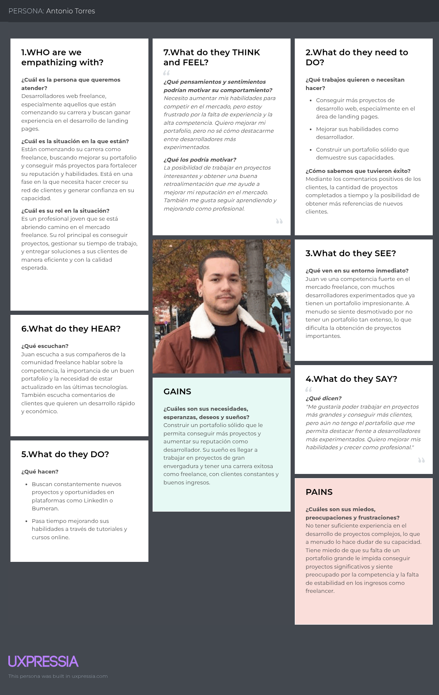
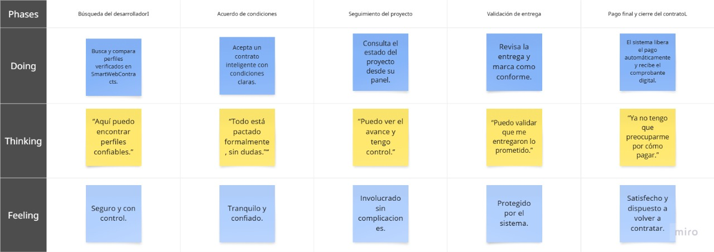

# Informe de Trabajo Final

**Universidad Peruana de Ciencias Aplicadas**  
**Ingenieria de Software**  
**Ciclo 08**

**Código del curso: 1ASI0728**  
**Curso: Arquitecturas De Software Emergentes**  
**NRC: 4281**

**Profesor: Rojas Malasquez, Royer Edelwer**

**Startup: Tarket**

**Producto: Tarket Contracts**

### Relación de integrantes:

|      Apellidos y Nombres       |   Código   |
|:------------------------------:|:----------:|
| Castilla Pachas, César Antonio | u202218735 |
| Cortés Casas, Joaquin Marcelo  | u202114545 |
|   Diaz Silva, Fernando Josué   | u202112722 |
| Jorge Arévalo, Ramón Alejandro | u20221D126 |

**Abril, 2025**

---

## Registro de Versiones del Informe

| **Versión** | **Fecha**  | **Autor**                                                                                               | **Descripción de Modificación**                                                                                                                                                 |
|-------------|------------|---------------------------------------------------------------------------------------------------------|---------------------------------------------------------------------------------------------------------------------------------------------------------------------------------|
| 1.0         | 15/04/2025 | Cortés Casas, Joaquín Marcelo                                                                           | Creación del informe. Adición de carátula y tabla de contenidos.                                                                                                                |
| 1.1         | 18/04/2025 | Castilla Pachas, César Antonio                                                                          | Adición del Startup Profile y Solution Profile.                                                                                                                                 |
| 1.2         | 23/04/2025 | Diaz Silva, Fernando Josué   Jorge Arévalo, Ramón Alejandro                                         | Adición del capítulo II.                                                                                                                                                        |
| 1.3         | 24/04/2025 | Castilla Pachas, César Antonio   Cortés Casas, Joaquin Marcelo   Jorge Arévalo, Ramón Alejandro | Adición de User Stories, Product Backlog, To-Be Scenario Mapping, Impact Mapping, Strategic Level Atribute Driven Design, Event Storming, Context Mapping y User Flow Modeling. |
| 1.4         | 25/04/2025 | Castilla Pachas, César Antonio   Cortés Casas, Joaquin Marcelo   Jorge Arévalo, Ramón Alejandro                                                                          | Adición de Domain Message Flow Modelings, Bounded context canvases y Software Architecture diagrams.                                                                            |

---

## Project Report Collaboration Insights
### URL del repositorio en la organización GitHub
[Enlace al repositorio del informe en GitHub](https://github.com/SolucionesIoT-Grupo-IoTInnovators/report/tree/develop)

### Actividades de elaboración del informe
#### TB1:

**Descripción de las actividades realizadas:**
- **Castilla Pachas, César Antonio:** Creación del Startup Profile, Solution Profile, Segmentos objetivo, To-Be Scenario Mapping, Impact Mapping y Strategic-Level Attribute-Driven Design.
- **Cortés Casas, Joaquin Marcelo:** Creación de User Stories, Product Backlog, Bounded Context Canvases y diagramas de Software Architecture.
- **Diaz Silva, Fernando Josué:** Creación de tabla de competidores, Diseño de entrevistas, Ubiquitous Language y As-Is Scenario Mapping.
- **Jorge Arévalo, Ramón Alejandro:** Creación de User Personas, User Task Matrix, User Journey Mapping, Empathy Mapping y la mayor parte de Strategic-Level Domain-Driven Design.

**Evidencia de colaboración y commits en GitHub del reporte:**

---

## Contenido

**Tabla de contenidos**

- [Student Outcome](#student-outcome)

- [Capítulo I: Introducción](#capítulo-i-introducción)
    - [1.1. Startup Profile](#11-startup-profile)
        - [1.1.1. Descripción de la Startup](#111-descripción-de-la-startup)
        - [1.1.2. Perfiles de integrantes del equipo](#112-perfiles-de-integrantes-del-equipo)
    - [1.2. Solution Profile](#12-solution-profile)
        - [1.2.1. Antecedentes y problemática](#121-antecedentes-y-problemática)
        - [1.2.2. Lean UX Process](#122-lean-ux-process)
            - [1.2.2.1. Lean UX Problem Statements](#1221-lean-ux-problem-statements)
            - [1.2.2.2. Lean UX Assumptions](#1222-lean-ux-assumptions)
            - [1.2.2.3. Lean UX Hypothesis Statements](#1223-lean-ux-hypothesis-statements)
            - [1.2.2.4. Lean UX Canvas](#1224-lean-ux-canvas)
    - [1.3. Segmentos objetivo](#13-segmentos-objetivo)

- [Capítulo II: Requirements Elicitation & Analysis](#capítulo-ii-requirements-elicitation--analysis)
    - [2.1. Competidores](#21-competidores)
        - [2.1.1. Análisis competitivo](#211-análisis-competitivo)
        - [2.1.2. Estrategias y tácticas frente a competidores](#212-estrategias-y-tácticas-frente-a-competidores)
    - [2.2. Entrevistas](#22-entrevistas)
        - [2.2.1. Diseño de entrevistas](#221-diseño-de-entrevistas)
        - [2.2.2. Registro de entrevistas](#222-registro-de-entrevistas)
        - [2.2.3. Análisis de entrevistas](#223-análisis-de-entrevistas)
    - [2.3. Needfinding](#23-needfinding)
        - [2.3.1. User Personas](#231-user-personas)
        - [2.3.2. User Task Matrix](#232-user-task-matrix)
        - [2.3.3. User Journey Mapping](#233-user-journey-mapping)
        - [2.3.4. Empathy Mapping](#234-empathy-mapping)
        - [2.3.5. As-is Scenario Mapping](#235-as-is-scenario-mapping)
    - [2.4. Ubiquitous Language](#24-ubiquitous-language)

- [Capítulo III: Requirements Specification](#capítulo-iii-requirements-specification)
    - [3.1. To-Be Scenario Mapping](#31-to-be-scenario-mapping)
    - [3.2. User Stories](#32-user-stories)
    - [3.3. Impact Mapping](#33-impact-mapping)
    - [3.4. Product Backlog](#34-product-backlog)

- [Capítulo IV: Strategic-Level Software Design](#capítulo-iv-strategic-level-software-design)
    - [4.1. Strategic-Level Attribute-Driven Design](#41-strategic-level-attribute-driven-design)
        - [4.1.1. Design Purpose](#411-design-purpose)
        - [4.1.2. Attribute-Driven Design Inputs](#412-attribute-driven-design-inputs)
            - [4.1.2.1. Primary Functionality (Primary User Stories)](#4121-primary-functionality-primary-user-stories)
            - [4.1.2.2. Quality attribute Scenarios](#4122-quality-attribute-scenarios)
            - [4.1.2.3. Constraints](#4123-constraints)
        - [4.1.3. Architectural Drivers Backlog](#413-architectural-drivers-backlog)
        - [4.1.4. Architectural Design Decisions](#414-architectural-design-decisions)
        - [4.1.5. Quality Attribute Scenario Refinements](#415-quality-attribute-scenario-refinements)
    - [4.2. Strategic-Level Domain-Driven Design](#42-strategic-level-domain-driven-design)
        - [4.2.1. EventStorming](#421-eventstorming)
        - [4.2.2. Candidate Context Discovery](#422-candidate-context-discovery)
        - [4.2.3. Domain Message Flows Modeling](#423-domain-message-flows-modeling)
        - [4.2.4. Bounded Context Canvases](#424-bounded-context-canvases)
        - [4.2.5. Context Mapping](#425-context-mapping)
    - [4.3. Software Architecture](#43-software-architecture)
        - [4.3.1. Software Architecture System Landscape Diagram](#431-software-architecture-system-landscape-diagram)
        - [4.3.2. Software Architecture Context Level Diagrams](#432-software-architecture-context-level-diagrams)
        - [4.3.3. Software Architecture Container Level Diagrams](#433-software-architecture-container-level-diagrams)
        - [4.3.4. Software Architecture Deployment Diagrams](#434-software-architecture-deployment-diagrams)

- [Conclusiones](#conclusiones)
    - [Conclusiones y recomendaciones](#conclusiones-y-recomendaciones)

- [Bibliografia](#bibliografia)

- [Anexos](#anexos)

---

## Student Outcome
El curso contribuye al cumplimiento del Student Outcome ABET:

**ABET – EAC - Student Outcome 3**

Criterio: Capacidad de comunicarse efectivamente con un rango de audiencias.

En el siguiente cuadro se describe las acciones realizadas y enunciados de conclusiones por parte del grupo, que permiten sustentar el haber alcanzado el logro del ABET – EAC - Student Outcome 3.

| **Criterio específico**                                                                                                                                                               | **Acciones realizadas**                                                                                                                                                                                                                                                                                                                                                                                                                                                                                                                                                                                                                                                                                                                                                                                                                                                                                                                                                                                                                                                                                                                                                                                                                                                                                                                                                                                                                                                                                                                                                                                                      | **Conclusiones** |
|---------------------------------------------------------------------------------------------------------------------------------------------------------------------------------------|------------------------------------------------------------------------------------------------------------------------------------------------------------------------------------------------------------------------------------------------------------------------------------------------------------------------------------------------------------------------------------------------------------------------------------------------------------------------------------------------------------------------------------------------------------------------------------------------------------------------------------------------------------------------------------------------------------------------------------------------------------------------------------------------------------------------------------------------------------------------------------------------------------------------------------------------------------------------------------------------------------------------------------------------------------------------------------------------------------------------------------------------------------------------------------------------------------------------------------------------------------------------------------------------------------------------------------------------------------------------------------------------------------------------------------------------------------------------------------------------------------------------------------------------------------------------------------------------------------------------------|----------------|
| Comunica oralmente sus ideas y/o resultados con objetividad a público de diferentes especialidades y niveles jerarquicos, en el marco del desarrollo de un proyecto en ingeniería.    | Castilla Pachas, César Antonio TB1 Durante el desarrollo del proyecto he podido comunicar mis ideas de fomra clara y objetiva, tanto en aspectos técnicos como funcionales, ademas he adaptado mi forma de explicar segun el publico, ya sea ante compañeros del proyecto o personas de cualquier otra parte, usando ejemplos y lenguaje sencillo cunado fuera necesario. TP1 Lorem ipsum dolor sit amet. TB2 Lorem ipsum dolor sit amet. TF1 Lorem ipsum dolor sit amet.  Cortés Casas, Joaquin Marcelo TB1 Lorem ipsum dolor sit amet. TP1 Lorem ipsum dolor sit amet. TB2 Lorem ipsum dolor sit amet. TF1 Lorem ipsum dolor sit amet.  Diaz Silva, Fernando Josué TB1 Durante los avances y resultados del proyecto logre comunicar de forma oral mis ideas de manera objetiva y estructurada. Me asegure de explicar tanto los conecptos tecnicos como los beneficios del proyecto, adaptando mi lenguaje para que fuera comprensible para cualquier persona. TP1 Lorem ipsum dolor sit amet. TB2 Lorem ipsum dolor sit amet. TF1 Lorem ipsum dolor sit amet.  Jorge Arévalo, Ramón Alejandro TB1 En esta entrega, he desarrollado los puntos de User Personas, User Task Matrix, Journey Mappings y Empathy Mappings, lo que me ha permitido entender y explicar el perfil de los segmentos objetivo a la que va a ir dirigida la aplicación. TP1 Lorem ipsum dolor sit amet. TB2 Lorem ipsum dolor sit amet. TF1 Lorem ipsum dolor sit amet.           | Lorem ipsum dolor sit amet.               |
| Comunica en forma escrita ideas y/o resultados con objetividad a público de diferentes especialidades y niveles jerarquicos, en el marco del desarrollo de un proyecto en ingeniería. | Castilla Pachas, César Antonio TB1 A lo largo del proyecto he comunicado por escrito nuestras ideas y resultados de manera clara y objetiva, tambien he redactado documentos tecnicos y explicativos adaptados a publicos de distintas especialidades, desde informes de arquitectura hasta resumenes funcionales. TP1 Lorem ipsum dolor sit amet. TB2 Lorem ipsum dolor sit amet. TF1 Lorem ipsum dolor sit amet.  Cortés Casas, Joaquin Marcelo TB1 Lorem ipsum dolor sit amet. TP1 Lorem ipsum dolor sit amet. TB2 Lorem ipsum dolor sit amet. TF1 Lorem ipsum dolor sit amet.  Diaz Silva, Fernando Josué TB1 Durante el proyecto redacte informes y entregables donde presente ideas y resultados de fomra clara, objetiva y organizada. Donde adapte el nivel de detalle y el lenguaje segun el publico, asegurandome de que tanto especialistas tecnicos como profesionales pudieran comprender el alcance de esta solución. TP1 Lorem ipsum dolor sit amet. TB2 Lorem ipsum dolor sit amet. TF1 Lorem ipsum dolor sit amet.  Jorge Arévalo, Ramón Alejandro TB1 En esta entrega, desarrollé los puntos de Event Storming, Candidate Context Discovery, Domain Message Flow Modelings y Context Mapping, lo cual me ha permitido identificar las bases del diseño de la arquitectura de nuestra aplicación, con el enfoque de Domain-Driven Design. TP1 Lorem ipsum dolor sit amet. TB2 Lorem ipsum dolor sit amet. TF1 Lorem ipsum dolor sit amet.   | Lorem ipsum dolor sit amet.               |

---

# Capítulo I: Introducción

## 1.1. Startup Profile

### 1.1.1. Descripción de la Startup

**SmartWebContracts** es una startup universitaria formada por estudiantes de tecnología con interés en aplicar **contratos inteligentes en entornos reales** para resolver problemas de confianza y transparencia en el desarrollo de sitios web. Nuestra propuesta central gira en torno a la creación de una **plataforma descentralizada** que permite automatizar acuerdos entre desarrolladores web y sus clientes mediante **blockchain**, garantizando así el cumplimiento del servicio, la seguridad del pago, y la generación de un comprobante digital como evidencia de ejecución.

####  Misión:
Desarrollar soluciones tecnológicas basadas en blockchain que automaticen los acuerdos de servicios digitales, promoviendo la **transparencia, confianza y equidad** en la contratación de profesionales independientes del desarrollo web.

####  Visión:
Ser reconocidos como una **startup innovadora** en el desarrollo de herramientas digitales seguras para freelancers, fomentando el uso de tecnologías descentralizadas como blockchain en Latinoamérica y más allá.

### 1.1.2. Perfiles de integrantes del equipo

| Foto                                                                                                                              | Nombre completo                   | Código     | Carrera                | Resumen                                                                                                                                                                                                                                                                            |
|-----------------------------------------------------------------------------------------------------------------------------------|-----------------------------------|------------|------------------------|------------------------------------------------------------------------------------------------------------------------------------------------------------------------------------------------------------------------------------------------------------------------------------|
|  | **César Antonio Castilla Pachas** | u202218735     | Ingenieria de software | Tengo 21 años y estudió la carrera de Ingeniería de Software en la Universidad Peruana de Ciencias Aplicadas. Me encanta crear páginas web y dar soluciones creativas, soy una persona responsable y puntual. Además, me encanta trabajar en equipo. Cada día me gusta aprender algo nuevo y poder ampliar mis conocimientos.|
|                                                                          | **Joaquín Marcelo Cortés Casas**  | u202114545 | Ingeniería de Software | Me llamo Joaquín, cuento con amplia experiencia previa liderando múltiples equipos de trabajo, buscando un buen nivel de compromiso y enfoque en la calidad del producto final. Actualizo constantemente mis conocimientos de software probando distintas tecnologías innovadoras. |
|                                                                        | **Fernando Josué Diaz Silva**     | u202112722     | Ingeniería de Software | Soy Fernando Diaz, tengo 21 años, me apasiona la tecnología, actualmente estudio la carrera de ingeniería de software en la Universidad Peruana de Ciencias Aplicadas(UPC). A lo largo de la carrera he desarrollado distintas habilidades, mi principal enfoque en esta carrera parte del software como tal y el ámbito empresarial, para lo cual planeo realizar un MBA. Soy una persona proactiva, responsable y disciplinada. Estoy preparado para desarrollar un buen trabajo junto a mi equipo y aplicar todo el conocimiento adquirido a lo largo de mi carrera.                                                                                                                                                                                                                                                                            |
|                                                                            | **Ramón Alejandro Jorge Arévalo**                          | u20221D126     | Ingeniería de Software | Mi nombre es Ramón, tengo 22 años y me encuentro estudiando la carrera de Ingeniería de Software en la UPC. Domino una gran variedad de lenguajes de programación, patrones de diseño y frameworks de desarrollo. Me considero una persona muy responsable, proactiva y capaz de trabajar en equipo y aportar al desarrollo de un proyecto de software.          |

---

## 1.2. Solution Profile

### 1.2.1. Antecedentes y Problemática

#### Enunciado del Problema
Existe una **falta de confianza en la contratación de servicios de desarrollo web**, donde los clientes temen no recibir el servicio prometido, y los desarrolladores temen no ser remunerados. Esto genera fricciones, sobrecostos, y pérdida de oportunidades para ambos.

| Clave | Pregunta | Respuesta                                                                                                 |
|-------|----------|-----------------------------------------------------------------------------------------------------------|
| **Who** | ¿Quiénes están involucrados? | Desarrolladores web y Profesionales que buscan crear un portafolio digital.                               |
| **What** | ¿Qué ocurre? | Se generan riesgos de fraude, falta de pago o incumplimiento en acuerdos de servicios web.                |
| **Where** | ¿Dónde ocurre? | En entornos digitales, principalmente redes sociales, plataformas independientes o acuerdos directos.     |
| **When** | ¿Cuándo ocurre? | Al contratar desarrolladores web por fuera de plataformas intermediarias.                                   |
| **Why** | ¿Por qué es un problema? | Porque no hay garantías legales ni mecanismos automáticos de verificación.                                |
| **How** | ¿Cómo se presenta? | A través de entregas fallidas, impagos o disputas entre las partes.                                       |
| **How Much** | ¿Qué tanto afecta? | Impacta directamente en la reputación de los desarrolladores y en la pérdida económica para ambas partes. |

---

### 1.2.2. Lean UX Process

#### 1.2.2.1. Lean UX Problem Statements
**Problem Statement 1**  
Se ha identificado que los desarrolladores web enfrentan desafíos importantes para garantizar el pago de sus servicios una vez entregado el producto final. La ausencia de mecanismos automatizados de verificación y pago genera desconfianza, especialmente cuando se trabaja fuera de plataformas intermediarias. Esto provoca frustración, riesgo de impago y limita el crecimiento de los profesionales independientes. Por lo tanto, se reconoce la necesidad de desarrollar un sistema descentralizado que asegure el cumplimiento del contrato y la liberación del pago únicamente cuando el cliente confirme que el servicio fue entregado correctamente o cuando el sistema lo valide automáticamente.

**¿Cómo podemos garantizar que los desarrolladores reciban el pago justo y oportuno por sus servicios sin depender de intermediarios, utilizando tecnologías descentralizadas?**

---

**Problem Statement 2**  
Por otro lado, se observa que muchos clientes que contratan servicios de desarrollo de páginas web no tienen la certeza de que recibirán un producto funcional o conforme a lo pactado. Las contrataciones informales y la falta de evidencia sobre el cumplimiento generan desconfianza, pérdida de tiempo y dinero. Además, no existe un mecanismo claro para verificar el estado de entrega ni para contar con una prueba digital de que el servicio se ha realizado. Por ello, se plantea la necesidad de contar con un sistema que permita validar de forma automatizada el estado del servicio y que brinde al cliente una prueba irrefutable de que se cumplió lo acordado, reduciendo así el riesgo percibido y fomentando relaciones comerciales más seguras.

**¿Cómo podemos ofrecer a los clientes una forma confiable y automatizada de validar la entrega de servicios web freelance y respaldar su cumplimiento mediante evidencia digital?**

---

#### 1.2.2.2. Lean UX Assumptions

#### • Business Assumptions

**Necesidad del mercado:**  
Creemos que tanto los desarrolladores web como sus clientes enfrentan desafíos al momento de contratar y entregar servicios digitales de forma segura y transparente. Los desarrolladores buscan garantías de pago tras la entrega, mientras que los clientes desean recibir productos funcionales antes de liberar el dinero. Actualmente, la informalidad de estos acuerdos, sumada a la falta de evidencia de cumplimiento, genera desconfianza en ambas partes.

**Solución integral:**  
Suponemos que el problema de la falta de garantías en servicios freelance puede ser mitigado mediante una **plataforma basada en contratos inteligentes en Ethereum**, que actúe como intermediario automático e imparcial. Esta plataforma validará el cumplimiento del servicio y ejecutará el pago automáticamente cuando se cumplan las condiciones predefinidas. Adicionalmente, generará un **comprobante digital** como prueba de cumplimiento.

**Clientes iniciales:**  
Nuestros clientes estarán divididos en dos segmentos:

- **Desarrolladores Web:** Profesionales que ofrecen servicios de desarrollo de landing pages o portafolios web y desean un sistema justo, transparente y automático para asegurar el pago.
- **Profesionales que buscan crear un portafolio digital** Personas que necesitan un sitio web funcional y desean tener garantía de cumplimiento antes de pagar, sin depender de plataformas intermediarias costosas.

**Propuesta de valor:**  
El valor principal de SmartWebContracts radica en brindar una solución descentralizada y segura para contratar servicios de desarrollo. Los contratos inteligentes garantizan transparencia y cumplimiento, mientras que la generación de comprobantes digitales permite certificar el trabajo realizado. Los beneficios clave incluyen:

- Protección automática para ambas partes durante la contratación.
- Reducción de conflictos y riesgo de fraude.
- Pago justo, liberado solo tras validación de cumplimiento.
- Evidencia digital verificable como respaldo profesional.

**Estrategia de adquisición:**  
Captaremos usuarios a través de comunidades de freelancers, grupos de desarrolladores, plataformas educativas, foros de criptomonedas y redes sociales. Se realizarán campañas piloto y demos con estudiantes y profesionales del desarrollo web. Además, se impulsará la adopción del sistema mediante **tutoriales sobre contratos inteligentes y wallets** para facilitar el onboarding.

**Principales riesgos:**
- Baja adopción por desconocimiento del uso de wallets o blockchain.
- Fallos en la validación automática del cumplimiento del servicio.
- Rechazo por parte de usuarios tradicionales no familiarizados con Web3.

**Mitigación de riesgos:**  
Se mitigarán mediante educación en el uso de wallets y contratos inteligentes, diseño de interfaz amigable y desarrollo incremental de validaciones automatizadas. Se incluirán también mecanismos de reclamo o evaluación secundaria por parte del cliente en los primeros lanzamientos.

#### •  User Assumptions

**¿Quién es el usuario?**
- **Desarrolladores web:** Jóvenes estudiantes, egresados o profesionales que ofrecen servicios de diseño web y buscan una forma segura y profesional de ser contratados y cobrar por sus servicios.
- **Profesionales que buscan crear un portafolio digital:** Personas que requieren una presencia digital rápida y profesional, como landing pages o portafolios.

**¿Dónde encaja nuestro producto?**
- En la rutina profesional: como una herramienta que les asegura el pago de su trabajo al entregar el servicio según lo pactado.
- En el proceso de contratación de clientes: como una garantía de que recibirán el producto antes de liberar el dinero.

**Problemas identificados y soluciones propuestas:**
- **Riesgo de impago al desarrollador web:**
    - *Solución:* contrato inteligente que bloquea el pago y lo libera solo si el servicio es entregado correctamente.
- **Dudas del cliente sobre la entrega del servicio:**
    - *Solución:* validación automática del servicio y generación de comprobante digital en blockchain.

**¿Cuándo y cómo se usa nuestro producto?**
- **Desarrollador web:** activan un contrato inteligente al iniciar el proyecto, configuran las condiciones, y al concluir, validan la entrega para liberar el pago.
- **Clientes:** depositan el pago en un contrato inteligente, reciben notificación cuando el servicio ha sido validado, y obtienen el acceso final + ticket digital del cumplimiento.

**Características importantes:**
- Contrato inteligente con condiciones personalizadas.
- Validación automática (por sistema o cliente).
- Liberación de pago vía blockchain (Ethereum, Trust Wallet).
- Comprobante digital de cumplimiento.
- Interfaz web accesible, clara y segura.

**Aspecto y comportamiento del producto:**
- **UI:** diseño moderno y minimalista compatible con navegadores y dispositivos móviles.
- **UX:** intuitiva, con guía paso a paso para contratación, seguimiento y validación.
- **Disponibilidad:** 24/7, sin necesidad de intervención de terceros.

**Features principales:**
- Registro y autenticación de clientes y desarrolladores web.
- Creación de contratos inteligentes personalizados.
- Integración con wallets Web3 (ej. Trust Wallet).
- Validación automatizada de cumplimiento.
- Emisión de ticket digital con hash en blockchain.
- Historial de contratos y reputación de desarrolladores web.
---

#### 1.2.2.3. Lean UX Hypothesis Statements

En relación con los segmentos objetivos definidos en SmartWebContracts, se presentan las siguientes hipótesis:

#### • Hipótesis para Desarrolladores Web:

Creemos que, al brindar a los desarrolladores una plataforma respaldada por contratos inteligentes que garantice el pago automático una vez validado el cumplimiento del servicio, se incrementará su seguridad, motivación y profesionalismo al momento de aceptar proyectos freelance.

Sabremos que hemos tenido éxito cuando al menos el 80% de los desarrolladores manifiesten sentirse más seguros al usar el sistema y se observe una tasa de finalización de proyectos superior al 90%, verificado mediante análisis de uso y encuestas post-proyecto.

#### • Hipótesis para Profesionales que buscan crear un portafolio digital:

Creemos que, al ofrecer a los profesionales una solución automatizada para contratar desarrolladores con validación de entrega y generación de comprobante digital, se incrementará la confianza y disminuirá la incertidumbre al momento de solicitar un servicio a uno o a un grupo de desarrolladores web.

Sabremos que hemos tenido éxito cuando más del 50% de los clientes contraten nuevamente a través de la plataforma y menos del 5% presenten reclamos o insatisfacción en la entrega, medido por métricas del sistema y encuestas de satisfacción.

#### • Hipótesis de Integración Tecnológica (Blockchain + Validación):

Creemos que, al integrar tecnología blockchain (Ethereum) con wallets Web3 y validaciones automáticas de cumplimiento, se logrará un proceso fluido y descentralizado que reduzca la necesidad de intervención humana o plataformas intermediarias.

Sabremos que hemos tenido éxito cuando el 95% de los contratos ejecutados se completen sin intervención manual, y al menos el 85% de los usuarios puedan utilizar correctamente el sistema desde su primera experiencia, verificado mediante pruebas piloto y métricas de adopción.

#### • Hipótesis de Viralidad y Reputación Profesional:

Creemos que una experiencia positiva al usar la plataforma, sumada a la generación de comprobantes digitales verificables en blockchain, incentivará tanto a desarrolladores como a profesionales a compartir y recomendar el sistema.

Sabremos que hemos tenido éxito cuando al menos el 30% de los nuevos usuarios provengan de referencias directas y más del 70% de los comprobantes digitales sean utilizados como evidencia profesional, medido por el sistema de tracking del ticket digital y portafolios públicos.

#### 1.2.2.4. Lean UX Canvas

| **Business Problem** | **Solutions** | **Business Outcomes** |
|----------------------|---------------|------------------------|
| • Alta desconfianza entre clientes y desarrolladores web debido a contratos informales y falta de garantías.   • Riesgo de impago para el desarrollador web una vez entregado el servicio.   • Imposibilidad del cliente de verificar si el servicio entregado cumple con lo pactado. | • Plataforma web con contratos inteligentes que gestionan el acuerdo y pago entre las partes.   • Validación automática del cumplimiento del servicio antes de liberar el pago.   • Generación de un comprobante digital en blockchain como evidencia del servicio completado.   • Integración con wallets como Trust Wallet para transferencias seguras en Ethereum. | • Aumento en la confianza y transparencia en los procesos de contratación freelance.   • Reducción de disputas entre cliente y desarrollador.   • Pagos automatizados y seguros sin necesidad de intermediarios.   • Fortalecimiento de la reputación profesional mediante tickets digitales verificables. |

| **Users** | **User Outcomes & Benefits** |
|-----------|------------------------------|
| • Desarrolladores web que ofrecen servicios de creación de landing pages o portafolios.   • Profesionales que requieren una presencia digital rápida y profesional, como landing pages o portafolios. | • Mayor seguridad y confianza en el proceso de contratación.   • Reducción del riesgo de estafa o incumplimiento.   • Evidencia digital del trabajo realizado (comprobante).   • Interacción fluida mediante una interfaz web simple, accesible y descentralizada. |

| **Hypotheses** | **What's the most important thing we need to learn first?** | **What's the least amount of work we need to do to learn the next most important thing?** |
|----------------|-------------------------------------------------------------|---------------------------------------------------------------------------------------------|
| • Creemos que ofrecer un sistema descentralizado de contratación mediante contratos inteligentes permitirá reducir el riesgo de fraude y aumentar la confianza.   • Creemos que automatizar el proceso de validación del cumplimiento antes del pago mejorará la experiencia tanto para el cliente como para el desarrollador web. | • Validar si los desarrolladores conocen o están dispuestos a aprender sobre el uso de wallets Web3 y contratos inteligentes.   • Entender qué tipo de evidencia consideran válida los clientes para aceptar un servicio como "cumplido". | • Realizar encuestas rápidas a desarrolladores web sobre medios de pago actuales y problemas al cobrar.   • Entrevistar a clientes que hayan contratado desarrolladores web y recopilar casos donde hubo disputas o incumplimientos. |

---

## 1.3. Segmentos Objetivo

Hemos sido diseñado para atender a dos segmentos objetivos bien definidos, ambos con necesidades concretas y complementarias dentro del proceso de contratación de servicios digitales. A continuación, se describe de manera detallada el perfil de cada uno:

### Segmento 1: Profesionales que buscan crear un portafolio digital

Este segmento está conformado por profesionales independientes, egresados, emprendedores y trabajadores creativos que necesitan construir su presencia digital para proyectar su identidad profesional, ya sea a través de un portafolio web, una landing page o una página personal. Muchos de ellos no cuentan con conocimientos técnicos en desarrollo web, por lo que recurren a desarrolladores web que les ayuden a materializar su imagen profesional en línea.

Su principal motivación es contar con una página funcional, visualmente atractiva y alineada a su propósito personal o laboral. Sin embargo, al tratarse de contrataciones informales o directas, estos profesionales enfrentan inseguridad respecto al cumplimiento del servicio, ya que no siempre hay un mecanismo que garantice la entrega del producto o que actúe como respaldo en caso de incumplimiento. Es por ello que buscan una alternativa más confiable y segura que les permita contratar sin temor a ser estafados y con evidencia de que el producto ha sido entregado correctamente.

### Segmento 2: Desarrolladores web

Este segmento incluye a estudiantes, egresados y profesionales técnicos dedicados al desarrollo web, especialmente aquellos que ofrecen servicios como la creación de landing pages y portafolios. Muchos de ellos utilizan redes sociales, comunidades en línea o referencias personales para conseguir clientes, pero enfrentan constantes dificultades para garantizar el pago justo por sus servicios.

Los desarrolladores de este segmento valoran herramientas que les permitan formalizar el acuerdo con el cliente sin necesidad de recurrir a plataformas costosas que cobran altas comisiones. Les interesa trabajar en entornos confiables que aseguren la recepción del pago únicamente después de haber cumplido con lo pactado. Asimismo, les resulta valioso contar con un comprobante digital que respalde su trabajo y que pueda ser usado como parte de su reputación profesional.

---

## Capítulo II: Requirements Elicitation & Analysis

## 2.1. Competidores

A continuación se presentan tres competidores relevantes que ofrecen soluciones similares o complementarias al modelo de SmartWebContracts:

| *Nombre del Competidor* | *Descripción*                                                                                                         | *Enlace*                                |
|---------------------------|-------------------------------------------------------------------------------------------------------------------------|-------------------------------------------|
| *Upwork*                | Plataforma global para contratar freelancers, que actúa como intermediario en pagos y entregas.                         | [https://www.upwork.com](https://www.upwork.com) |
| *Braintrust*            | Red descentralizada para conectar freelancers con empresas mediante tecnología blockchain, sin comisiones.             | [https://www.usebraintrust.com](https://www.usebraintrust.com) |
| *LaborX*             | Plataforma freelance basada en blockchain que conecta a freelancers con clientes mediante contratos inteligentes y pagos en criptomonedas.              | [https://laborx.com](https://laborx.com) |

#### 2.1.1. Análisis competitivo

<table border="1" cellspacing="0" cellpadding="6">

<!-- Título -->
<tr>
  <th colspan="6" align="left">Competitive Analysis Landscape</th>
</tr>

<!-- Propósito del análisis -->
<tr>
  <td rowspan="2"><strong>¿Por qué llevar a cabo este análisis?</strong></td>
  <td colspan="5">Para comprender cómo se posiciona SmartWebContracts frente a sus principales competidores, identificando fortalezas, debilidades, oportunidades y amenazas que guíen su estrategia de crecimiento.</td>
</tr>
<tr></tr>

<!-- Cabecera de competidores -->
<tr>
  <td colspan="2"><strong>Competidores</strong></td>
  <td> <strong>SmartWebContracts</strong></td>
  <td> <strong>Upwork</strong></td>
  <td> <strong>Braintrust</strong></td>
  <td> <strong>LaborX</strong></td>
</tr>

<!-- Overview -->
<tr>
  <td rowspan="1"><strong>Perfil</strong></td>
  <td>Overview</td>
  <td>Plataforma Web3 universitaria que automatiza acuerdos entre desarrolladores web y clientes mediante contratos inteligentes en blockchain.</td>
  <td>Marketplace freelance global con comisiones por intermediación y reputación consolidada.</td>
  <td>Plataforma descentralizada de trabajo freelance con gobernanza comunitaria y sin comisiones.</td>
  <td>Plataforma de contratación freelance basada en blockchain que permite acuerdos mediante contratos inteligentes y pagos en cripto.</td>
</tr>

<!-- Perfil de Marketing -->
<tr>
  <td rowspan="3"><strong>Perfil de Marketing</strong></td>
  <td>Ventaja competitiva ¿Qué valor ofrece a los clientes?</td>
  <td>Contratos inteligentes automáticos, validación en blockchain y comprobante digital como evidencia de cumplimiento.</td>
  <td>Acceso a clientes internacionales, protección de pagos y reputación digital.</td>
  <td>Modelo sin comisiones, autogestión vía DAO y enfoque transparente.</td>
  <td>Pagos en cripto, sin intermediarios, libertad contractual entre partes.</td>
</tr>
<tr>
  <td>Mercado objetivo</td>
  <td>Freelancers web y profesionales que buscan presencia digital funcional y segura.</td>
  <td>Freelancers de diversas áreas y empresas globales.</td>
  <td>Empresas tecnológicas medianas y grandes que contratan talento remoto Web3.</td>
  <td>Freelancers y clientes familiarizados con el ecosistema cripto y descentralizado.</td>
</tr>
<tr>
  <td>Estrategias de marketing</td>
  <td>Workshops, contenido educativo sobre Web3, alianzas en universidades y comunidades tech.</td>
  <td>Publicidad pagada, posicionamiento en motores de búsqueda y reviews.</td>
  <td>Promoción comunitaria mediante DAO y presencia en eventos cripto.</td>
  <td>Alianzas con ecosistemas blockchain, recompensas por reputación y visibilidad Web3.</td>
</tr>

<!-- Perfil de Producto -->
<tr>
  <td rowspan="3"><strong>Perfil de Producto</strong></td>
  <td>Productos & Servicios</td>
  <td>Creación de contratos inteligentes personalizados, validación automatizada, emisión de comprobante digital.</td>
  <td>Contratación freelance, resolución de disputas y gestión de proyectos.</td>
  <td>Conexión descentralizada, reputación comunitaria, gobernanza abierta.</td>
  <td>Mercado freelance Web3 con contratos inteligentes preconfigurados y pagos automatizados.</td>
</tr>
<tr>
  <td>Precios & Costos</td>
  <td>Comisión baja por contrato validado, sin intermediarios.</td>
  <td>Comisión entre 5% y 20% por proyecto gestionado.</td>
  <td>Sin comisiones, modelo basado en token.</td>
  <td>Pagos en cripto, sin comisiones por intermediación.</td>
</tr>
<tr>
  <td>Canales de distribución (Web y/o Móvil)</td>
  <td>Web app con integración a Metamask, Trust Wallet y otras wallets Web3.</td>
  <td>Web + App móvil, con sistema de notificaciones y mensajería.</td>
  <td>Plataforma Web3 conectada a DAO y wallets.</td>
  <td>Plataforma Web3 accesible desde navegador y mobile-friendly.</td>
</tr>

<!-- Análisis SWOT -->
<tr>
  <td rowspan="5"><strong>Análisis SWOT</strong></td>
  <td colspan="5">Fortalezas, debilidades, oportunidades y amenazas de la startup y sus competidores principales.</td>
</tr>
<tr>
  <td>Fortalezas</td>
  <td>Descentralización, seguridad, automatización, validez en blockchain, foco educativo.</td>
  <td>Escalabilidad, reputación consolidada, herramientas robustas.</td>
  <td>Modelo sin fees, participación comunitaria, escalabilidad DAO.</td>
  <td>Libertad para establecer condiciones entre partes, visibilidad cripto, foco Web3.</td>
</tr>
<tr>
  <td>Debilidades</td>
  <td>Curva de aprendizaje blockchain, baja adopción inicial, barrera tecnológica.</td>
  <td>Comisiones altas, modelo centralizado, dependencia de la plataforma.</td>
  <td>Complejidad para usuarios nuevos, limitada difusión LATAM.</td>
  <td>Baja adopción general fuera de la comunidad cripto.</td>
</tr>
<tr>
  <td>Oportunidades</td>
  <td>Educación Web3, expansión en LATAM, alianzas académicas.</td>
  <td>Verticalización en nichos freelance.</td>
  <td>Expansión hacia modelos de talento corporativo descentralizado.</td>
  <td>Crecimiento del uso de criptomonedas y plataformas autónomas.</td>
</tr>
<tr>
  <td>Amenazas</td>
  <td>Desinformación tecnológica, resistencia a blockchain, regulación.</td>
  <td>Competencia descentralizada emergente.</td>
  <td>Regulación cripto, saturación de plataformas.</td>
  <td>Volatilidad cripto, posibles bloqueos regulatorios en ciertos países.</td>
</tr>

</table>

#### 2.1.2. Estrategias y tácticas frente a competidores
Nuestras estrategias y tácticas frente a la competencia se enfocan en diferenciar nuestra propuesta mediante el uso de tecnología blockchain y en brindar una experiencia accesible, segura y descentralizada.

- Para hacer frente a plataformas consolidadas como Upwork, nos enfocaremos en ofrecer contratos inteligentes automatizados que aseguren cumplimiento y confianza sin necesidad de intermediarios.
- Aprovecharemos la baja presencia de soluciones Web3 en Latinoamérica ofreciendo una plataforma localizada, con enfoque educativo y pensada para el contexto de freelancers emergentes.
- Frente a las fortalezas de los competidores, nuestra táctica será ofrecer una propuesta más transparente, sin comisiones ocultas, con validación automática y soporte para comprobantes digitales.
- Para abordar debilidades del mercado, nos posicionaremos como una alternativa moderna, descentralizada y especialmente útil para quienes inician su carrera freelance.
- Ante amenazas como la falta de adopción Web3 o cambios regulatorios, implementaremos estrategias de formación continua, acompañamiento al usuario y escalabilidad con tecnologías de bajo costo como soluciones L2 o blockchains más eficientes.

Estas estrategias permitirán que SmartWebContracts se consolide como una opción innovadora y confiable en la contratación de servicios freelance en entornos digitales.

### 2.2. Entrevistas

#### 2.2.1. Diseño de entrevistas

Con el objetivo de comprender a profundidad las necesidades, expectativas, motivaciones y frustraciones de nuestros usuarios potenciales, se diseñaron entrevistas cualitativas semiestructuradas para los dos segmentos objetivo de SmartWebContracts:

---

### Segmento 1: Desarrolladores Web 

*Objetivo de la entrevista:*  
Entender cómo gestionan sus servicios, cómo cobran, qué problemas enfrentan al cerrar acuerdos, y su familiaridad con herramientas Web3.

*Datos demográficos y de contexto a recolectar:*  
- Edad  
- Nivel de estudios  
- Ciudad de residencia  
- Años de experiencia como desarrollador  
- Canales que usan para conseguir clientes  
- Herramientas digitales que utilizan  
- Conocimiento o uso previo de wallets y blockchain  

*Preguntas principales:*  
1. ¿Cuánto tiempo llevas trabajando como desarrollador web?  
2. ¿Cómo sueles conseguir a tus clientes?  
3. ¿Cómo estableces acuerdos de pago? ¿Has tenido problemas para cobrar?  
4. ¿Con qué frecuencia enfrentas retrasos o impagos?  
5. ¿Conoces o has usado alguna vez tecnología blockchain o contratos inteligentes?  
6. ¿Qué tan dispuesto estarías a utilizar una herramienta que automatice estos acuerdos?

*Preguntas complementarias:*  
- ¿Qué importancia le das a tener respaldo o evidencia de cumplimiento de tu trabajo?  
- ¿Qué te generaría más confianza al iniciar un nuevo proyecto con un cliente?  
- ¿Qué canales digitales usas más: WhatsApp, Discord, Telegram, otros?

---

###  Segmento 2: Profesionales que buscan portafolio digital

*Objetivo de la entrevista:*  
Identificar las motivaciones y miedos al contratar servicios de desarrollo web, su experiencia previa, y expectativas de seguridad y cumplimiento.

*Datos demográficos y de contexto a recolectar:*  
- Edad  
- Profesión actual  
- Objetivo del sitio web (marca personal, negocio, CV, etc.)  
- Nivel de conocimiento tecnológico  
- Medios por los que busca desarrolladores  
- Canales de pago preferidos  
- Nivel de confianza al contratar por redes

*Preguntas principales:*  
1. ¿Has contratado alguna vez a un desarrollador web? ¿Cómo fue la experiencia?  
2. ¿Cuál es tu mayor temor al contratar servicios freelance por internet?  
3. ¿Qué tipo de garantías o pruebas necesitas antes de pagar por un servicio digital?  
4. ¿Te sentirías más seguro si el pago solo se libera cuando el servicio se cumple correctamente?  
5. ¿Te resulta familiar el concepto de blockchain o contratos inteligentes?

*Preguntas complementarias:*  
- ¿Qué dispositivos usas normalmente para gestionar tus contrataciones digitales?  
- ¿A qué medios recurres para buscar desarrolladores (grupos, plataformas, contactos)?  
- ¿Qué elementos te harían sentir más seguridad al contratar digitalmente?

---

Este diseño permitirá obtener tanto información *cuantitativa básica* (demográfica y de hábitos), como *cualitativa clave* (objetivos, frustraciones, necesidades), la cual será útil para construir los *arquetipos de usuario* y tomar decisiones sobre el diseño del producto.

#### 2.2.2. Registro de entrevistas

#### 2.2.3. Análisis de entrevistas

### 2.3. Needfinding

Usaremos las herramientas de User Persona, User Task Matrix, User Journey Mapping, Empathy Mapping y As-is Scenario Mapping para tener una visión general de las experiencias de nuestros usuarios.

#### 2.3.1. User Personas

##### User Persona Desarrollador Freelance

##### User Persona Profesional

#### 2.3.2. User Task Matrix

A continuación mostramos la User Task Matrix, en la que podremos observar las tareas más importantes que realizan los segmentos objetivos en sus jornadas normales.

| Task                                       | Desarrollador Freelance (Frecuencia/Importancia) | Profesionales que desea un portafolio digital (Frecuencia/Importancia) |
|--------------------------------------------|-----------------------------------------------|----------------------------------------|
| Búsqueda de nuevos proyectos               | Alta/Alta                                    | Baja/Baja                             |
| Negociación con clientes                   | Alta/Alta                                    | Media/Media                           |
| Gestión de proyectos                       | Alta/Alta                                    | Media/Alta                            |
| Creación de landing pages                  | Alta/Alta                                    | Media/Alta                            |
| Comunicación con clientes                  | Alta/Alta                                    | Media/Media                           |
| Aprendizaje y mejora de habilidades        | Alta/Alta                                    | Baja/Baja                             |
| Desarrollo de aplicaciones web             | Alta/Alta                                    | Baja/Media                            |
| Gestión de pagos y presupuestos            | Media/Media                                  | Alta/Alta                             |
| Planificación de tareas y plazos           | Alta/Alta                                    | Media/Alta                            |
| Evaluación de la satisfacción del cliente  | Media/Media                                  | Alta/Alta                             |
| Mejora de portafolio                       | Alta/Alta                                    | Alta/Alta                             |
| Investigación de nuevas tecnologías        | Alta/Alta                                    | Baja/Baja                             |
| Supervisión de la calidad del trabajo      | Alta/Alta                                    | Baja/Baja                             |
| Asesoría técnica a clientes                | Media/Alta                                   | Baja/Baja                             |
| Implementación de sistemas de gestión      | Baja/Baja                                    | Alta/Alta                             |

#### 2.3.3. User Journey Mapping

En esta sección se exponen los Journey Mappings, explicando las etapas principales del proceso de los segmentos objetivo:

##### User Journey Mapping Desarrollador Freelance

##### User Journey Mapping Profesional

#### 2.3.4. Empathy Mapping

En esta sección se exponen los Empathy Mappings, en los cuales intentamos comprender la situación. los problemas, las necesidades y los retos que enfrenta cada segmento objetivo:

##### Empathy Mapping Desarrollador Freelance

##### Empathy Mapping Profesional

#### 2.3.5. As-is Scenario Mapping  
*Segmento: Desarrollador Web *

Durante la investigación, se realizó un ejercicio de As-is Scenario Mapping para entender el flujo actual de trabajo del usuario objetivo, sus acciones, pensamientos y emociones en cada fase del proceso. Se utilizó una matriz con cuatro filas: Phases, Doing, Thinking y Feeling, y se identificaron áreas positivas , negativas  y desconocidas.

---

###  Positive points:
- *Desarrollo del proyecto*: El usuario suele estar motivado durante esta etapa, ya que disfruta aplicar sus conocimientos y ver avances tangibles.
- *Entrega final*: Confía en su trabajo y siente que el producto tiene valor para el cliente.

###  Negative points:
- *Contacto y acuerdo informal*: No existen mecanismos formales de validación ni registro del acuerdo.
- *Cobro del servicio*: El pago depende de la confianza, y muchos freelancers reportan impagos o demoras frecuentes.
- *Falta de garantía*: No hay forma automática de asegurar el cumplimiento del cliente o proteger al desarrollador.

###  Blank points:
- “¿Será un cliente serio?” → Es necesario investigar qué elementos generan confianza inicial en un posible cliente.
- “¿Le gustará el diseño?” → Se requiere entender cómo el freelancer mide la aceptación del cliente y cómo reacciona a cambios no pactados.
- “¿Me pagará a tiempo?” → Hay que explorar las formas de pago actuales y los problemas más comunes que enfrentan.

---

Este mapeo revela puntos críticos en el flujo actual del desarrollador freelance, que SmartWebContracts busca transformar mediante automatización, evidencia digital y contratos inteligentes.

*Segmento: Profesional que busca un portafolio digital*

Se mapeó el proceso típico de un usuario que necesita contratar un desarrollador freelance para crear su sitio web o portafolio digital. El análisis incluyó fases clave del proceso, sus acciones, pensamientos y emociones, junto con áreas positivas , negativas  y desconocidas .

---

###  Positive points:
- *Entrega del sitio web*: El cliente se siente satisfecho al ver una entrega concreta, especialmente si visualmente cumple con lo que esperaba.

###  Negative points:
- *Búsqueda y contacto inicial*: El proceso es informal y no brinda seguridad. La mayoría lo hace por redes sin referencias verificables.
- *Definición y pago*: No existe garantía ni contrato. Hay riesgo de perder el dinero o de no recibir lo que esperaba.
- *Post-pago*: No hay evidencia de cumplimiento. Si hay problemas, el cliente no tiene cómo reclamar formalmente.

###  Blank points:
- “¿Estará entendiendo bien lo que necesito?” → Es clave saber cómo validan el entendimiento del servicio antes de contratar.
- “¿Y si tengo que reclamar algo después del pago?” → Se debe explorar qué nivel de respaldo busca el cliente tras realizar el pago.
- “No tengo cómo comprobar que me entregará algo útil.” → Necesitamos entender qué criterios usa para confiar en un proveedor digital.

---

Este mapeo evidencia las principales tensiones y vacíos que experimentan los usuarios al contratar desarrolladores informales. SmartWebContracts propone resolver estas fricciones ofreciendo *respaldo digital, validación automática y garantías integradas* mediante tecnología blockchain

#### 2.4. Ubiquitous Language

A continuación, se presenta un glosario con los términos clave que forman parte del lenguaje ubicuo del dominio de SmartWebContracts. Este lenguaje común es utilizado por todos los miembros del equipo, stakeholders y usuarios, con el objetivo de evitar ambigüedades y alinear la comunicación alrededor del problema y la solución propuesta.

| Término (Inglés)            | Término (Español)               | Definición                                                                                   |
|-----------------------------|----------------------------------|----------------------------------------------------------------------------------------------|
| Smart Contract              | Contrato inteligente            | Acuerdo digital autoejecutable entre dos partes que se activa cuando se cumplen ciertas condiciones. Se utiliza para automatizar el cumplimiento de servicios freelance. |
| Freelancer                  | Trabajador independiente         | Profesional que ofrece servicios por proyecto, sin relación de dependencia con una empresa.  |
| Digital Portfolio           | Portafolio digital              | Sitio web que muestra el trabajo, habilidades y experiencia de un profesional de manera visual y estructurada. |
| Service Agreement           | Acuerdo de servicio             | Compromiso pactado entre el cliente y el desarrollador sobre el alcance, tiempos y condiciones del trabajo. |
| Evidence of Delivery        | Evidencia de entrega            | Prueba digital verificable de que el servicio fue realizado conforme a lo pactado. Puede incluir enlaces, hashes en blockchain o tickets de cumplimiento. |
| Dispute Resolution          | Resolución de disputas          | Mecanismo mediante el cual se gestionan desacuerdos entre cliente y desarrollador sobre el cumplimiento del servicio. |
| Verified Payment Release    | Liberación de pago verificada   | Proceso automático que transfiere el dinero al desarrollador solo cuando se valida que el servicio fue entregado correctamente. |
| Web3 Onboarding             | Incorporación a Web3            | Proceso educativo y de soporte para que los usuarios aprendan a utilizar wallets y tecnologías descentralizadas. |
| Digital Trust               | Confianza digital               | Percepción de seguridad, transparencia y cumplimiento que un usuario tiene al contratar o vender un servicio por medios digitales. |
| Reputation System           | Sistema de reputación           | Mecanismo que permite evaluar y mostrar el historial de cumplimiento y calidad de los usuarios dentro de la plataforma. |

---

## Capítulo III: Requirements Specification

## 3.1. To-Be Scenario Mapping
En esta sección se presentan los To-Be Scenario Mapping para cada segmento objetivo donde se reflejarán, a partir de los As-is Scenario Mapping, la experiencia de usuario ideal si se resuelven los puntos de dolor y necesidades. La herramienta empleada para su desarrollo ha sido Miro.

**Segmento 1: Desarrollador Web**

**Segmento 2: Profesionales que buscan portafolio digital**

## 3.2. User Stories

### User Stories

A continuación se presentan las historias de usuario agrupadas por épicas identificadas en el proyecto. Cada historia se ha elaborado siguiendo las buenas prácticas de diseño de User Stories, asegurando trazabilidad con los bounded contexts y los segmentos objetivo definidos. Los criterios de aceptación se expresan en formato Gherkin (Given-When-Then), y se incluyen también historias técnicas necesarias para el backend.

#### Epicas

| Epic / User Story ID | Título | Descripción                                                                                                   |
|----------------------|--------|---------------------------------------------------------------------------------------------------------------|
| E1 | Autenticación inicial | Gestión de autenticación y registro de usuarios para iniciar el uso de la plataforma.                         |
| E2 | Gestión contractual | Creación y seguimiento de contratos inteligentes entre cliente y desarrollador.                               |
| E3 | Seguimiento de reputación | Permite a clientes dejar evaluaciones sobre los desarrolladores contratados.                                  |
| E4 | Gestión de suscripciones | Acceso a funcionalidades avanzadas mediante planes de suscripción.                                            |
| E5 | Gestión de perfiles | Mantenimiento de información personal según el tipo de cuenta.                                                |
| E6 | Notificaciones de contrato | Alertas automáticas del estado de los contratos.                                                              |
| E7 | Revisión de sitios web | Permitir publicar y consultar enlaces web de desarrolladores.                                                 |
| E8 | Landing Page informativa | Visita informativa de la plataforma antes del registro.                                                       |

#### Historias de usuario

| User Story ID | Título | Descripción                                                                                                   | Criterios de Aceptación | Relacionado con (Epic ID) |
|---------------|--------|---------------------------------------------------------------------------------------------------------------|--------------------------|----------------------------|
| US1 | Registro de desarrollador | Como desarrollador web, deseo registrarme y autenticarme de forma segura, para comenzar a usar la plataforma. | **Escenario: Registro exitoso con correo** Given un desarrollador con correo válido When completa el formulario Then se crea la cuenta y se confirma por correo  **Escenario: Registro con wallet Web3** Given un desarrollador con wallet activa When se autentica Then se redirige al dashboard con acceso de desarrollador | E1 |
| US2 | Registro de cliente | Como cliente, deseo crear una cuenta y acceder, para contratar desarrolladores de forma segura.               | **Escenario: Registro exitoso de cliente** Given un nuevo cliente When se registra con sus datos Then accede a la plataforma  **Escenario: Intento de inicio de sesión inválido** Given datos incorrectos When intenta iniciar sesión Then se muestra un mensaje de error | E1 |
| US3 | Crear contrato | Como cliente, deseo crear un contrato inteligente para formalizar la contratación de un desarrollador.        | **Escenario: Contrato creado exitosamente** Given un cliente autenticado When registra términos y wallet del desarrollador Then se genera un contrato en la blockchain  **Escenario: Error por datos inválidos** Given campos vacíos o inválidos When se intenta crear contrato Then el sistema bloquea el envío | E2 |
| US4 | Validar contrato | Como desarrollador web, deseo validar un contrato creado por el cliente, para comenzar a trabajar.            | **Escenario: Validación exitosa del contrato** Given un contrato pendiente When el desarrollador acepta desde su perfil Then el estado del contrato cambia a “activo” | E2 |
| US5 | Dejar reseña | Como cliente, deseo dejar una calificación sobre el desarrollador al finalizar el contrato.                   | **Escenario: Reseña creada exitosamente** Given un contrato finalizado When se completa el formulario Then la reseña aparece en el perfil del desarrollador | E3 |
| US6 | Ver reseñas | Como cliente, deseo ver reseñas previas de un desarrollador antes de contratarlo.                             | **Escenario: Visualización de reseñas** Given un perfil público When el cliente lo visita Then ve un listado de reseñas verificadas | E3 |
| US7 | Suscribirse a plan | Como cliente, deseo suscribirme a un plan para acceder a funcionalidades premium.                             | **Escenario: Suscripción activa** Given datos de pago válidos When se confirma el pago Then se activa el plan premium | E4 |
| US8 | Validar pago (técnico) | Como Developer, deseo validar pagos de suscripciones desde backend para autorizar servicios.                  | **Escenario: Pago confirmado vía API** Given un request de confirmación When la respuesta es válida Then se actualiza el estado de suscripción a “activa” | E4 |
| US9 | Completar perfil desarrollador | Como desarrollador, deseo editar mis datos y añadir enlaces a proyectos.                                      | **Escenario: Perfil actualizado exitosamente** Given un desarrollador autenticado When edita sus datos y guarda Then se muestra el perfil actualizado | E5 |
| US10 | Completar perfil cliente | Como cliente, deseo actualizar mis datos personales.                                                          | **Escenario: Actualización exitosa de cliente** Given un cliente autenticado When edita sus datos Then se confirma el cambio | E5 |
| US11 | Notificación por contrato creado | Como desarrollador, deseo recibir una alerta cuando un cliente me envía un contrato.                          | **Escenario: Alerta generada** Given un contrato nuevo When el cliente lo envía Then se genera notificación automática al desarrollador | E6 |
| US12 | Notificación de contrato finalizado | Como cliente, deseo recibir una notificación cuando un contrato finaliza.                                     | **Escenario: Notificación de fin de contrato** Given un contrato llega a su fin When se cumplen las condiciones Then el sistema notifica al cliente | E6 |
| US13 | Publicar enlace de proyecto | Como desarrollador, deseo compartir un enlace web de mi portafolio.                                           | **Escenario: Enlace publicado exitosamente** Given un desarrollador autenticado When añade el enlace Then este se muestra en su perfil | E7 |
| US14 | Revisar proyecto | Como cliente, deseo revisar el enlace web publicado por un desarrollador.                                     | **Escenario: Acceso exitoso al enlace** Given un cliente autenticado When da clic al enlace Then se abre en una nueva pestaña | E7 |
| US15 | Acceder al sitio web | Como cliente, deseo ver la información del proyecto antes de crear una cuenta.                                | **Escenario: Acceso a landing page** Given un visitante anónimo When ingresa al dominio Then visualiza las secciones públicas informativas | E8 |

### 3.3. Impact Mapping
En esta sección, se plantearon metas de negocio utilizando los criterios SMART para elaborar el Impact Mapping en base a nuestras User Personas y User Stories.

- Segmento 1: Desarrollador Web

- Segmento 2: Profesional que busca portafolio digital

### 3.4. Product Backlog

| Orden | User Story ID | Título                         | Descripción                                                                                            | Story Points |
|-------|----------------|--------------------------------|--------------------------------------------------------------------------------------------------------|--------------|
| 1     | US15           | Acceder al sitio web           | Como cliente, deseo ver la información de la startup antes de crear una cuenta.                         | 1            |
| 2     | US13           | Publicar enlace de proyecto    | Como desarrollador, deseo compartir un enlace web de mi portafolio.                                    | 2            |
| 3     | US14           | Revisar proyecto               | Como cliente, deseo revisar el enlace web publicado por un desarrollador.                              | 2            |
| 4     | US3            | Crear contrato                 | Como cliente, deseo crear un contrato inteligente para formalizar la contratación de un desarrollador. | 5 |
| 5     | US4            | Validar contrato               | Como desarrollador web, deseo validar un contrato creado por el cliente.                               | 3            |
| 6     | US11           | Notificación por contrato creado | Como desarrollador, deseo recibir una alerta cuando un cliente me envía un contrato.                   | 2       |
| 7     | US12           | Notificación de contrato finalizado | Como cliente, deseo recibir una notificación cuando un contrato finaliza.                              | 2     |
| 8     | US5            | Dejar reseña                   | Como cliente, deseo dejar una calificación sobre el desarrollador al finalizar el contrato.            | 3       |
| 9     | US6            | Ver reseñas                    | Como cliente, deseo ver reseñas previas de un desarrollador antes de contratarlo.                      | 2         |
| 10    | US7            | Suscribirse a plan             | Como cliente, deseo suscribirme a un plan para acceder a funcionalidades premium.                      | 3           |
| 11    | US8            | Validar pago (técnico)         | Como Developer, deseo validar pagos de suscripciones desde backend.                                    | 2            |
| 12    | US9            | Completar perfil desarrollador | Como desarrollador, deseo editar mis datos y añadir enlaces a proyectos.                               | 2            |
| 13    | US10           | Completar perfil cliente       | Como cliente, deseo actualizar mis datos personales.                                                   | 2            |
| 14    | US1            | Registro de desarrollador      | Como desarrollador, deseo registrarme y autenticarme para comenzar a usar la plataforma.               | 3        |
| 15    | US2            | Registro de cliente            | Como cliente, deseo crear una cuenta y acceder para contratar desarrolladores.                         | 3            |

---

### Captura del Product Backlog

### Enlace público al Product Backlog

[🔗 Acceder al Product Backlog](https://ejemplo-herramienta.com/product-backlog-public-link)

## Capítulo IV: Strategic-Level Software Design

### 4.1 Strategic-Level Attribute-Driven Design

El enfoque Attribute-Driven Design (ADD) a nivel estratégico se ha aplicado para estructurar la solución de SmartWebContracts como una plataforma de contratación descentralizada que responde a las necesidades clave de transformación digital en el contexto de los servicios freelance. Este proceso permite definir las decisiones arquitectónicas a partir de atributos de calidad y funcionalidades críticas, vinculadas directamente a los objetivos del negocio y las expectativas de los usuarios.

---

#### 4.1.1 Design Purpose

El propósito del proceso de diseño arquitectónico en SmartWebContracts es definir una solución técnica y funcional que responda de manera efectiva a los problemas de confianza, informalidad y falta de garantías en la contratación de servicios de desarrollo web.

A través del uso de **contratos inteligentes**, **validación automática**, y **comprobantes digitales**, la arquitectura busca:

- Garantizar **transparencia y seguridad** para ambas partes (cliente y desarrollador).
- Automatizar el cumplimiento del contrato mediante lógica descentralizada.
- Brindar una experiencia confiable y accesible a usuarios no técnicos.
- Permitir la **escalabilidad** del sistema a medida que se incrementa el número de contratos y usuarios.
- Alinear los componentes tecnológicos con los **objetivos del negocio**, como la reducción de disputas, fidelización de usuarios y posicionamiento en el mercado Web3 de Latinoamérica.

Este proceso de diseño se fundamenta en los principios de **Transformación Digital**, usando blockchain como habilitador tecnológico clave, y considerando los atributos de calidad como **usabilidad, rendimiento, seguridad, disponibilidad** y **mantenibilidad** como impulsores principales de la arquitectura.

#### 4.1.2. Attribute-Driven Design Inputs

El proceso de Attribute-Driven Design (ADD) requiere identificar los elementos clave que condicionan el diseño arquitectónico de la solución. Esta sección recopila los tres tipos principales de inputs: funcionalidades principales (Primary Functionality), escenarios de atributos de calidad (Quality Attribute Scenarios) y restricciones (Constraints), todos los cuales guían las decisiones estructurales de la arquitectura.

---

##### 4.1.2.1. Primary Functionality (Primary User Stories)

Las siguientes funcionalidades fueron seleccionadas por su impacto directo en el flujo principal de la solución y la experiencia de usuario para los segmentos clave.

| Epic / User Story ID | Título                        | Descripción                                                                                          | Criterios de Aceptación                                                                                                                                                    | Relacionado con (Epic ID) |
|----------------------|-------------------------------|------------------------------------------------------------------------------------------------------|-----------------------------------------------------------------------------------------------------------------------------------------------------------------------------|----------------------------|
| US1                  | Registro de desarrollador     | Permite a un desarrollador crear una cuenta con correo o wallet Web3.                               | Given un desarrollador con correo válido When completa el formulario Then se crea la cuenta y se confirma por correo                                                | E1                         |
| US2                  | Registro de cliente           | El cliente puede registrarse para contratar servicios de desarrollo.                                | Given un nuevo cliente When registra sus datos Then accede a funcionalidades básicas de la plataforma.                                                              | E1                         |
| US3                  | Crear contrato                | Formaliza la contratación mediante contrato inteligente.                                             | Given un cliente autenticado When completa los datos Then se genera el contrato en blockchain.                                                                       | E2                         |
| US4                  | Validar contrato              | El desarrollador confirma un contrato antes de empezar.                                              | Given un contrato pendiente When el desarrollador acepta Then el contrato pasa a estado "activo".                                                                    | E2                         |
| US5                  | Dejar reseña                  | El cliente evalúa al desarrollador tras finalizar el contrato.                                       | Given un contrato finalizado When envía una reseña Then se muestra en el perfil del desarrollador.                                                                   | E3                         |
| US6                  | Ver reseñas                   | El cliente revisa la reputación del desarrollador antes de contratar.                                | Given un perfil público When lo visualiza Then accede a reseñas verificadas.                                                                                         | E3                         |
| US13                 | Publicar enlace de proyecto   | El desarrollador publica un enlace a su portafolio o sitio entregado.                               | Given un desarrollador When publica un enlace Then este aparece en su perfil público.                                                                               | E7                         |
| US14                 | Revisar proyecto              | El cliente visualiza el proyecto compartido por el desarrollador.                                   | Given un enlace compartido When el cliente accede Then puede revisar el proyecto entregado.                                                                          | E7                         |

---

##### 4.1.2.2. Quality Attribute Scenarios

A continuación, se presentan los escenarios clave de atributos de calidad que afectan directamente a las decisiones arquitectónicas:

| Atributo    | Fuente             | Estímulo                                      | Artefacto                        | Entorno                 | Respuesta                                                       | Medida                                |
|-------------|--------------------|-----------------------------------------------|----------------------------------|--------------------------|------------------------------------------------------------------|----------------------------------------|
| Usabilidad  | Usuario nuevo       | Accede por primera vez a la plataforma        | Interfaz web                    | Dispositivo móvil o PC   | Muestra instrucciones claras, formularios simples               | Completa el registro en < 5 minutos     |
| Seguridad   | Actor externo       | Intenta modificar un contrato                 | Contrato inteligente            | Red pública              | Rechazo automático del intento                                  | Integridad del contrato inalterada     |
| Disponibilidad | Usuario activo    | Envía un contrato o valida entrega            | Plataforma Web3                 | Alta concurrencia         | El sistema procesa la acción sin errores ni caídas              | Tiempo de respuesta < 2 segundos        |
| Auditabilidad | Auditor o usuario | Solicita evidencia de cumplimiento            | Ticket digital en blockchain    | Fase post-entrega        | Muestra hash verificable del contrato y entrega                 | Evidencia consultable en 100% de casos |
| Escalabilidad | Plataforma         | Aumento de contratos simultáneos              | Smart contract handler          | Escenario de crecimiento | Mantiene estabilidad sin degradar rendimiento                   | +1000 contratos/día sin caídas         |

---

##### 4.1.2.3. Constraints

En esta sección se presentan restricciones críticas que afectan la arquitectura. Estas constraints no son negociables y se han formulado como historias técnicas.

| Technical Story ID | Título                            | Descripción                                                                                      | Criterios de Aceptación                                                                                     | Relacionado con (Epic ID) |
|--------------------|-----------------------------------|--------------------------------------------------------------------------------------------------|----------------------------------------------------------------------------------------------------------------|----------------------------|
| TS1                | Integración con wallets Web3      | La plataforma debe ser compatible con Metamask y Trust Wallet.                                  | Given un usuario When conecta su wallet Then puede autenticarse y firmar contratos.                     | E1                         |
| TS2                | Uso de contratos inteligentes      | El sistema debe usar contratos desplegados en Ethereum u otra red EVM-compatible.               | Given un contrato generado When se firma Then se despliega en red blockchain y queda inmutable.         | E2                         |
| TS3                | Cumplimiento de protección de datos | El sistema debe cumplir con normativas de privacidad (ej. GDPR/LPDP).                          | Given un usuario When solicita eliminar sus datos Then el sistema realiza el borrado correspondiente.   | E5                         |
| TS4                | Plataforma disponible 24/7         | La plataforma debe estar activa todo el día sin caídas operativas.                              | Given usuarios activos When acceden en cualquier horario Then pueden operar sin errores o interrupciones.| E2, E6                     |

---

#### 4.1.3. Architectural Drivers Backlog

El Architectural Drivers Backlog de SmartWebContracts reúne los principales impulsores que guían el diseño de la arquitectura. Estos drivers han sido identificados y priorizados tras el análisis de funcionalidades críticas, atributos de calidad y restricciones innegociables.

Realizamos sesiones colaborativas y un Quality Attribute Workshop para evaluar los elementos de mayor valor para los stakeholders y mayor influencia en las decisiones técnicas. A continuación, se presentan los drivers más relevantes, priorizados desde los de **mayor impacto estratégico y técnico**.

| Driver ID | Título de Driver                  | Descripción                                                                                             | Importancia para Stakeholders | Impacto en Architecture Technical Complexity |
|-----------|-----------------------------------|---------------------------------------------------------------------------------------------------------|-------------------------------|----------------------------------------------|
| D1        | Validación automática del cumplimiento | El sistema debe permitir validar la entrega de servicios sin intervención manual, usando reglas o hash. | High                          | High                                         |
| D2        | Contratos inteligentes inmutables | Los contratos entre cliente y desarrollador deben registrarse y ejecutarse en blockchain.               | High                          | High                                         |
| D3        | Interfaz simple para usuarios no técnicos | La experiencia debe ser comprensible para personas sin conocimiento Web3 (clientes y desarrolladores).  | High                          | Medium                                       |
| D4        | Evidencia digital verificable     | Se debe generar un ticket o comprobante digital en blockchain como prueba del cumplimiento.             | Medium                        | High                                         |
| D5        | Compatibilidad con wallets Web3   | Los usuarios deben poder autenticarse y operar con wallets como Metamask o Trust Wallet.                | Medium                        | Medium                                       |
| D6        | Alta disponibilidad de plataforma | La solución debe estar operativa 24/7 para evitar bloqueos durante validaciones o cobros.               | High                          | Medium                                       |
| D7        | Registro de contratos fallidos o disputados | El sistema debe permitir registrar y consultar incidentes o reclamos por incumplimiento.               | Medium                        | Medium                                       |
| D8        | Protección de datos personales    | Toda la gestión de datos debe alinearse a normativas como GDPR o similares.                             | High                          | Low                                          |

#### 4.1.4. Architectural Design Decisions

Durante el proceso de Quality Attribute Workshop, el equipo de SmartWebContracts evaluó distintos patrones de arquitectura con base en los drivers priorizados en el backlog. Para cada driver se identificaron alternativas viables y se evaluaron sus ventajas y desventajas. Esta evaluación se realizó en función de los atributos de calidad definidos, las restricciones tecnológicas, y los objetivos estratégicos del negocio.

A continuación, se presenta un resumen de las decisiones tomadas, asociadas a los principales drivers, junto con la matriz de evaluación de patrones arquitectónicos.

---

| Driver ID | Título de Driver                  | Pattern 1: Microservicios + API Gateway           | Pattern 2: Arquitectura Modular Monolítica        | Pattern 3: Event-Driven Architecture              |
|-----------|-----------------------------------|--------------------------------------------------|--------------------------------------------------|--------------------------------------------------|
| D1        | Validación automática del cumplimiento | **Pro**: Alta desacoplamiento, escalabilidad **Con**: Alta complejidad inicial | **Pro**: Fácil de implementar y mantener **Con**: Menos flexible ante cambios | **Pro**: Responde bien a acciones asincrónicas como validaciones **Con**: Difícil trazabilidad si no se gestiona correctamente |
| D2        | Contratos inteligentes inmutables | **Pro**: Total trazabilidad y cumplimiento autónomo **Con**: Complejidad de debugging | **Pro**: Menor esfuerzo inicial en integración blockchain **Con**: Mayor acoplamiento y menor automatización | **Pro**: Permite validaciones disparadas por eventos **Con**: Alto esfuerzo de configuración inicial |
| D3        | Interfaz simple para usuarios no técnicos | **Pro**: Se puede aislar frontend con experiencia guiada por pasos **Con**: Requiere orquestación API más compleja | **Pro**: Facilidad de desarrollo de UI uniforme **Con**: Dificulta escalabilidad modular | **Pro**: Permite flujos UI reactivos a eventos backend **Con**: Menor control secuencial en UI tradicional |
| D6        | Alta disponibilidad de plataforma | **Pro**: Escalabilidad horizontal fácil **Con**: Necesita infraestructura cloud robusta | **Pro**: Sencillo para MVP **Con**: No ideal para crecimiento intensivo | **Pro**: Aísla fallos de servicios **Con**: Complejidad en el monitoreo y recuperación de errores |

---

#### 4.1.5. Quality Attribute Scenario Refinements
En esta sección se documentan los escenarios priorizados que influenciaron las decisiones arquitectónicas del proyecto SmartWebContracts. Estos refinamientos surgen del análisis realizado en el Quality Attribute Workshop y tienen como propósito asegurar que la solución cumpla con los atributos de calidad establecidos.

A continuación, se presenta el refinamiento de los escenarios más relevantes, considerando su impacto en los objetivos del negocio y la experiencia de usuario.

**Scenario Refinement for Scenario 1**

| Elemento                       | Detalle                                                                 |
|-------------------------------|-------------------------------------------------------------------------|
| **Scenario(s):**              | Validación de entrega automática y generación de comprobante digital   |
| **Business Goals:**           | Asegurar cumplimiento verificable, reducir disputas y aumentar la confianza del cliente |
| **Relevant Quality Attributes:** | Auditabilidad, Seguridad, Usabilidad                                  |
| **Stimulus:**                 | El desarrollador marca el contrato como entregado                      |

**Scenario Components**

| Componente         | Detalle                                                                              |
|--------------------|---------------------------------------------------------------------------------------|
| **Stimulus Source:** | Desarrollador Web                                                                   |
| **Environment:**     | Plataforma en ambiente productivo                                                   |
| **Artifact (if Known):** | Contrato inteligente y ticket digital asociado                             |
| **Response:**         | El sistema genera hash verificable como comprobante en blockchain                 |
| **Response Measure:** | Evidencia disponible 100% del tiempo, hash consultable en menos de 2 segundos     |

**Questions:**
- ¿El cliente puede acceder fácilmente a la evidencia desde su interfaz?
- ¿Qué ocurre si no valida manualmente?

**Issues:**
- Definir reglas de validación automática por timeout o entrega implícita.

**Scenario Refinement for Scenario 2**

| Elemento                       | Detalle                                                           |
|-------------------------------|-------------------------------------------------------------------|
| **Scenario(s):**              | Protección contra modificación de contratos firmados              |
| **Business Goals:**           | Garantizar integridad de acuerdos y seguridad de operaciones       |
| **Relevant Quality Attributes:** | Seguridad, Integridad, Disponibilidad                          |
| **Stimulus:**                 | Actor externo intenta modificar un contrato inteligente firmado   |

**Scenario Components**

| Componente         | Detalle                                                                 |
|--------------------|-------------------------------------------------------------------------|
| **Stimulus Source:** | Actor externo (malicioso o accidental)                              |
| **Environment:**     | Red pública blockchain (Ethereum)                                   |
| **Artifact (if Known):** | Contrato inteligente firmado                                |
| **Response:**         | Blockchain rechaza toda modificación posterior a la firma         |
| **Response Measure:** | Tasa de modificación no permitida = 100%                          |

**Questions:**
- ¿Es necesario informar al usuario sobre el intento fallido?
- ¿Los logs deben registrarse on-chain o off-chain?

**Issues:**
- Balancear auditoría con eficiencia técnica.

**Scenario Refinement for Scenario 3**

| Elemento                       | Detalle                                                                 |
|-------------------------------|-------------------------------------------------------------------------|
| **Scenario(s):**              | Registro e ingreso de usuarios no técnicos                              |
| **Business Goals:**           | Aumentar adopción de la plataforma entre usuarios con bajo conocimiento digital |
| **Relevant Quality Attributes:** | Usabilidad, Accesibilidad                                              |
| **Stimulus:**                 | Un nuevo usuario accede por primera vez al sitio                        |

**Scenario Components**

| Componente         | Detalle                                                                               |
|--------------------|----------------------------------------------------------------------------------------|
| **Stimulus Source:** | Cliente potencial                                                                   |
| **Environment:**     | Navegador web desde laptop o smartphone                                             |
| **Artifact (if Known):** | Pantalla de registro / login                                                  |
| **Response:**         | El sistema muestra opciones simples: registro por email o wallet, con mensajes claros |
| **Response Measure:** | El usuario completa el registro en < 3 minutos; tasa de abandono < 15%             |

**Questions:**
- ¿Qué ayudas visuales o textos pueden mejorar la tasa de éxito del registro?
- ¿Se requiere onboarding adicional tras el primer login?

**Issues:**
- Necesidad de simplificar sin comprometer la validación de identidad.

**Scenario Refinement for Scenario 4**

| Elemento                       | Detalle                                                                 |
|-------------------------------|-------------------------------------------------------------------------|
| **Scenario(s):**              | Operación ininterrumpida 24/7 de la plataforma                         |
| **Business Goals:**           | Garantizar acceso constante, especialmente durante entregas y validaciones |
| **Relevant Quality Attributes:** | Disponibilidad, Escalabilidad                                          |
| **Stimulus:**                 | Un usuario intenta acceder o validar un contrato en cualquier horario    |

**Scenario Components**

| Componente         | Detalle                                                                             |
|--------------------|--------------------------------------------------------------------------------------|
| **Stimulus Source:** | Cliente o desarrollador                                                            |
| **Environment:**     | Plataforma productiva con múltiples usuarios simultáneos                          |
| **Artifact (if Known):** | Backend + sistema de contratos inteligentes + validadores                    |
| **Response:**         | El sistema responde sin interrupciones ni caídas                                 |
| **Response Measure:** | Disponibilidad ≥ 99.9% mensual; tiempos de respuesta < 2 segundos                |

**Questions:**
- ¿El sistema cuenta con monitoreo proactivo y alertas?
- ¿Qué mecanismos se usarán para balancear carga?

**Issues:**
- Posible necesidad de infraestructura escalable en la nube o soluciones L2.

### 4.2. Strategic-Level Domain-Driven Design

#### 4.2.1. EventStorming

#### 4.2.2. Candidate Context Discovery

**Paso 1: Collect Domain Events:** En el primer paso del Event Storming, iniciamos con una lluvia de ideas, intentando identificar todos los eventos que van a presentarse a lo largo del uso de la aplicación. Para ello, usamos la herramienta Miro y cada uno iba poniendo los eventos que se le ocurrían.  
**Imagen del resultado:** 

**Paso 2: Refine Domain Events:** En este segundo paso, organizamos los eventos, intentando agruparlos según el orden en el que suceden en el dominio. También agregamos nuevos eventos que no habíamos considerado en el paso 1 y los resaltamos para reconocerlos fácilmente. 
**Imagen del resultado:**

**Paso 3: Track Causes:** Para el tercer paso, relacionamos con flechas el orden de los eventos, creando una sucesión. Agregamos también las interacciones del usuario y los comandos que desencadenan eventos.
**Imagen del resultado:**

**Paso 4: Find aggregates & re-sort them:** Para el último paso, identificamos Aggregates en los distintos eventos del dominio y agrupamos dichos eventos en Bounded Context. Luego los nombramos y relacionamos los contextos que lo requerían entre ellos.
**Imagen del resultado:**

#### 4.2.3. Domain Message Flows Modeling

#### 4.2.4. Bounded Context Canvases

1. IAM

2. Profile

3. Reviews

4. Contracts

5. Contract Validation

6. Website

7. Notification

8. Subscription

#### 4.2.5. Context Mapping

### 4.3. Software Architecture

#### 4.3.1. Software Architecture System Landscape Diagram

#### 4.3.2. Software Architecture Context Level Diagrams

#### 4.3.3. Software Architecture Container Level Diagrams

#### 4.3.4. Software Architecture Deployment Diagrams

---

## Conclusiones
### Conclusiones y recomendaciones

## Bibliografia

## Anexos
